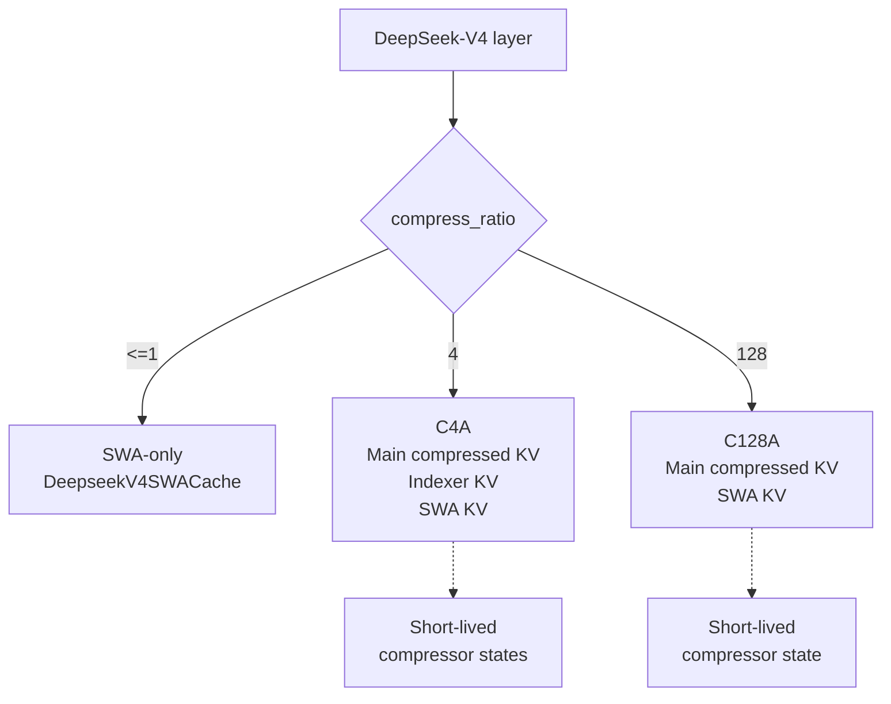
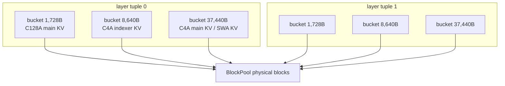
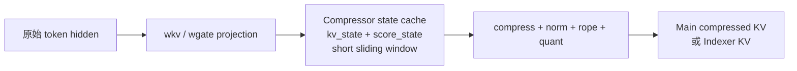
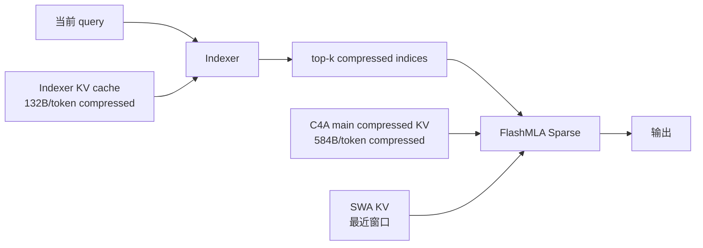
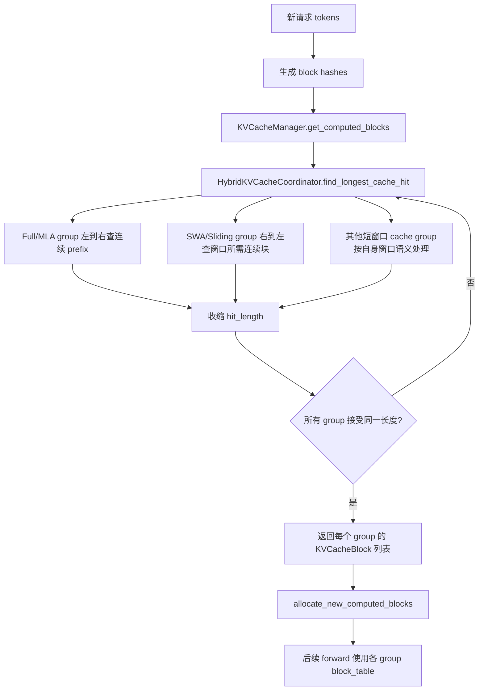
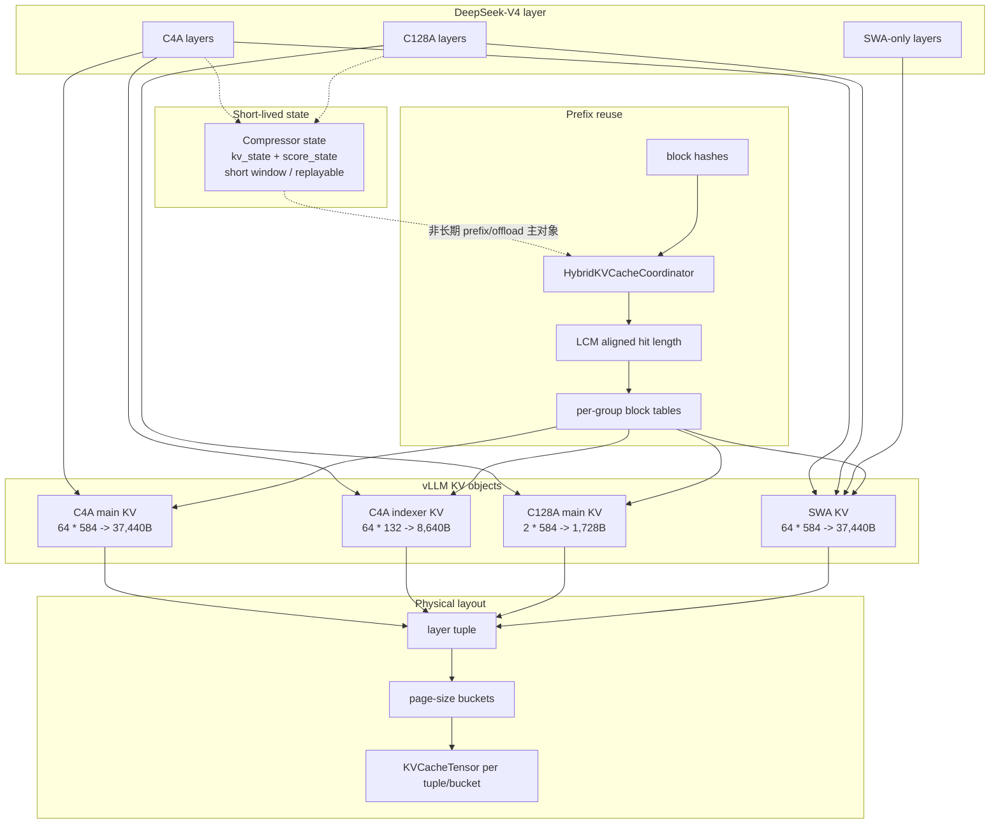

# DeepSeek-V4 在 vLLM 中的 KVCache 管理

分析日期：`2026-04-27`

源码基线：`vllm-project/vllm main`，本地快进后包含 DeepSeek-V4 专用实现。

本文只总结上游 vLLM 的 DeepSeek-V4 实现，不使用 vllm-ascend PR #8739 作为 V4 混合注意力依据。

主要源码锚点：

- `vllm/model_executor/models/deepseek_v4.py`
- `vllm/model_executor/layers/deepseek_v4_attention.py`
- `vllm/model_executor/layers/deepseek_compressor.py`
- `vllm/v1/kv_cache_interface.py`
- `vllm/v1/core/kv_cache_utils.py`
- `vllm/v1/core/kv_cache_coordinator.py`
- `vllm/v1/core/single_type_kv_cache_manager.py`
- `vllm/v1/attention/backends/mla/indexer.py`
- `vllm/v1/attention/backends/mla/sparse_swa.py`
- `vllm/v1/attention/backends/mla/compressor_utils.py`
- `vllm/v1/attention/ops/deepseek_v4_ops/cache_utils.py`
- `tests/v1/attention/test_indexer_deepseek_v4_slot_mapping.py`
- vLLM 官方 blog: `https://vllm.ai/blog/deepseek-v4`

## 1. 总体结论

vLLM 对 DeepSeek-V4 的 KVCache 管理不是把所有层压成一个传统 paged KV，而是把不同注意力对象拆成多个 `KVCacheSpec`，再通过 DeepSeek-V4 专用的 `UniformTypeKVCacheSpecs` 与 tuple/bucket allocator 把物理页大小对齐。

核心变化有四个：

- `compress_ratio` 决定每层是 SWA-only、C4A 还是 C128A。
- 主 compressed KV、SWA KV、indexer KV 是需要重点管理的 KV 对象；compressor state cache 是压缩过程的短窗口运行时状态，不应和长期 KV / prefix offload 对象混在一起描述。
- vLLM 统一使用逻辑 `block_size=256` 作为上层块粒度，但压缩 KV 的真实 `storage_block_size = block_size / compress_ratio`。
- Prefix cache 命中由 `HybridKVCacheCoordinator` 在多个 KV group 之间求共同可复用前缀，最终命中长度必须按所有 group 的块粒度对齐。

## 2. Layer 类型与 KV 对象

`DeepseekV4Attention` 从 HF config 读取 `compress_ratios[layer_id]`：

- `compress_ratio <= 1`：SWA-only layer，没有自己的 main compressed KV。
- `compress_ratio == 4`：C4A layer，有 main compressed KV、SWA KV、indexer KV；另有 main/indexer compressor state 用于生成 compressed KV。
- `compress_ratio == 128`：C128A layer，有 main compressed KV、SWA KV；另有 main compressor state，没有 indexer。

源码依据：

- `deepseek_v4.py` 中 `self.compress_ratio = max(1, config.compress_ratios[layer_id])`
- `deepseek_v4.py` 中只有 `compress_ratio == 4` 时创建 `DeepseekV4Indexer`
- `deepseek_v4_attention.py` 中 `compress_ratio <= 1` 的 main attention `get_kv_cache_spec()` 返回 `None`

逻辑图：



## 3. 单页内存布局

以下以 vLLM DeepSeek-V4 默认逻辑块 `block_size=256` 为例。实际字节数来自 `MLAAttentionSpec`、`SlidingWindowMLASpec` 和 cache insert kernel。

### 3.1 Main compressed KV

`MLAAttentionSpec` 对 DeepSeek-V4 使用：

```text
storage_block_size = block_size // compress_ratio
real_page_size_bytes = storage_block_size * 584
page_size_bytes = round_up(real_page_size_bytes, 576)
```

584B 是每个 compressed token 的存储格式：

```text
448B NoPE FP8
+ 128B RoPE BF16
+   8B FP8 scale
= 584B
```

对应源码：

- `kv_cache_interface.py`: `MLAAttentionSpec.storage_block_size`
- `kv_cache_interface.py`: `model_version == "deepseek_v4"` 时 `storage_block_size * 584`
- `deepseek_v4_ops/cache_utils.py`: K cache block layout

以 `block_size=256` 计算：

| 对象 | compress_ratio | storage_block_size | real page | padded page |
|---|---:|---:|---:|---:|
| C4A main KV | 4 | 64 | 64 * 584 = 37,376B | 37,440B |
| C128A main KV | 128 | 2 | 2 * 584 = 1,168B | 1,728B |

这里不会出现“4.56B 这类不对齐单位”。vLLM 的实际存储单位是 page，page 内是按字节布局的 uint8 tensor，并按 576B 对齐。

### 3.2 SWA KV

`DeepseekV4SWACache` 固定：

```text
block_size = 64
shape = [num_blocks, 64, 584]
real_page_size = 64 * 584 = 37,376B
padded_page_size = 37,440B
```

源码依据：

- `sparse_swa.py`: `DeepseekV4SWACache.block_size = 64`
- `sparse_swa.py`: `get_kv_cache_shape()` 对 `fp8_ds_mla` 返回 `(num_blocks, block_size, 584)`
- `kv_cache_interface.py`: `SlidingWindowMLASpec` 对 DeepSeek-V4 同样使用 584B/token

这个大小正好和 C4A main KV 的 page 对齐。因此 SWA cache 可以和 C4A bucket 共享同一类 page size。

### 3.3 Indexer KV

只有 C4A layer 创建 indexer。

`DeepseekV4Indexer` 中 indexer K cache 使用：

```text
head_dim = 128
quant_block_size = 128
k_cache_head_dim = 128 + 128 / 128 * 4 = 132B
storage_block_size = 256 / 4 = 64
real_page_size = 64 * 132 = 8,448B
padded_page_size = 8,640B
```

源码依据：

- `deepseek_v4_attention.py`: `DeepseekV4IndexerCache.get_kv_cache_spec()`
- `deepseek_v4_attention.py`: `k_cache_head_dim = head_dim + head_dim // quant_block_size * 4`
- `tests/kernels/test_compressor_kv_cache.py`: indexer cache stride 为 132B

如果启用 FP4 indexer cache，源码注释说明仍按 FP8 indexer cache 申请同样大小，只使用前半部分空间。

### 3.4 Compressor state cache 是短窗口状态

DeepSeek-V4 的 compressor 也有 state cache，但它不是最终 attention 要复用的 compressed KV。它保存的是生成 compressed KV 之前的中间状态：

```text
state_cache = [kv_state, score_state]
```

`DeepseekCompressor.forward()` 先把每个原始 token 的 `kv` 与 `score + APE` 写入 state cache，然后 fused kernel 在压缩边界读取最近一小段 state，做 softmax 加权、RMSNorm、RoPE、量化，最后写入 main compressed KV 或 indexer KV。

因此它的定位更接近“压缩工作区 / 短窗口 state cache”，不是 prefix offload 时必须长期保存的 KV history。

源码依据：

- `deepseek_compressor.py`: `CompressorStateCache`
- `deepseek_compressor.py`: `state_dim=2 * coff * head_dim`，注释为 `kv_state + score_state`
- `deepseek_compressor.py`: `_save_partial_states_kernel` 写入 `[kv_state, score_state]`
- C4 main compressor state：`block_size=4`，`state_dim=2048`，约 32,768B，padding 到 32,832B。
- C128 main compressor state：`block_size=8`，`state_dim=1024`，约 32,768B，padding 到 32,832B。
- C4 indexer compressor state：`block_size=4`，`state_dim=512`，约 8,192B，padding 到 8,640B。

为什么 C4 main compressor state 看起来很大：

```text
head_dim = 512
compress_ratio = 4
overlap = true
coff = 2
state_dim = 2 * coff * head_dim = 2048 fp32
每个原始 token = 2048 * 4 = 8192B
state block_size = 4
每页 = 4 * 8192 = 32768B
```

这里“大”是因为 state 用 fp32 保存压缩中间量，并且 C4 有 overlap；但它的窗口很短。`CompressorStateCache` 使用 `SlidingWindowMLASpec`，C4 的 `sliding_window = coff * compress_ratio = 8`，所以它不会像 main compressed KV 那样随整段上下文长期增长。

## 4. vLLM 的 tuple / bucket 物理布局

DeepSeek-V4 的长期 KV page size 明显不统一。vLLM 没有直接给每层单独建完全独立的 allocator，而是在 `kv_cache_utils.py` 中走 DeepSeek-V4 专用分支：

```text
group_and_unify_kv_cache_specs()
_get_kv_cache_groups_uniform_groups()
_get_kv_cache_config_deepseek_v4()
```

关键概念：

- `UniformTypeKVCacheSpecs`：一组“需要同样 token slot 数”的 KV spec，但每个 layer 的 page size 可以不同。
- `page bucket`：按 `page_size_bytes` 把 layer 分桶，例如 1,728B、8,640B、37,440B。
- `layer tuple`：由不同 page bucket 中同一 tuple index 的若干 layer 组成。
- `KVCacheTensor`：vLLM 最终分配的物理 tensor，粒度是 `(tuple_idx, page_size_bucket)`。

注意：`CompressorStateCache` 在源码实现上也是 `KVCacheSpec` 支撑的 cache layer，因为它需要 block table 和 slot mapping 来跨 token 保存短窗口状态；但在架构文档里应单独放在 state plane，而不是和 main/indexer/SWA 这些 attention KV 一起画成长期 layer tuple。下面的图只表达长期/召回价值最高的 KV 对象。

源码里的 allocator 逻辑是：

```text
page_sizes = sorted(full_mla_spec.get_page_sizes())
layer_tuple_page_bytes = sum(page_sizes)
num_layer_tuples = max(bucket lengths across groups)

for tuple_idx in range(num_layer_tuples):
    for page_size in page_sizes:
        shared_by = all group layers at this tuple_idx/page_size
        allocate KVCacheTensor(size = page_size * num_blocks)
```

示意图：



这就是官方 blog 中“Keeping the KV Cache Memory Packed”的源码落点：不是让所有 layer 变成同一种 KV，而是把不同大小的页对齐进同一个 tuple/bucket 体系，减少碎片和 padding。

短窗口 state plane 可以单独理解为：



## 5. Block、slot 与压缩位置

上层 prefix hash 仍以原始 token block 为基础，但 compressed KV 写入时必须转换成压缩后的 slot。

`get_compressed_slot_mapping()` 的规则：

```text
pos 是原始 token 位置
只有 (pos + 1) % compress_ratio == 0 的 token 产生 compressed KV
pos_after_compress = pos // compress_ratio
block_id = pos_after_compress // storage_block_size
slot = physical_block_id * storage_block_size
     + pos_after_compress % storage_block_size
```

测试 `test_indexer_deepseek_v4_slot_mapping.py` 明确覆盖了跨 storage block 边界的情况：

```text
block_size = 256
compress_ratio = 4
storage_block_size = 64

原始 computed token 从 240 到 280
压缩位置从 60 到 69
compressed positions 60..63 -> physical block 5
compressed positions 64..69 -> physical block 7
```

这说明 indexer KV 复用时不能拿普通 uncompressed slot mapping 直接用，必须用 compressed slot mapping。

## 6. Decode 时如何读 KV

DeepSeek-V4 decode 路径由 `DeepseekV4MultiHeadLatentAttentionWrapper` 驱动。

### 6.1 C4A decode



源码路径：

- `DeepseekV4Indexer.forward()` 产生 top-k indices。
- `_forward_decode()` 中 `compress_ratio == 4` 时调用 `compute_global_topk_indices_and_lens()`。
- `flash_mla_with_kvcache()` 同时接收 `k_cache=swa_cache` 和 `extra_k_cache=compressed main KV`。

### 6.2 C128A decode

C128A 没有 indexer，top-k indices 在 metadata build 阶段预计算：

```text
compress_ratio == 128
topk_indices = attn_metadata.c128a_global_decode_topk_indices
```

它仍会和 SWA window 一起喂给 FlashMLA。

### 6.3 SWA-only decode

`compress_ratio <= 1` 时不使用 main compressed KV，只读取 `DeepseekV4SWACache`。

## 7. Prefix cache 复用逻辑

DeepSeek-V4 是多 KV group 模型，因此 prefix 复用走 `HybridKVCacheCoordinator`。

### 7.1 为什么不能只看一个 group

一个 token prefix 要被认为“可复用”，需要相关 KV group 都能在对应块边界上命中。对长期 KV 复用而言，关键对象是 C4A main、C4A indexer、C128A main 与 SWA 窗口；compressor state 是短窗口中间状态，通常应通过尾部 replay 重建，而不是作为长前缀 offload 的主对象。

`HybridKVCacheCoordinator` 做了三件事：

- 按 `KVCacheSpec` 把 kv cache groups 分成 attention groups。
- 计算所有 group block size 的 `lcm_block_size`。
- 迭代调用各 group 的 `find_longest_cache_hit()`，如果某个 group 只能命中更短前缀，则把全局命中长度收缩后重新检查。

源码注释明确说明：当前不支持 partial block cache hit，因此最终 hit length 必须是所有 attention type block size 的 LCM 的倍数。

### 7.2 命中流程图



### 7.3 SWA 的特殊性

`SlidingWindowManager` 的 prefix 命中不是从左到右完整复用所有历史，而是从右往左找窗口需要的连续块，并在前面填 `null_block`。

这符合 SWA 的语义：很久以前的 token 对 SWA 不再可见，不需要真实 KV 块。

源码依据：

- `SlidingWindowManager.find_longest_cache_hit()`
- `SlidingWindowManager.get_num_common_prefix_blocks()` 返回 0，注释说明 sliding-window prefix blocks 是 null blocks，不能像 full attention 一样按 ref count 统计 common prefix。

### 7.4 压缩 KV 的 prefix 边界

对 C4A/C128A 来说，prefix 复用必须满足：

- 原始 token 前缀落在完整 block 边界。
- 生成 compressed KV 的 token 必须满足 `(pos + 1) % compress_ratio == 0`。
- indexer KV 和 main compressed KV 必须基于同一个 compressed position / block table 映射。

因此，C4A 的 prefix 复用不是“只保存 main KV 就够了”。如果要在 decode 中继续做 DSA top-k，indexer KV 也必须按同样 prefix 边界可用。

## 8. 和传统 V3.2 / paged KV 的差异

传统 paged KV 常见假设是：

```text
每层一种 page shape
所有层 page size 近似一致
block_table 直接从原始 token block 映射到 KV slot
prefix hit 只需检查单一 KV group 或少数同构 group
```

DeepSeek-V4 在 vLLM 中变成：

```text
同一 layer 可拥有多个 cache 对象
main compressed KV 与 SWA KV 同时存在
C4A 额外拥有 indexer KV
compressor state 是短窗口压缩状态，不等同于长期 KV
compressed slot mapping 与原始 slot mapping 不同
多个 KV group 必须共同决定 prefix hit length
长期 KV 主对象按 tuple_idx + page_size_bucket 组织物理页
```

## 9. 对 Prefix Offload / Mooncake 的要求

如果要把 vLLM 的 DeepSeek-V4 KVCache offload 到 Mooncake 或其他外部 KV store，不能再假设“一个 request block 对应一段同构 KV blob”。

建议 offload manifest 至少包含：

- `model_version = deepseek_v4`
- `kv_group_id`
- `layer_name`
- `object_kind`: `main_compressed_kv`、`swa_kv`、`indexer_kv`
- `compress_ratio`
- `logical_block_size`
- `storage_block_size`
- `page_size_bytes`
- `real_page_size_bytes`
- `page_size_bucket`
- `tuple_idx`
- `block_hash`
- `physical_block_id`

召回时需要按 vLLM 的 group 语义恢复：

- 先按 `HybridKVCacheCoordinator` 能接受的 hit length 裁剪 prefix。
- 对 C4A 同时召回 main compressed KV 和 indexer KV。
- 对 SWA 只召回窗口所需块，长历史可用 null blocks 表示。
- 对 compressor state 默认不做长期 offload；需要时只把它当作短窗口 checkpoint，或者通过 replay 尾部 token 重建。
- 对 compressed KV 使用 compressed slot mapping，而不是原始 slot mapping。
- 外部存储的对象大小应按 `page_size_bytes`，不是按 `real_page_size_bytes`，否则会破坏 vLLM 的 page/bucket 对齐。

## 10. 一页版总结



## 11. 最关键的实现判断

DeepSeek-V4 的 KVCache 复用原则仍然是“前缀可复用”，但在 vLLM 里这个前缀不再是单一 KV page 的前缀，而是多个 KV group 在共同 block 边界上的交集。

对系统实现者来说，最容易踩坑的是三点：

- 不保存 C4A indexer KV，只保存 main KV，会导致 decode DSA 无法直接复用 prefix。
- 按原始 slot mapping 写 indexer KV，会在跨 storage block 时写错位置。
- 把 compressor state 当成长期 KV 保存，会高估 offload 价值并复杂化召回；它更适合作为短窗口 checkpoint 或通过尾部 replay 重建。
- 外部 offload 如果忽略 `page_size_bytes` padding 和 tuple/bucket layout，会导致召回后 block table 能命中但内存内容不符合 vLLM kernel 预期。
