# DeepSeek-V4 与 vLLM PR 的 KVCache / Prefix Offload / Decode DSA / PD 传输分析

分析日期：`2026-04-25`

参考资料：

- DeepSeek-V4 论文：`DeepSeek_V4.pdf`
- vLLM 社区博客：[DeepSeek-V4 support](https://vllm.ai/blog/deepseek-v4)
- vLLM PR：[vllm-project/vllm#40760 - [New Model] Support DeepseekV4](https://github.com/vllm-project/vllm/pull/40760)
- 本地 vLLM main：`428b988`，该 main 分支目前不包含 PR #40760 的完整 DeepSeek-V4 实现

## 1. 结论

DeepSeek-V4 的 KVCache 变化不是简单的 KV 压缩，而是一次完整的 attention/KV/runtime 协同设计：

- 论文侧把长期上下文拆成 `CSA`、`HCA`、`SWA` 三类 attention 状态：`CSA` 做细粒度压缩加 DSA top-k，`HCA` 做重压缩全局摘要，`SWA` 保留最近窗口。
- 运行时侧把 KVCache 拆成 `classical KV cache` 和 `state cache`：前者适合 prefix reuse/offload，后者更多用于最近窗口和未凑满压缩块的尾部状态。
- vLLM PR #40760 没有把 V4 塞进原有普通 paged KV 模型，而是新增了 `compress_ratio`、`storage_block_size`、`hash_block_size`、`SlidingWindowMLASpec`、group-aware KV manager、DeepSeek-V4 专用 FlashMLA sparse backend 和 Mooncake HMA 支持。
- Prefix offload 的复用单位从“单组物理 KV block”升级为“跨多个 KV group 收敛到同一个 prefix frontier”。
- Decode DSA 的关键状态不仅是主 KV，还包括 indexer KV；如果 prefix/offload 不保存 indexer KV，decode 仍可通过重算 indexer 恢复正确性，但会损失 V4 设计中的稀疏检索收益。
- PD 分离传输必须从 `list[int] block_ids` 升级到 `list[list[int]] block_ids_by_group`，并且传输长度必须按真实 stride/alignment 计算，而不能再按 tensor shape 粗略推导。

对 MooncakeStore / Mooncake Connector 的直接启发是：

- Store 层需要 `manifest + group segments`，而不是单一 opaque KV blob。
- `CSA main KV`、`CSA indexer KV`、`HCA main KV`、`SWA window KV` 需要在同一 prefix hash / logical block range 下统一编排。
- `SWA` 应作为 window-only 或 recompute-friendly 状态处理，不能和长期 compressed KV 一样全量持久化。
- PD 传输和 prefix offload 都需要显式携带 `hash_block_size`、`logical_block_size`、`group_block_size`、`storage_block_size`、`compress_ratio`、`page_size_bytes`、`stride_bytes`。

## 2. DeepSeek-V4 论文中的 KVCache 结构

### 2.1 Attention 组成

DeepSeek-V4 的 attention 不再是单一路径，而是由三类状态共同组成：

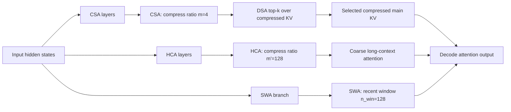

V4-Pro 论文配置中，关键 KV 参数如下：

| 项目 | V4-Pro 论文值 | 系统含义 |
|---|---:|---|
| `m` | `4` | CSA 每 4 个原始 token 压成 1 个 compressed KV entry |
| `m'` | `128` | HCA 每 128 个原始 token 压成 1 个 compressed KV entry |
| `n_win` | `128` | SWA 最近窗口大小 |
| CSA top-k | `1024` | DSA 从压缩历史中选择的条目数 |
| indexer heads | `64` | DSA lightning indexer 的头数 |
| indexer head dim | `128` | indexer KV 的语义维度 |
| main head dim | `512` | V4 MLA 主 KV 的语义维度 |
| qk rope dim | `64` | RoPE 部分维度 |
| qk nope dim | `448` | NoPE 部分维度 |

### 2.2 Classical KV Cache 与 State Cache

论文 3.6.1 的核心是把 KVCache 拆成两类：

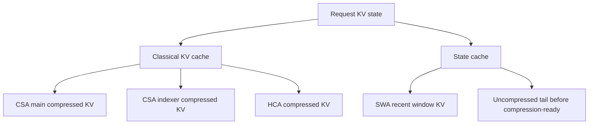

两类 cache 的行为不同：

| 类型 | 内容 | 生命周期 | 是否适合 prefix/offload |
|---|---|---|---|
| Classical KV cache | CSA/HCA compressed KV，indexer KV | 随上下文增长 | 适合，且是主要复用对象 |
| State cache | SWA window，未凑满压缩块的尾部状态 | 固定上界，强位置相关 | 可保存窗口，但通常更适合裁剪或重算 |

### 2.3 统一逻辑块

论文建议 classical KV 按 `lcm(m, m')` 个原始 token 组织。V4-Pro 中：

```text
lcm(4, 128) = 128 原始 tokens
```

因此一个逻辑 block 覆盖 128 个原始 token：

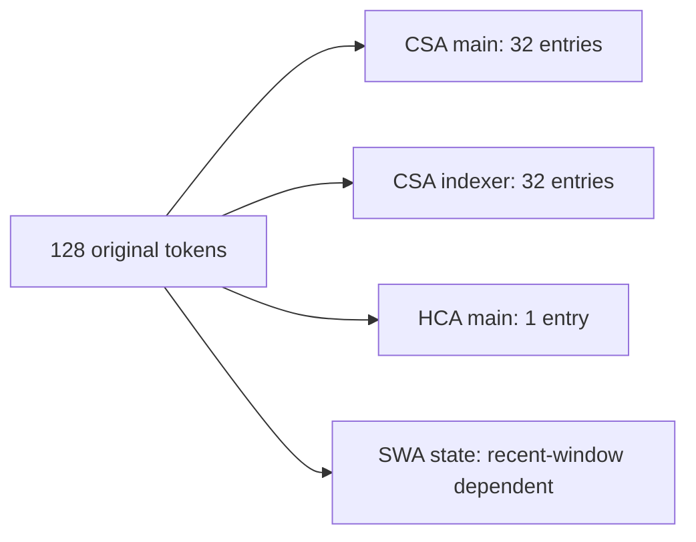

这对 prefix/offload 的含义是：长期 KV 的自然复用边界不是任意 token，而是完整压缩块边界。未凑满压缩块的尾巴应该放进 state cache 或通过 replay 重建。

## 3. vLLM PR #40760 的 KVCache 实现方案

### 3.1 关键文件

PR #40760 涉及大量文件，KVCache 相关主线主要是：

| 模块 | 关键文件 | 作用 |
|---|---|---|
| 模型层 | `vllm/model_executor/models/deepseek_v4.py` | 注册 DeepSeek-V4 模型结构 |
| Attention 层 | `vllm/model_executor/layers/deepseek_v4_attention.py` | V4 MLA、SWA、compressor、indexer 组合 |
| KV spec | `vllm/v1/kv_cache_interface.py` | 新增 compression/alignment/model_version 语义 |
| KV grouping | `vllm/v1/core/kv_cache_utils.py` | 多 KV group 分组、对齐、分配 |
| KV coordinator | `vllm/v1/core/kv_cache_coordinator.py` | 多 group prefix hit 收敛 |
| Sparse backend | `vllm/v1/attention/backends/mla/flashmla_sparse.py` | V4 compressed slot mapping、C128A metadata |
| SWA backend | `vllm/v1/attention/backends/mla/sparse_swa.py` | V4 SWA metadata 和 FlashMLA tile scheduler |
| Indexer backend | `vllm/v1/attention/backends/mla/indexer.py` | V4 indexer compressed slot mapping |
| Worker reshape | `vllm/v1/worker/gpu_model_runner.py` | compression-aware shape 和 padding-aware stride view |
| Mooncake connector | `vllm/distributed/kv_transfer/kv_connector/v1/mooncake/mooncake_connector.py` | group-aware PD KV transfer |

### 3.2 新增 KVCache Spec 语义

PR 对 `MLAAttentionSpec` 增加了三个关键字段：

```text
compress_ratio: int
model_version: str | None
alignment: int | None
```

并新增：

```text
storage_block_size = block_size // compress_ratio
```

这很关键，因为 V4 中调度层看到的是原始 token block，但实际 KV tensor 里存的是压缩后的 entry block。

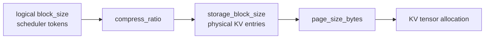

PR 还新增 `SlidingWindowMLASpec`，表示“使用 MLA cache 格式的滑动窗口 KV”。这让 SWA 不再是普通 sliding-window attention，而是一个带 V4 custom FP8 layout 的独立 KV group。

### 3.3 V4 实际 KV entry 大小

vLLM PR 中 V4 主 KV 的实际 layout 是：

```text
448B FP8 NoPE
128B BF16 RoPE
8B UE8M0 scale / padding
= 584B per compressed entry
```

对比 V3.2 sparse MLA：

| 模型/路径 | NoPE | RoPE | scale | 单 entry 大小 |
|---|---:|---:|---:|---:|
| V3.2 main MLA | `512B FP8` | `128B BF16` | `16B FP32 scale` | `656B` |
| V4 main MLA | `448B FP8` | `128B BF16` | `8B UE8M0 scale/pad` | `584B` |
| V3.2/V4 indexer FP8 | `128B FP8` | 无独立 BF16 RoPE 存储 | `4B scale` | `132B` |

按 V4-Pro 压缩率折算：

| KV 类型 | compress ratio | vLLM entry bytes | 平均 bytes/token/layer |
|---|---:|---:|---:|
| CSA main KV | `4` | `584` | `146` |
| CSA indexer KV | `4` | `132` | `33` |
| HCA main KV | `128` | `584` | `4.5625` |
| SWA KV | `1` | `584` | 窗口内 `584`，但只保存最近窗口 |

注意：V4 论文中如果只数数据部分，主 KV entry 可以估为 `576B`；vLLM 实现还需要额外 `8B` scale/pad，因此工程上应按 `584B` 管理。

### 3.4 多 KV Group 分配

PR 里的 `get_kv_cache_groups()` 对 V4 做了特殊处理：

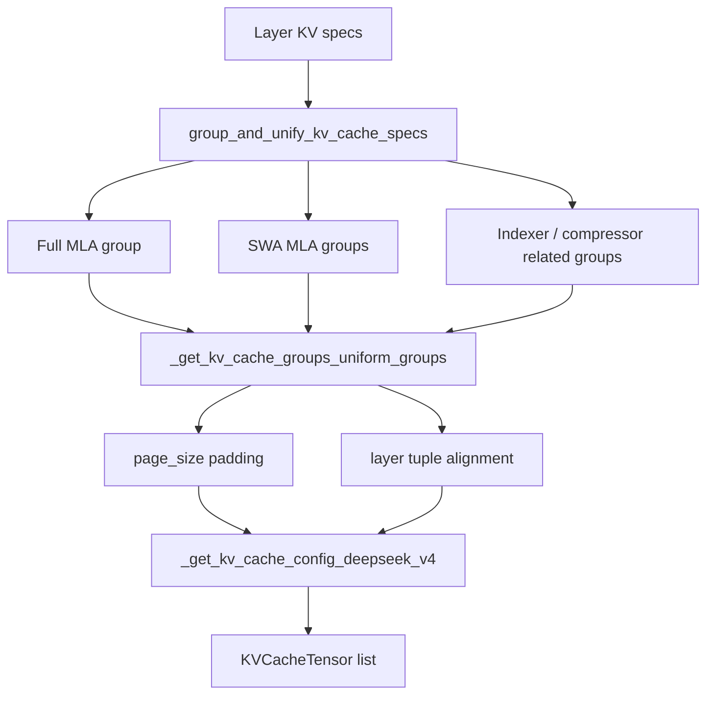

这个设计解决了一个老问题：vLLM 的 KV manager 原先更偏向“同类 layer 使用同样 page size”。V4 里不同 layer 可能有不同压缩率、不同 SWA 形态、不同 page size，因此 PR 用 `UniformTypeKVCacheSpecs` + page-size bucket + layer tuple 的方式把它们放进统一的 memory planning 模型。

### 3.5 Scheduler block size 与 Hash block size 分离

PR 新增 `resolve_kv_cache_block_sizes()`：

```text
scheduler_block_size = lcm(all group block_size)
hash_block_size = cache_config.hash_block_size or gcd(all group block_size)
```

含义如下：

| 粒度 | 用途 | 为什么需要分离 |
|---|---|---|
| `scheduler_block_size` | 调度层 `num_computed_tokens` 对齐 | 必须对所有 KV group 都安全 |
| `hash_block_size` | prefix hash / KV connector block hash | 希望尽量细，便于 prefix hit |
| `storage_block_size` | 某个 group 实际 KV entries/block | 由压缩率决定 |

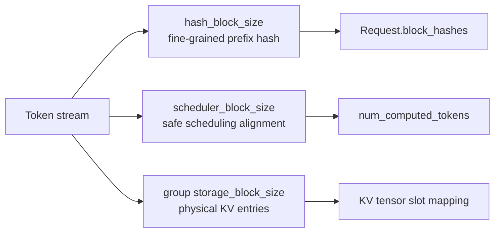

这是 prefix offload 能适配 V4 的核心改动。

## 4. 重点场景一：Prefix Offload

### 4.1 Prefix hit 的问题

在普通 full attention 模型中，prefix hit 可以理解为：

```text
hash(token block) -> KV block
```

但 V4 中，同一段 token prefix 对应多组状态：

```text
prefix tokens
  -> CSA main compressed KV
  -> CSA indexer compressed KV
  -> HCA main compressed KV
  -> SWA recent window KV
  -> tail state
```

因此 prefix hit 需要回答的不再是“命中了多少个 block”，而是：

```text
每个 KV group 分别命中了哪些 block？
这些 group 能共同支持到哪个 prefix frontier？
缺失的 group 是加载、重算，还是裁剪？
```

### 4.2 vLLM PR 的 Prefix Hit 收敛机制

PR 修改了 `kv_cache_coordinator.py` 中的 `find_longest_cache_hit()`。核心思想：

- 多个 attention group 分别查自己的 cache hit。
- Full attention group 具备 downward-closed 性质，后续可以裁剪。
- SWA / compressed group 可能因为窗口或压缩粒度导致 hit length 不一致，需要迭代收敛。
- EAGLE/MTP 的 last-block drop 只应用到标记为 `is_eagle_group` 的 group，避免所有 group 被重复 drop。

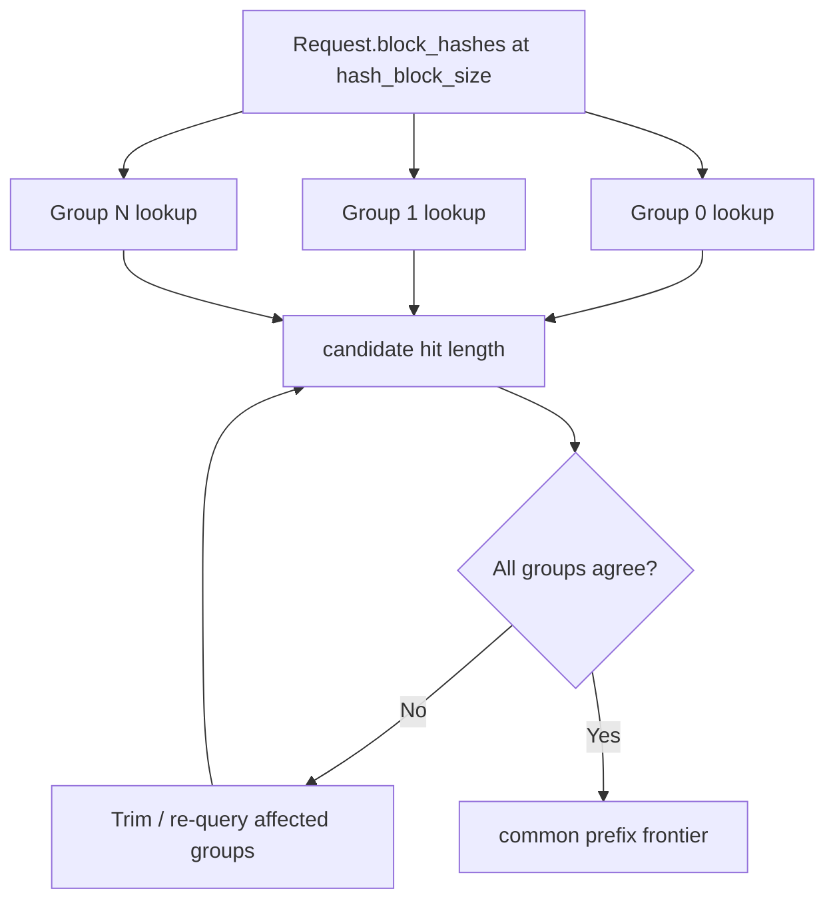

### 4.3 Prefix Offload 的推荐对象

从 DeepSeek-V4 论文和 vLLM 实现共同看，prefix offload 的对象应分层处理：

| 对象 | 是否建议 offload | 原因 |
|---|---|---|
| CSA main KV | 强烈建议 | decode 主 attention 需要，体积较传统 KV 小 |
| CSA indexer KV | 强烈建议 | DSA top-k 直接依赖，缺失会导致重算 indexer |
| HCA main KV | 强烈建议 | 体积极小，长上下文全局摘要价值高 |
| SWA window KV | 只保存窗口或重算 | 窗口状态大且生命周期短 |
| Tail state | 通常重算 | 未凑满压缩块，不适合长期持久化 |

### 4.4 Prefix Offload Manifest 建议

MooncakeStore 不应该只看到一个 KV blob，而应该看到一个带 group 语义的 manifest：

```yaml
prefix_object:
  model_id: deepseek-v4-pro
  layout_version: vllm-pr-40760-compatible
  prefix_hash_algo: sha256_cbor_or_xxhash_cbor
  hash_block_size: 64
  scheduler_block_size: 256
  logical_token_range: [0, 8192)
  groups:
    - name: csa_main
      compress_ratio: 4
      logical_block_size: 256
      storage_block_size: 64
      entry_bytes: 584
      page_size_bytes: 37376
      stride_bytes: 37440
    - name: csa_indexer
      compress_ratio: 4
      logical_block_size: 256
      storage_block_size: 64
      entry_bytes: 132
      page_size_bytes: 8448
      stride_bytes: 8640
    - name: hca_main
      compress_ratio: 128
      logical_block_size: 256
      storage_block_size: 2
      entry_bytes: 584
    - name: swa
      policy: window_only
      sliding_window: 128
      block_size: 64
```

其中 `stride_bytes` 很重要。PR 已经把 Mooncake connector 的 block length 计算从 shape size 改成：

```text
block_len = cache.stride(0) * cache.element_size()
```

原因是 V4 MLA cache 可能有 alignment/padding，RDMA 传输必须覆盖真实 block 跨度。

### 4.5 Prefix Offload 恢复流程

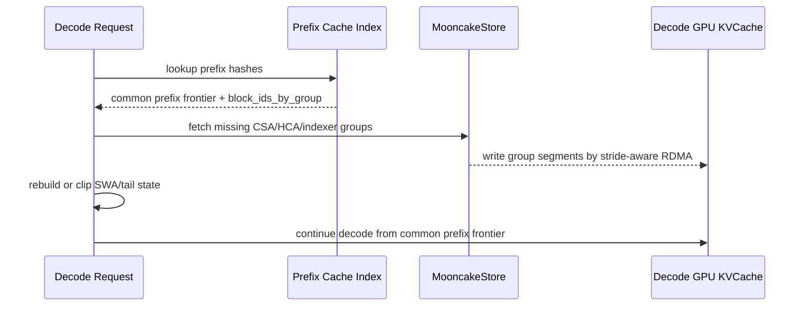

## 5. 重点场景二：Decode DSA

### 5.1 DSA 在 V4 Decode 中的路径

V4 的 CSA decode 不是直接扫所有历史 KV，而是：

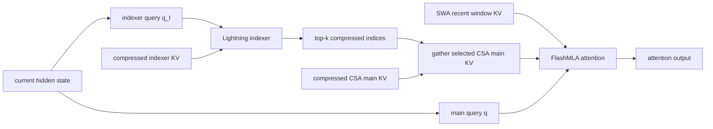

vLLM PR 中对应实现集中在：

- `DeepseekV4Indexer`
- `DeepseekV4IndexerCache`
- `SparseAttnIndexer`
- `DeepseekV4FlashMLASparseBackend`
- `DeepseekSparseSWABackend`
- `fused_indexer_q_rope_quant`
- `compute_global_topk_indices_and_lens`
- `combine_topk_swa_indices`

### 5.2 Decode 阶段的两类 index

V4 decode 中至少有两类 index：

| Index 类型 | 来源 | 用途 |
|---|---|---|
| DSA top-k indices | Lightning indexer 或 C128A metadata | 选择 compressed main KV |
| SWA indices | Sliding window metadata builder | 选择最近窗口 KV |

最终 FlashMLA 调用会同时接收：

```text
indices = swa_indices
extra_k_cache = compressed main KV
extra_indices_in_kvcache = topk_indices
extra_topk_length = topk_lens
```

也就是说，decode attention 的输入是：

```text
SWA window KV + sparse selected compressed KV
```

### 5.3 CSA 与 HCA 在 vLLM PR 中的差异

PR 用 `compress_ratio` 区分 V4 layer 类型：

| 类型 | compress ratio | decode top-k 行为 |
|---|---:|---|
| SWA-only | `1` | 只用 SWA |
| C4A / CSA | `4` | indexer 生成 top-k |
| C128A / HCA-like compressed path | `128` | 预计算 C128A top-k metadata，近似全 compressed 历史或 coarse sparse path |

`sparse_swa.py` 中按 `compress_ratio` 分三类 tile scheduler：

```text
swaonly
c4a
c128a
```

每类 decode layer 的 top-k、extra top-k、page block size 不同，因此不能共享同一个 FlashMLA tile-scheduler plan；但同类型的多层可以在一个 decode step 内共享 plan。

### 5.4 Decode DSA 对 KVCache Offload 的要求

如果 prefix/offload 要恢复 decode DSA 的性能路径，需要保存：

- compressed main KV：被 top-k 选中后用于主 attention。
- compressed indexer KV：用于 indexer 计算 top-k。
- block table / slot mapping 元数据：用于把 local index 转成 global slot id。
- compress ratio：用于计算 compressed seq_lens 和 compressed slot mapping。
- SWA window：用于和 sparse selected KV 共同 attention，或者提供重算策略。

如果不保存 indexer KV：

- 正确性可以通过 replay prefix 或重跑 compressor/indexer 恢复。
- 但 decode 首 token 或 remote prefix reuse 的收益会明显下降。
- PD 分离时 decoder 需要额外做 indexer prefill/reconstruction，削弱“prefill 侧生产、decode 侧消费”的职责拆分。

因此对 V4 来说，`CSA main KV` 与 `CSA indexer KV` 应该作为同一个 prefix block group 的两个 segment 管理。

## 6. 重点场景三：PD 分离传输

### 6.1 PR 中 Mooncake Connector 的变化

PR 对 Mooncake connector 的关键修改：

- `local_block_ids` 从 `list[int]` 改为 `list[list[int]]`。
- `req_blocks` 从单组 block ids 改为 per-group block ids。
- 新增 `request_finished_all_groups()`。
- connector 实现 `SupportsHMA`。
- 对 sliding-window group 做 block clipping。
- partial prefix hit 时按 group 分别裁剪，再 flatten 做 RDMA。
- register KV cache 时使用 stride-based block length。

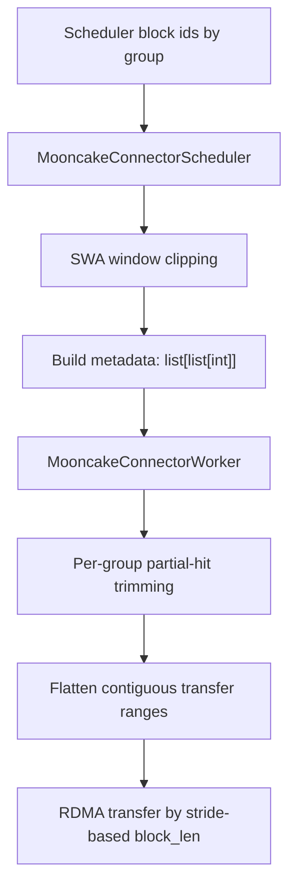

### 6.2 PD 传输中的 Producer / Consumer 语义

Prefill worker 是 KV producer，Decode worker 是 KV consumer：

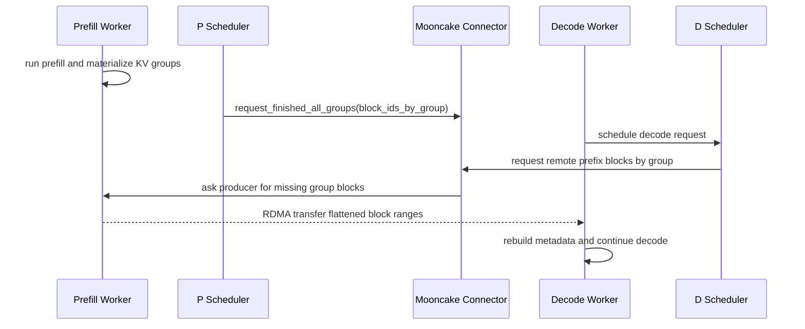

### 6.3 为什么必须 per-group 传输

V4 中各 group 的物理 block 含义不同：

| Group | logical token coverage | storage entries | 是否窗口化 |
|---|---:|---:|---|
| CSA main | `block_size` tokens | `block_size / 4` | 否 |
| CSA indexer | `block_size` tokens | `block_size / 4` | 否 |
| HCA main | `block_size` tokens | `block_size / 128` | 否 |
| SWA | `64` 或窗口相关 | `block_size` | 是 |

如果仍用单 `list[int]`：

- 无法表达“CSA 命中 20 个 block，但 SWA 只需要最后 3 个 block”。
- 无法表达“indexer KV 和 main KV 共享 prefix frontier，但物理 entry size 不同”。
- 无法安全处理 HMA 下多个 group 共享同一个 tensor 但使用不同 block range。
- partial prefix hit 时可能错误裁剪，导致 P/D 两侧 block 不对齐。

### 6.4 PD 与 Prefix Offload 的组合

Prefix offload 与 PD 分离结合时，可以形成两级复用：

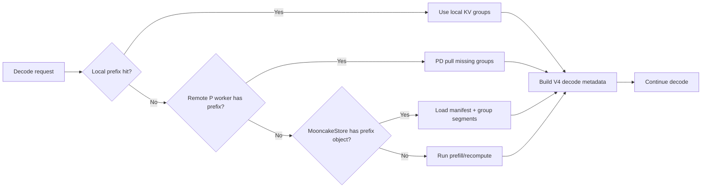

推荐优先级：

1. 本地 GPU prefix cache hit。
2. PD 从活跃 prefill worker 拉取缺失 group blocks。
3. 从 MooncakeStore 加载长期 compressed KV group。
4. 对 SWA/tail 做窗口恢复或 replay。
5. 全量 prefill fallback。

### 6.5 MooncakeStore 需要新增的能力

为了适配 V4，MooncakeStore 需要支持：

| 能力 | 说明 |
|---|---|
| Group-aware object manifest | 一个 prefix 对象包含多个 KV group segment |
| Compression-aware metadata | 记录 `compress_ratio`、`storage_block_size`、entry bytes |
| Hash/block 分离 | 记录 `hash_block_size` 与 physical group block size 的关系 |
| Stride-aware transfer | 记录或推导真实 `stride_bytes`，避免 padding 丢失 |
| SWA policy | 支持 `window_only`、`periodic_checkpoint`、`zero/recompute` 策略 |
| Indexer KV 生命周期 | indexer KV 与 CSA main KV 同 prefix frontier 管理 |
| Partial group restore | 允许只恢复某些 group 的尾部缺失 blocks |
| Layout versioning | V4 PR 的 cache layout 可能变化，必须版本化 |

## 7. 从论文到 vLLM PR 的映射关系

| 论文概念 | vLLM PR 实现 | 系统含义 |
|---|---|---|
| CSA compression `m=4` | `compress_ratio=4` | `storage_block_size = block_size / 4` |
| HCA compression `m'=128` | `compress_ratio=128` / C128A metadata | 极低成本长程 compressed KV |
| SWA `n_win=128` | `DeepseekV4SWACache` + `SlidingWindowMLASpec` | 最近窗口独立 KV group |
| Classical KV cache | `MLAAttentionSpec` groups | 适合 prefix/offload |
| State cache | `SlidingWindowMLASpec` + tail/recompute | 适合 window clipping/replay |
| Lightning indexer | `DeepseekV4Indexer` / `SparseAttnIndexer` | DSA top-k 选择器 |
| 压缩块边界 | `get_compressed_slot_mapping()` | 只在 compression-ready token 写 KV |
| Prefix reuse | `hash_block_size` + `find_longest_cache_hit()` | 多 group 收敛到共同 frontier |
| PD KV 传输 | Mooncake connector `list[list[int]]` | per-group block ids |

## 8. 对 Mooncake 适配的建议方案

### 8.1 数据结构建议

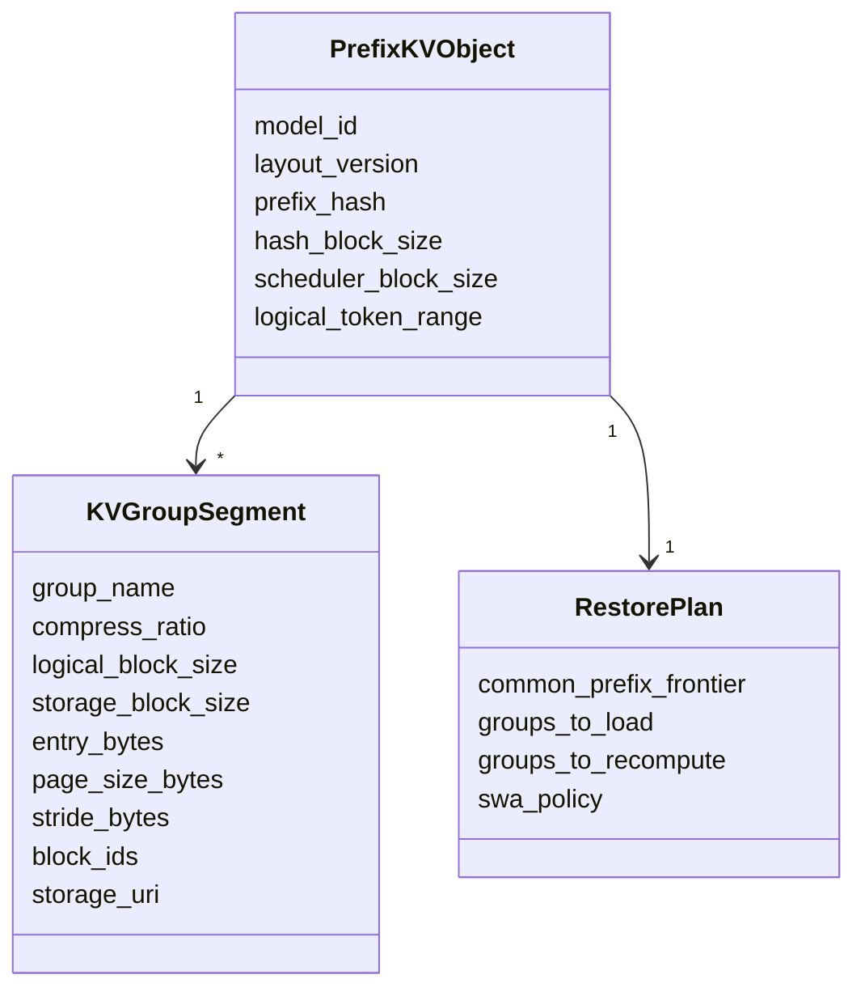

### 8.2 写入策略

- Prefill 完成或 prefix 达到稳定边界后，写入 classical KV group。
- CSA main 与 CSA indexer 使用同一 logical block range 和 prefix hash。
- HCA main 虽然很小，也应与同一 prefix object 绑定。
- SWA 只写最近窗口，或者不写并标记为 recompute。
- Tail state 默认不长期写入，除非业务需要极低首 token latency。

### 8.3 读取策略

- 先用 `hash_block_size` 查 prefix object。
- 根据各 group manifest 判断可恢复到的 common prefix frontier。
- 对缺失 group 做 partial restore 或 replay。
- 对 SWA 根据策略恢复最近窗口。
- 恢复后构造 vLLM 需要的 block table、compressed slot mapping、SWA indices、indexer metadata。

### 8.4 PD 传输策略

- Scheduler 向 connector 传递 `block_ids_by_group`。
- Connector 对 SWA group 做 window clipping。
- Producer 和 Consumer 分别按 group 做 partial hit trimming。
- 真正 RDMA 传输前 flatten 成连续 ranges。
- 每个 range 的 byte offset 使用 `base_addr + block_id * stride_bytes`。

## 9. 风险与待确认点

- PR #40760 当前仍是 open 状态，最终合入前接口可能变化。
- `alignment=576`、SWA `block_size=64`、V4 `584B/entry` 是该 PR 当前实现细节，需要 layout versioning 防御后续变化。
- V4 indexer 支持 FP8 和 FP4 cache；FP4 路径依赖 Blackwell datacenter GPU，Store metadata 应记录 indexer cache dtype/layout。
- HCA/C128A 在 vLLM PR 中的实现形态与论文命名不完全一一对应，工程上应以 `compress_ratio` 和 backend metadata 为准。
- 多 group prefix hit 依赖 `hash_block_size` 能整除所有 group block size；如果未来引入更多异构 attention group，需要重新验证 GCD/LCM 策略。
- SWA cache 是否保存会直接影响 remote prefix hit 的 TTFT；需要按业务在“保存窗口”和“replay 重算”之间选择。
- PD 分离场景下，如果只传 main KV 不传 indexer KV，会造成 decoder 侧重算 indexer，影响 decode DSA 的首步延迟。

## 10. 最小落地清单

如果要把 Mooncake 面向 DeepSeek-V4 做工程适配，建议按以下顺序推进：

1. 在 KV 元数据中加入 group-aware manifest，支持 `block_ids_by_group`。
2. 在 Store 对象中记录 `hash_block_size`、`scheduler_block_size`、`compress_ratio`、`storage_block_size`、`stride_bytes`。
3. 将 CSA main 与 CSA indexer 作为同一 logical block group 的两个 segment 保存。
4. 对 HCA main 启用默认保存策略。
5. 对 SWA 引入 window clipping 和 recompute policy。
6. 在 PD connector 中按 group 做 partial hit trimming，再 flatten RDMA ranges。
7. 在 prefix lookup 中返回 common prefix frontier，而不是单一 hit block 数。
8. 增加 layout version 校验，防止不同 vLLM/DeepSeek-V4 PR 版本的 KVCache 混用。

