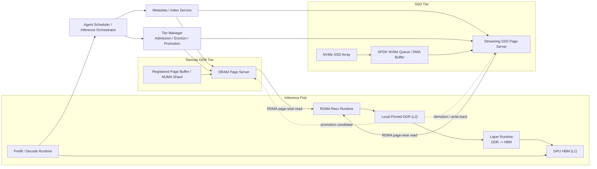

# KVCache 软硬件设计研究

## Chapter 1. 场景与问题定义

KVCache 系统的目标不是单纯提高命中率，也不是单纯减少 prefill 重算，而是：

在算力、内存、SSD、网络带宽和时延约束下，通过有选择地保存和复用高价值 KV 对象，实现系统推理效率最大化。

因此后续统一用 3 个指标讨论“命中率”：

- 理论可复用率：当前请求中，历史 token 在逻辑上可复用的比例。
- 存储可命中率：理论可复用部分中，系统里仍保有且可定位的比例。
- 有效命中率：已命中的 KV 中，能及时消费且对系统总效率有正收益的比例。

### 1.1 多轮 Chat

谁生产缓存：
- 当前会话所在推理实例在 prefill 和 decode 中共同生产。
- 上一轮 decode 生成 token 的 KV，下一轮通常也要继续复用。

谁消费缓存：
- 同一会话的下一轮请求。
- 可能是同进程、同机其他进程，或远端节点。

命中时间窗口：
- 典型是秒级到分钟级。
- 用户连续追问时更短，停顿思考时稍长。

丢失缓存代价：
- 中高。
- 会导致整段历史重新 prefill，TTFT 直接上升。
- 上下文越长，代价越高。

复用可预测性：
- 高。
- 会话基本线性增长。
- 前缀稳定，热点集中。

场景结论：
- 多轮 chat 是典型的“线性前缀递增”场景。
- 更适合高 DRAM 占比、低时延命中、较短但可靠的 TTL。

### 1.2 Agent

谁生产缓存：
- 推理实例在各轮 prefill/decode 中生产。
- 内容包含固定骨架、任务计划、工具调用、观察结果、反思轨迹等。

谁消费缓存：
- 同一 agent 任务的后续轮次。
- 同一任务的不同分支。
- retry、反思、重规划等后继请求。

命中时间窗口：
- 比 chat 更长，但更分散。
- 受任务阶段和历史压缩周期强影响。

丢失缓存代价：
- 分化很大。
- 丢失稳定骨架和共享前缀代价高。
- 丢失短命尾部代价相对有限。

复用可预测性：
- 中等。
- 固定骨架可预测性高。
- 分支尾部、工具返回、反思链路波动更大。

场景结论：
- agent 更像“共享主干 + 多个变化尾部”。
- 应优先优化共享前缀命中，而不是追求完整上下文命中。
- TTL 应围绕压缩周期和阶段性复用窗口设计。

### 1.3 生成式推荐

#### 1.3.1 模板共享型推荐

例如：
- 推荐理由生成
- 候选集解释
- 重排理由生成
- 个性化文案生成

这类 prompt 通常是：

- 平台级系统模板
- 推荐任务说明
- 规则或安全约束
- 输出格式
- 用户画像摘要
- 候选集信息

特点：
- 平台级模板和规则高度稳定。
- 人群模板可能批量共享。
- 请求级尾部变化较大，但通常只是后半段。

结论：
- 跨请求共享前缀价值高。
- 可预测性强。
- 适合做模板片段级 KV 复用。

#### 1.3.2 行为序列递增型推荐

例如系统根据用户历史行为序列做推荐：

- 用户历史浏览/点击/加购/购买序列
- 时间信息
- 商品属性摘要
- 当前候选集
- 推荐任务指令

其序列往往呈现前缀递增：

- t1: [a, b, c, d]
- t2: [a, b, c, d, e]
- t3: [a, b, c, d, e, f]

这类场景为什么适合 KVCache：
- 用户历史行为序列天然具备前缀递增特征。
- 理论可复用率通常较高。
- 比 agent 更少历史重写。
- 如果编码方式稳定，存储可命中率和有效命中率也有机会做高。

需要注意的限制：
- 行为窗口可能只保留最近 N 条。
- 可能会发生截断、采样、聚合、重编码。
- prompt 编码方式如果变化，旧 KV 前缀关系会被打断。

场景结论：
- 这是生成式推荐里最接近多轮 chat 的子场景。
- 但它是“用户状态递增”，不是“对话轮次递增”。
- TTL 应围绕行为窗口长度、序列编码稳定性和推荐触发频率来设计。

### 1.4 三类场景对比

| 维度 | 多轮 Chat | Agent | 生成式推荐 |
|---|---|---|---|
| 主要复用来源 | 同一会话连续轮次 | 同一任务主干、阶段共享前缀、分支复用 | 模板共享、用户行为序列递增、热点内容共享 |
| 上下文结构 | 线性增长 | 主干 + 分支/阶段尾部 | 模板骨架 + 用户状态/候选尾部 |
| 理论可复用率走势 | 随轮次上升，通常较平滑 | 可上升，但受分支和压缩影响更大 | 模板型长期高；行为序列型随用户状态递增上升 |
| 存储可命中率影响因素 | TTL、实例漂移、热池大小 | TTL、压缩周期、对象粒度、驱逐策略 | 模板版本、序列编码稳定性、热点周期 |
| 有效命中率影响因素 | 远端取回时延、热层容量 | 取回时延、分层迁移、压缩重写、调度决策 | 批量共享规模、模板稳定性、候选尾部变化 |
| 命中时间窗口 | 秒级到分钟级 | 分层窗口，短中长并存 | 模板可长，行为/热点中等，请求尾部较短 |
| 丢失缓存代价 | 中高，长上下文下更高 | 分化大，共享骨架代价高 | 高共享模板或热点对象代价高，单请求尾部较低 |
| 复用可预测性 | 高 | 中等 | 中高，通常高于 agent |
| TTL 设计重点 | 覆盖下一轮到后续几轮 | 覆盖压缩前复用窗口 | 覆盖模板版本周期、行为窗口周期、热点变化周期 |
| 最适合的缓存策略 | 高 DRAM、低时延热命中 | 分层缓存、价值驱逐、共享前缀保留 | 模板分层、跨请求共享、行为前缀复用 |

### 1.5 第一章阶段性定稿结论

KVCache 系统是一个面向在线推理的中间状态复用系统。它以系统推理效率最大化为目标，在算力、内存、SSD、网络和时延约束下，对不同价值、不同生命周期的 KV 对象进行分层保留与快速搬运，把理论可复用部分尽可能转化为存储可命中和有效命中，从而减少重复 prefill，降低 TTFT，并提升整体吞吐与调度灵活性。

## Chapter 2. 负载模型与容量/带宽推导

### 2.1 真实模型的单 token KVCache 大小基线

本章后续统一使用两个真实模型作为锚点：

- Kimi K2.5
- MiniMax M2.5

#### Kimi K2.5

根据公开配置，Kimi K2.5 的文本模型采用 MLA 风格结构，关键字段为：

- num_hidden_layers = 61
- kv_lora_rank = 512
- qk_rope_head_dim = 64

如果按“理论纯 FP8 payload”估算，则每层每 token 需要保存：

- 512B 的 NoPE latent
- 64B 的 RoPE key

即：

- 每层每 token = 576B
- 全模型每 token = 61 x 576B = 35,136B = 34.3 KiB

但如果按当前 FlashMLA 的工程落地格式估算，FP8 KV cache 采用 “FP8 with scale”：

- 512B quantized NoPE
- 16B scale
- 128B BF16 RoPE

即：

- 每层每 token = 656B
- 全模型每 token = 61 x 656B = 40,016B = 39.1 KiB

后续容量和带宽计算默认采用这个更接近现网实现的 39.1 KiB。

#### MiniMax M2.5

根据公开配置，MiniMax M2.5 的文本模型采用标准 GQA 结构，关键字段为：

- num_hidden_layers = 62
- num_key_value_heads = 8
- head_dim = 128

按 FP8 KV cache 估算，每层每 token 需要保存：

- key: 8 x 128 x 1B
- value: 8 x 128 x 1B

即：

- 每层每 token = 2 x 8 x 128B = 2,048B
- 全模型每 token = 62 x 2,048B = 126,976B = 124.0 KiB

#### 两模型对比

| 模型 | 结构 | 层数 | 单层单 token KV | 全模型单 token KV | 64 token page | 64 token 的 page-layer chunk |
|---|---|---:|---:|---:|---:|---:|
| Kimi K2.5 | MLA | 61 | 656B（工程值） | 39.1 KiB | 2.44 MiB | 41 KiB |
| MiniMax M2.5 | GQA | 62 | 2,048B | 124.0 KiB | 7.75 MiB | 128 KiB |

MiniMax M2.5 的单 token KV 大小约为 Kimi K2.5 的 3.17 倍。

### 2.2 Coding-Agent 负载基线

本章后续不再使用 2025 年 Mooncake trace，而是只围绕公开的 coding-agent 资料建模。

公开锚点：

- Novita x SGLang HiCache：coding agent 对话常超过 25K tokens，约 8 turns/session，接入分层 KV caching 后 cache hit rate 从 40% 提升到 80%。
- Anthropic System Card：多 agent 运行中，subagent/orchestrator 会在约 50K tokens 做 compaction。
- LoCoBench-Agent：软件工程 agent 工作负载覆盖 10K 到 1M tokens。

基于这些公开信息，本章采用以下 coding-agent 上下文档位：

| 档位 | 上下文长度 |
|---|---:|
| A | 25K |
| B | 50K |
| C | 100K |
| D | 150K |
| E | 200K |

其中：

- 25K 表示当前较常见的 coding-agent 活跃上下文。
- 50K 对应 compaction 前的常见重上下文窗口。
- 100K、150K、200K 用于长上下文 coding-agent 的规划档位。

命中率区分两档口径：

| 指标 | 取值 | 用途 |
|---|---:|---|
| 有效命中率（运营基线） | 0.70 / 0.80 | 用于日常容量与带宽规划的保守估算 |
| 有效命中率（目标上界） | 0.90 / 0.95 | 用于评估高复用调度下的数据面天花板 |

后文的 page-wise / layer-wise IOPS 与带宽主表，默认采用“目标上界”口径，用来描述高复用 coding-agent 的 dataplane ceiling，不应直接理解为常态运营值。

### 2.3 推理服务器性能档位

为了隔离“模型 KV 大小差异”与“服务器性能档位差异”，本章采用统一的服务规划档位：

- H20 x 8: 15k prefill tok/s
- H200 x 8: 28k prefill tok/s
- GB200 x 8: 50k prefill tok/s

这些值用于容量与带宽规划，不代表厂商官方 benchmark。

### 2.4 容量与带宽模型

#### 容量模型

对 coding-agent，容量最直接的表达应该显式包含热并发和冷并发：

```text
Cap_hot  = C_hot  * L_hot  * B_tok
Cap_cold = C_cold * L_cold * B_tok
```

其中：

- C_hot：需要保留在 DRAM 热层、未来很快会恢复执行的 agent session 数
- C_cold：可以降到 SSD/远端冷层、但后续仍可能恢复的 agent session 数
- L_hot / L_cold：每个 session 在该层平均保留的 token 数
- B_tok：模型的单 token KV 大小

本章采用三个并发档位：

| 并发档位 | C_hot | C_cold |
|---|---:|---:|
| S | 32 | 128 |
| M | 128 | 512 |
| L | 512 | 2048 |

上面的写法把 `C_hot / C_cold` 当作显式输入参数，便于直接做容量 sizing。  
但对推理系统而言，`C_hot / C_cold` 也可以由“服务器性能 + session TTL”反推出来。

先定义单个 step 的 miss token 数：

```text
M_step = (1 - h_eff) * L_step
```

其中：

- `L_step`：单个 coding-agent step 的上下文长度
- `h_eff`：有效命中率

若服务器新算 prefill 吞吐为 `R_eff`，则单位时间内可完成的 step 数近似为：

```text
lambda_step = R_eff / M_step
```

若每个完成 step 的 session 有一部分会在热层继续停留 `TTL_hot`，另一部分会在冷层停留 `TTL_cold`，则可用 Little's Law 风格近似：

```text
C_hot_perf  = lambda_step * TTL_hot  * alpha_hot
C_cold_perf = lambda_step * TTL_cold * alpha_cold
```

其中：

- `alpha_hot`：每个完成 step 中，进入或继续停留在热层的 session 比例
- `alpha_cold`：每个完成 step 中，进入或继续停留在冷层的 session 比例

于是容量也可以写成由性能驱动的形式：

```text
Cap_hot_perf  = lambda_step * TTL_hot  * alpha_hot  * L_hot  * B_tok
Cap_cold_perf = lambda_step * TTL_cold * alpha_cold * L_cold * B_tok
```

这组公式说明：

- 更快的推理节点，不仅会推高带宽，也会在 `TTL_hot / TTL_cold` 不变时线性推高容量需求
- 同样的模型和上下文长度下，若调度器能把服务器喂得更满，则单位时间内进入热层和冷层的 session 数都会增加
- 因此 `C_hot / C_cold` 既可以作为规划输入，也可以由 `R_eff + L_step + h_eff + TTL` 反推出来

#### 带宽模型

对单次 prefill 请求，定义：

- h_eff：有效命中率
- R_eff：服务器实际新算 prefill 吞吐

则为了把命中的 KV 读取尽量隐藏在 miss suffix 的 prefill 计算之后，最小读带宽为：

```text
BW_read_hide = (h_eff / (1 - h_eff)) * R_eff * B_tok
```

如果只看“新算 token 首次落入热层”的最低写入需求，则：

```text
BW_write_lower = R_eff * B_tok
```

重要性质：

- 上式只是写带宽下界，不包含写穿冷层、热层降级到冷层、以及副本写入。
- 更完整的规划式应写成：

```text
BW_write_total = BW_write_hot
               + BW_write_cold_front
               + BW_write_cold_bg
               + BW_write_replica
```

其中：

- BW_write_hot：新算 token 首次写入热层，近似为 `R_eff * B_tok`
- BW_write_cold_front：write-through 或 selective write-through 到冷层的前台写流量
- BW_write_cold_bg：热层对象被驱逐到冷层时产生的后台 demotion/write-back 流量
- BW_write_replica：副本、纠删或冗余写带来的额外放大

- 当 R_eff 固定时，`BW_read_hide` 是理想条件下的持续读带宽下界，与 h_eff 和 B_tok 强相关。
- 上下文长度增加时，单次请求的总读取字节数、总页数和持续时间会增加；在完美 overlap、无 batch split、无同步阻塞的理想条件下，持续带宽下界不变。
- 实际工程中，长上下文会因为 prefetch timeout、batch split、pipeline drain 和跨 rank 同步带来额外放大，因此需要引入长度修正系数。
- 因此更快的推理节点，会线性推高带宽需求；更大的 C_hot/C_cold，会线性推高容量需求。

如果将上面的 `C_hot/C_cold` 再展开为 `lambda_step * TTL`，则可以得到更完整的结论：

- 更快的推理节点，会线性推高带宽需求
- 在 `TTL_hot / TTL_cold` 和调度策略不变时，更快的推理节点也会线性推高容量需求
- 因此性能和容量并不是完全解耦的，性能提升会通过“单位时间内驻留 session 增加”间接推高热冷层容量

一个更贴近工程现实的修正式为：

```text
BW_read_practical = gamma_len(L) * BW_read_hide
```

建议将 `gamma_len(L)` 作为长度放大因子：

| 上下文长度 | 建议 gamma_len |
|---|---:|
| 25K - 50K | 1.0 - 1.1 |
| 100K | 1.1 - 1.2 |
| 150K | 1.2 - 1.3 |
| 200K | 1.3 - 1.5 |

### 2.5 单 session KV 大小

| 模型 | 25K | 50K | 100K | 150K | 200K |
|---|---:|---:|---:|---:|---:|
| Kimi K2.5 | 0.93 GiB | 1.86 GiB | 3.73 GiB | 5.59 GiB | 7.45 GiB |
| MiniMax M2.5 | 2.96 GiB | 5.91 GiB | 11.83 GiB | 17.74 GiB | 23.65 GiB |

### 2.6 并发档位下的容量需求

以下表格使用“热层和冷层保留同样上下文长度”的保守口径，便于做上限规划。它们描述的是 gross upper bound，不应直接当作推荐部署值。

#### Kimi K2.5

| 上下文长度 | S 档 hot/cold | M 档 hot/cold | L 档 hot/cold |
|---|---|---|---|
| 25K | 0.03 / 0.12 TiB | 0.12 / 0.47 TiB | 0.47 / 1.86 TiB |
| 50K | 0.06 / 0.23 TiB | 0.23 / 0.93 TiB | 0.93 / 3.73 TiB |
| 100K | 0.12 / 0.47 TiB | 0.47 / 1.86 TiB | 1.86 / 7.45 TiB |
| 150K | 0.17 / 0.70 TiB | 0.70 / 2.80 TiB | 2.80 / 11.18 TiB |
| 200K | 0.23 / 0.93 TiB | 0.93 / 3.73 TiB | 3.73 / 14.91 TiB |

#### MiniMax M2.5

| 上下文长度 | S 档 hot/cold | M 档 hot/cold | L 档 hot/cold |
|---|---|---|---|
| 25K | 0.09 / 0.37 TiB | 0.37 / 1.48 TiB | 1.48 / 5.91 TiB |
| 50K | 0.18 / 0.74 TiB | 0.74 / 2.96 TiB | 2.96 / 11.83 TiB |
| 100K | 0.37 / 1.48 TiB | 1.48 / 5.91 TiB | 5.91 / 23.65 TiB |
| 150K | 0.55 / 2.22 TiB | 2.22 / 8.87 TiB | 8.87 / 35.48 TiB |
| 200K | 0.74 / 2.96 TiB | 2.96 / 11.83 TiB | 11.83 / 47.30 TiB |

#### 更贴近运行时的分层样例

为了让 `L_hot` 和 `L_cold` 的差异显式可见，这里补两个更贴近 coding-agent 运行时的样例：

- `P1`：`L_hot = 25K`，`L_cold = 100K`
- `P2`：`L_hot = 50K`，`L_cold = 150K`

##### Kimi K2.5

| 分层样例 | S 档 hot/cold | M 档 hot/cold | L 档 hot/cold |
|---|---|---|---|
| P1: 25K / 100K | 0.03 / 0.47 TiB | 0.12 / 1.86 TiB | 0.47 / 7.45 TiB |
| P2: 50K / 150K | 0.06 / 0.70 TiB | 0.23 / 2.80 TiB | 0.93 / 11.18 TiB |

##### MiniMax M2.5

| 分层样例 | S 档 hot/cold | M 档 hot/cold | L 档 hot/cold |
|---|---|---|---|
| P1: 25K / 100K | 0.09 / 1.48 TiB | 0.37 / 5.91 TiB | 1.48 / 23.65 TiB |
| P2: 50K / 150K | 0.18 / 2.22 TiB | 0.74 / 8.87 TiB | 2.96 / 35.48 TiB |

这两组样例比“热冷保留同长上下文”的上限表更接近日常运行形态，也更能体现热冷层配比的实际意义。

#### 默认 TTL 下的性能驱动容量表

为了把“推理性能会不会反过来推高容量”这件事更直观地说明白，这里补一组性能驱动的容量表。

默认假设：

- `h_eff = 0.90`
- `TTL_hot = 60s`
- `TTL_cold = 15min`
- `alpha_hot = 1`
- `alpha_cold = 1`

含义是：每个完成 step 的 session，都会先在热层保留 `60s`，随后在冷层保留 `15min`。  
这是一组偏保守、适合做容量规划的默认值。

##### 表 2-7. 默认 TTL 下，由性能反推的驻留 session 数

单元格格式：`C_hot_perf / C_cold_perf`

| 服务器 | 25K | 50K | 100K | 150K | 200K |
|---|---|---|---|---|---|
| H20 x 8 | `360 / 5400` | `180 / 2700` | `90 / 1350` | `60 / 900` | `45 / 675` |
| H200 x 8 | `672 / 10080` | `336 / 5040` | `168 / 2520` | `112 / 1680` | `84 / 1260` |
| GB200 x 8 | `1200 / 18000` | `600 / 9000` | `300 / 4500` | `200 / 3000` | `150 / 2250` |

这张表说明：

- 推理节点越快，在相同 `TTL_hot / TTL_cold` 下，会驻留更多 session
- 因此性能不仅推高带宽，也会推高容量
- 在 `50K` coding-agent 步长下，`H200 x 8` 的默认性能驱动驻留规模已达到 `336 / 5040`，明显高于之前手工设定的 `M` 档

##### 表 2-8. Kimi K2.5 在固定驻留窗口下、由不同 `L_step` 驱动的性能容量

这里需要区分两个不同的长度：

- `L_step`：单个 agent step 的上下文长度，用来决定 `M_step`、`lambda_step`，从而决定 `C_hot_perf / C_cold_perf`
- `L_hot / L_cold`：session 在热层与冷层的驻留长度，用来把 `C_hot_perf / C_cold_perf` 转成容量

因此这里的计算口径是：

```text
C_hot_perf, C_cold_perf <- 由横轴 L_step 驱动
Cap_hot_perf            <- C_hot_perf  * L_hot
Cap_cold_perf           <- C_cold_perf * L_cold
```

其中：
- `P1` 固定 `L_hot = 25K`、`L_cold = 100K`
- `P2` 固定 `L_hot = 50K`、`L_cold = 150K`

单元格格式：`hot / cold`，单位 `TiB`

| 驻留窗口 | 服务器 | `L_step=25K` | `L_step=50K` | `L_step=100K` | `L_step=150K` | `L_step=200K` |
|---|---|---|---|---|---|---|
| P1: `L_hot=25K`, `L_cold=100K` | H20 x 8 | `0.33 / 19.67` | `0.16 / 9.83` | `0.08 / 4.92` | `0.05 / 3.28` | `0.04 / 2.46` |
| P1: `L_hot=25K`, `L_cold=100K` | H200 x 8 | `0.61 / 36.72` | `0.31 / 18.36` | `0.15 / 9.18` | `0.10 / 6.12` | `0.08 / 4.59` |
| P1: `L_hot=25K`, `L_cold=100K` | GB200 x 8 | `1.09 / 65.57` | `0.54 / 32.78` | `0.27 / 16.39` | `0.18 / 10.93` | `0.14 / 8.20` |
| P2: `L_hot=50K`, `L_cold=150K` | H20 x 8 | `0.65 / 29.48` | `0.33 / 14.74` | `0.16 / 7.37` | `0.11 / 4.91` | `0.08 / 3.68` |
| P2: `L_hot=50K`, `L_cold=150K` | H200 x 8 | `1.22 / 55.03` | `0.61 / 27.51` | `0.31 / 13.76` | `0.20 / 9.17` | `0.15 / 6.88` |
| P2: `L_hot=50K`, `L_cold=150K` | GB200 x 8 | `2.18 / 98.26` | `1.09 / 49.13` | `0.54 / 24.57` | `0.36 / 16.38` | `0.27 / 12.28` |

##### 表 2-9. MiniMax M2.5 在固定驻留窗口下、由不同 `L_step` 驱动的性能容量

单元格格式：`hot / cold`，单位 `TiB`

| 驻留窗口 | 服务器 | `L_step=25K` | `L_step=50K` | `L_step=100K` | `L_step=150K` | `L_step=200K` |
|---|---|---|---|---|---|---|
| P1: `L_hot=25K`, `L_cold=100K` | H20 x 8 | `1.04 / 62.38` | `0.52 / 31.19` | `0.26 / 15.60` | `0.17 / 10.40` | `0.13 / 7.80` |
| P1: `L_hot=25K`, `L_cold=100K` | H200 x 8 | `1.94 / 116.45` | `0.97 / 58.23` | `0.49 / 29.11` | `0.32 / 19.41` | `0.24 / 14.56` |
| P1: `L_hot=25K`, `L_cold=100K` | GB200 x 8 | `3.47 / 207.95` | `1.73 / 103.97` | `0.87 / 51.99` | `0.58 / 34.66` | `0.43 / 25.99` |
| P2: `L_hot=50K`, `L_cold=150K` | H20 x 8 | `2.08 / 93.55` | `1.04 / 46.78` | `0.52 / 23.39` | `0.35 / 15.59` | `0.26 / 11.69` |
| P2: `L_hot=50K`, `L_cold=150K` | H200 x 8 | `3.88 / 174.63` | `1.94 / 87.31` | `0.97 / 43.66` | `0.65 / 29.10` | `0.48 / 21.83` |
| P2: `L_hot=50K`, `L_cold=150K` | GB200 x 8 | `6.93 / 311.84` | `3.46 / 155.92` | `1.73 / 77.96` | `1.15 / 51.97` | `0.87 / 38.98` |

如果把 `h_eff` 从 `0.90` 再向上下调整，这些性能驱动容量仍会显著变化。  
在 `L_step`、`TTL_hot`、`TTL_cold` 不变时，性能驱动容量近似按 `1 / (1 - h_eff)` 缩放；相对 `0.90` 的比例如下：

| `h_eff` | 相对 `0.90` 的容量倍率 |
|---|---:|
| 0.70 | `0.33x` |
| 0.80 | `0.50x` |
| 0.90 | `1.00x` |
| 0.95 | `2.00x` |

这组表格的用途是：

- 用 `R_eff + TTL` 反推“默认会在系统里停驻多少 session”
- 用于校验手工设定的 `S/M/L` 并发档位是否偏乐观或偏保守
- 为 Chapter 3 的硬件规格提供更贴近 runtime 的 sizing 依据

### 2.7 Page-wise 与 Layer-wise：IOPS 与带宽

在 page_size = 64 tokens 下：

- Kimi K2.5：1 page = 2.44 MiB；1 page-layer chunk = 41 KiB
- MiniMax M2.5：1 page = 7.75 MiB；1 page-layer chunk = 128 KiB

#### 内存命中与 SSD 命中的带宽分解

将有效命中率进一步拆成：

```text
h_eff = h_mem + h_ssd
```

其中：

- h_mem：在内存池命中的比例
- h_ssd：需要从 SSD 池拉回的比例

则总的 page-wise 读取带宽可拆成：

```text
BW_page_mem = (h_mem / (1 - h_eff)) * R_eff * B_tok
BW_page_ssd = (h_ssd / (1 - h_eff)) * R_eff * B_tok
BW_page_total = BW_page_mem + BW_page_ssd
```

而 layer-wise 的 L2 DRAM -> GPU payload 带宽在理想情况下不变，仍为：

```text
BW_layer = (h_eff / (1 - h_eff)) * R_eff * B_tok
```

这意味着：

- 当业务调度把更多命中提前提升到内存池时，SSD 池的前台 page-wise 读带宽会按比例下降。
- 但总的 layer-wise 带宽不会因为“SSD 命中变成内存命中”而下降，因为命中的数据最终都仍需要从 L2 DRAM 搬到 GPU。

以下使用 4 组命中分层比例。所有表格仍采用“目标上界”命中率口径：

- 100/0：全部命中在内存池
- 75/25：75% 的命中在内存池，25% 的命中在 SSD 池
- 50/50：内存池与 SSD 池各承担一半命中
- 25/75：SSD 池承担大部分命中

表格格式均为 `内存 page-wise / SSD page-wise`，单位 `GB/s`。

##### Kimi K2.5，h_eff = 0.90

| 服务器 | 总 page-wise 带宽 | 100/0 | 75/25 | 50/50 | 25/75 |
|---|---:|---|---|---|---|
| H20 x 8 | 5.03 | 5.03 / 0.00 | 3.77 / 1.26 | 2.52 / 2.52 | 1.26 / 3.77 |
| H200 x 8 | 9.39 | 9.39 / 0.00 | 7.04 / 2.35 | 4.70 / 4.70 | 2.35 / 7.04 |
| GB200 x 8 | 16.77 | 16.77 / 0.00 | 12.58 / 4.19 | 8.38 / 8.38 | 4.19 / 12.58 |

##### Kimi K2.5，h_eff = 0.95

| 服务器 | 总 page-wise 带宽 | 100/0 | 75/25 | 50/50 | 25/75 |
|---|---:|---|---|---|---|
| H20 x 8 | 10.62 | 10.62 / 0.00 | 7.96 / 2.65 | 5.31 / 5.31 | 2.65 / 7.96 |
| H200 x 8 | 19.83 | 19.83 / 0.00 | 14.87 / 4.96 | 9.91 / 9.91 | 4.96 / 14.87 |
| GB200 x 8 | 35.40 | 35.40 / 0.00 | 26.55 / 8.85 | 17.70 / 17.70 | 8.85 / 26.55 |

##### MiniMax M2.5，h_eff = 0.90

| 服务器 | 总 page-wise 带宽 | 100/0 | 75/25 | 50/50 | 25/75 |
|---|---:|---|---|---|---|
| H20 x 8 | 15.96 | 15.96 / 0.00 | 11.97 / 3.99 | 7.98 / 7.98 | 3.99 / 11.97 |
| H200 x 8 | 29.80 | 29.80 / 0.00 | 22.35 / 7.45 | 14.90 / 14.90 | 7.45 / 22.35 |
| GB200 x 8 | 53.22 | 53.22 / 0.00 | 39.91 / 13.30 | 26.61 / 26.61 | 13.30 / 39.91 |

##### MiniMax M2.5，h_eff = 0.95

| 服务器 | 总 page-wise 带宽 | 100/0 | 75/25 | 50/50 | 25/75 |
|---|---:|---|---|---|---|
| H20 x 8 | 33.70 | 33.70 / 0.00 | 25.28 / 8.43 | 16.85 / 16.85 | 8.43 / 25.28 |
| H200 x 8 | 62.91 | 62.91 / 0.00 | 47.18 / 15.73 | 31.45 / 31.45 | 15.73 / 47.18 |
| GB200 x 8 | 112.34 | 112.34 / 0.00 | 84.25 / 28.09 | 56.17 / 56.17 | 28.09 / 84.25 |

#### Page-wise

Page-wise 主要对应 L3/SSD -> L2 DRAM 的远端读取。其 payload 带宽需求就是 BW_read_hide。

##### Kimi K2.5

| h_eff | 服务器 | page IOPS | page-wise payload 带宽 |
|---|---|---:|---:|
| 0.90 | H20 x 8 | 2,109 pages/s | 5.03 GB/s |
| 0.90 | H200 x 8 | 3,938 pages/s | 9.39 GB/s |
| 0.90 | GB200 x 8 | 7,031 pages/s | 16.77 GB/s |
| 0.95 | H20 x 8 | 4,453 pages/s | 10.62 GB/s |
| 0.95 | H200 x 8 | 8,312 pages/s | 19.83 GB/s |
| 0.95 | GB200 x 8 | 14,844 pages/s | 35.40 GB/s |

##### MiniMax M2.5

| h_eff | 服务器 | page IOPS | page-wise payload 带宽 |
|---|---|---:|---:|
| 0.90 | H20 x 8 | 2,109 pages/s | 15.96 GB/s |
| 0.90 | H200 x 8 | 3,938 pages/s | 29.80 GB/s |
| 0.90 | GB200 x 8 | 7,031 pages/s | 53.22 GB/s |
| 0.95 | H20 x 8 | 4,453 pages/s | 33.70 GB/s |
| 0.95 | H200 x 8 | 8,312 pages/s | 62.91 GB/s |
| 0.95 | GB200 x 8 | 14,844 pages/s | 112.34 GB/s |

#### Layer-wise

Layer-wise 主要对应 L2 DRAM -> GPU 的小块分层搬运。其 payload 带宽在理想零拷贝下与 page-wise 相同，但 chunk IOPS 会高很多。

##### Kimi K2.5

| h_eff | 服务器 | layer-wise chunk IOPS | layer-wise payload 带宽 |
|---|---|---:|---:|
| 0.90 | H20 x 8 | 128,672 chunks/s | 5.03 GB/s |
| 0.90 | H200 x 8 | 240,188 chunks/s | 9.39 GB/s |
| 0.90 | GB200 x 8 | 428,906 chunks/s | 16.77 GB/s |
| 0.95 | H20 x 8 | 271,641 chunks/s | 10.62 GB/s |
| 0.95 | H200 x 8 | 507,062 chunks/s | 19.83 GB/s |
| 0.95 | GB200 x 8 | 905,469 chunks/s | 35.40 GB/s |

##### MiniMax M2.5

| h_eff | 服务器 | layer-wise chunk IOPS | layer-wise payload 带宽 |
|---|---|---:|---:|
| 0.90 | H20 x 8 | 130,781 chunks/s | 15.96 GB/s |
| 0.90 | H200 x 8 | 244,125 chunks/s | 29.80 GB/s |
| 0.90 | GB200 x 8 | 435,938 chunks/s | 53.22 GB/s |
| 0.95 | H20 x 8 | 276,094 chunks/s | 33.70 GB/s |
| 0.95 | H200 x 8 | 515,375 chunks/s | 62.91 GB/s |
| 0.95 | GB200 x 8 | 920,312 chunks/s | 112.34 GB/s |

### 2.8 推理卡性能与容量的关系

推理卡性能与容量存在两层关系，上一版只写了第一层，这里补完整。

第一层关系是“性能推高带宽”：

- 更高性能的卡通常会带来更高的 HBM 带宽和更强的 prefill 吞吐，因此显著推高外部 KVCache 的读带宽需求。
- 更高性能的卡通常也会有更大的 HBM 容量，从而提升本地 L1 KVCache 能力，但容量增长常常慢于吞吐增长。

第二层关系是“性能通过 session 驻留数推高容量”：

- 若单 step miss token 为 `M_step = (1-h_eff) * L_step`，则 `lambda_step = R_eff / M_step`。
- 当服务器更快时，单位时间内完成的 step 更多。
- 在 `TTL_hot / TTL_cold` 不变、调度器持续喂满、session 会在热层或冷层停驻一段时间的前提下，`C_hot / C_cold` 会随 `lambda_step` 线性增长。
- 于是 `Cap_hot_perf` 和 `Cap_cold_perf` 也会随推理性能上升。

因此更准确的结论应写成：

- 对外部 KVCache 系统而言，带宽直接由 `R_eff` 驱动。
- 容量既可以由 `C_hot / C_cold` 显式给定，也可以由 `R_eff + L_step + h_eff + TTL` 反推。
- 所以更快的推理卡，不仅会把瓶颈推向 page-wise 和 layer-wise 带宽，也可能在高 session fan-in 和长 TTL 场景下，间接推高热层与冷层容量需求。

### 2.9 引用

- Kimi K2.5 config: https://huggingface.co/moonshotai/Kimi-K2.5/blob/main/config.json
- MiniMax M2.5 config: https://huggingface.co/MiniMaxAI/MiniMax-M2.5/blob/main/config.json
- FlashMLA FP8 KV cache format: https://github.com/deepseek-ai/FlashMLA
- SGLang HiCache blog: https://lmsys.org/blog/2025-09-10-sglang-hicache/
- Anthropic system card: https://www-cdn.anthropic.com/14e4fb01875d2a69f646fa5e574dea2b1c0ff7b5.pdf
- LoCoBench-Agent: https://arxiv.org/abs/2511.13998

## Chapter 3. 基于 Coding-Agent 场景的 KVCache 服务器硬件设计

### 3.1 关键设计逻辑

本章只回答 4 个关键问题：

- 推理节点本地 DDR 要不要算进 KVCache 热池
- 远端 KV 的数据路径应该怎么走
- H20 x 8、H200 x 8、GB200 x 8 三档推理节点分别更适合什么硬件组织
- Kimi K2.5 与 MiniMax M2.5 会如何改变 KVCache 硬件形态

基于第二章，本章收敛出 5 条硬件设计逻辑：

1. 推理节点本地 DDR 必须算进热池，但不能按满配容量直接计算。  
当前 8-GPU 推理节点通常配置到 `2TB DDR`。这部分 DDR 可以池化给 KVCache 使用，但要先扣除：
- 推理 runtime 与 scheduler
- pinned memory / staging buffer
- RDMA / 通信缓冲
- OS、页缓存、元数据和故障余量

因此规划时应使用：

```text
DDR_local_effective = DDR_local_gross - DDR_reserved
DDR_hot_total = sum(DDR_local_effective) + DDR_remote_pool
```

对 `2TB DDR` 的推理节点，Chapter 3 建议先按 `1.2TB - 1.5TB` 的 `DDR_local_effective` 做 KV 热池规划，而不是直接按 `2TB` 计算。

2. 对 coding-agent，优先级应是 `本地 DDR 命中 > 远端 DDR 命中 > SSD 命中`。  
原因不是 SSD 不能做缓存，而是高命中、高吞吐场景下，SSD page-wise 前台读很难长期稳定地被计算完全掩盖。  
因此 SSD 更适合：
- 长尾保留
- 后台 write-back
- fallback / cold restore

3. `8 x NIC` 的理论总带宽不能直接当作 KVCache host 路径可用带宽。  
DGX/HGX 节点上的多张 NIC 很多是围绕 GDR / GPU 通信组织的。  
如果第二章成立，即 KV 数据路径需要先进入 host memory，再做 layer-wise 搬运到 HBM，那么瓶颈会落在：
- NIC 到 host memory 的实际可见带宽
- CPU / IOMMU / PCIe root complex
- NUMA 亲和
- host DRAM 带宽与 copy path 效率

所以不能直接用：

```text
8 x 400Gb/s = 400 GB/s
```

去当作 host 侧 KV ingest 预算。  
Chapter 3 的规划原则是：`NIC 总带宽先打折，再按 host-memory 数据路径做 sizing`。  
而且在主流 `2U 2P` 服务器里，`8 x x16 NIC` 本身就不是现实的 SSD 节点形态，Chapter 3 后文会收敛到更可落地的 `4 x 400G` 级别。

4. KV 数据路径需要尽量简化。  
对远端 KV，优先采用：

```text
remote DDR / SSD -> local pinned DDR -> layer-wise transfer -> HBM
```

而不是引入多次 page 重组、多次 memcpy 或把 SSD 直接做成 H200/GB200 的主前台命中层。  
换句话说，真正要优化的是：
- 只做一次 host-side staging
- 尽量减少 page reassembly
- 让 page-wise 和 layer-wise 的边界清晰

5. 更快的推理卡会优先放大带宽问题，而不是自动消除容量问题。  
H200/B200 这类更快的节点，虽然本地 HBM 更大，但提升更快的是推理吞吐和数据面压力。  
因此随着服务器升级，KVCache 的主矛盾通常会从“能不能存下”转向“能不能从 DRAM 层稳定喂到 GPU”。

### 3.2 单节点硬件结论

#### 表 3-1. 三档推理节点对应的 KVCache 硬件组织

| 推理节点 | 本地 DDR 对热池的贡献 | Host 侧 NIC 带宽规划口径 | 推荐前台主命中层 | SSD 角色 | 推荐形态 | 主要瓶颈 |
|---|---|---|---|---|---|---|
| H20 x 8 | `2TB gross`，建议按 `1.2-1.5TB effective` 计入热池 | 不按 `8 x NIC` 满算；优先规划 `host-visible` 带宽，通常以 `4 x 400G` 级别预算更稳妥 | 本地 DDR + 远端 DDR 混合 | 可承接一部分前台 miss 后的提升，也可做冷层 | `Hybrid` | 热池容量与 page-wise 带宽并重 |
| H200 x 8 | `2TB gross`，建议按 `1.2-1.5TB effective` 计入热池 | 不直接按 `8 x 400G` 满算；应优先保证 NUMA 对齐后可持续的 host ingest | 本地 DDR 优先，远端 DDR 为主补充 | 以冷层和后台回写为主，前台命中比例应受控 | `DRAM-biased Hybrid` | page-wise 带宽、layer-wise DRAM->HBM 搬运 |
| GB200 x 8 | `2TB gross` 常见，若扩到 `4TB` 也仍需扣减；建议 `2TB 配置按 1.2-1.8TB effective` 规划 | 必须按 `host-memory` 路径打折规划；只有在专门 rail/拓扑优化下，才适合把更高 NIC 能力给 KVCache | 本地 DDR + 大远端 DDR 热层 | 主要作为长尾冷层和 fallback，不宜做主前台命中层 | `DRAM-first` 或 `DRAM-heavy Hybrid` | Host ingest、DRAM 带宽、layer-wise 调度 |

表 3-1 的核心意思很简单：
- `H20 x 8`：可以做更均衡的 Hybrid
- `H200 x 8`：要明显向 DRAM 倾斜
- `GB200 x 8`：如果是高命中 coding-agent，基本应该把 SSD 从前台主命中层退出

#### 表 3-2. 不同模型 x 不同推理节点的 KVCache 硬件建议

| 模型 | 推理节点 | 推荐热层组织 | 推荐冷层组织 | 硬件重点 | 不建议的做法 |
|---|---|---|---|---|---|
| Kimi K2.5 | H20 x 8 | 本地 DDR + 中等规模远端 DDR | SSD 承接 100K+ 长尾 session | 优先把高价值共享前缀留在 DDR；`4 x 400G` 级别网络通常可接受 | 纯 SSD-dense 做前台主命中层 |
| Kimi K2.5 | H200 x 8 | 本地 DDR + 较大远端 DDR | SSD 主要做长尾和 write-back | 更关注 DRAM 带宽和 NUMA，而不只是 DRAM 容量 | 让 SSD 承担高比例前台 page-wise 命中 |
| Kimi K2.5 | GB200 x 8 | DRAM-first，本地 DDR 尽量吃掉热 session | SSD 退到冷层 | 重点是把 `h_mem` 做高，让 layer-wise 路径稳定 | 继续把 SSD 当主前台层 |
| MiniMax M2.5 | H20 x 8 | 本地 DDR + 明显更大的远端 DDR 热层 | SSD 承接 100K-200K 长尾冷层 | 先看热池容量，再看前台带宽 | 仅靠本地 DDR 撑热池 |
| MiniMax M2.5 | H200 x 8 | DRAM-biased Hybrid，远端 DDR 基本必需 | SSD 以冷层为主 | 同时关注热层容量、page-wise 带宽和 DRAM->HBM 搬运 | 认为 H200 的更大 HBM 足以替代外部热层 |
| MiniMax M2.5 | GB200 x 8 | DRAM-first 或 DRAM-heavy Hybrid | SSD 主要做长尾保留和 fallback | 主矛盾会转向 host ingest、DRAM 带宽和 layer-wise 调度 | SSD-dense 作为主前台命中层 |

表 3-2 的核心结论是：
- `Kimi K2.5` 因单 token KV 小，更适合积极把热数据留在 DDR
- `MiniMax M2.5` 因 KV 约为 Kimi 的 `3.17x`，会更快把系统推向“容量 + 带宽”双瓶颈

### 3.3 面向 500 台推理服务器的分布式 KVCache 硬件设计

本节把第 2 章的单节点负载，提升到 `500 台推理服务器` 的集群规模。

#### 3.3.1 集群级热池规划

记：

```text
N_inf = 500
DDR_local_effective_per_inf = 1.2TB - 1.5TB
eta_pool = 0.6 - 0.7
DDR_pool_schedulable = N_inf * DDR_local_effective_per_inf * eta_pool
```

则 500 台推理节点的本地 DDR 池化能力约为：

- `gross pooled DDR`：`600TiB - 750TiB`
- `schedulable pooled DDR`：`360TiB - 525TiB`

这里的 `schedulable` 是指真正能在 locality、NUMA、rack/pod 亲和、故障余量约束下，被分布式 KVCache 稳定拿来做热池的那部分容量。  
这也是 Chapter 3 的第一个集群级结论：

`500 台推理服务器自带的 DDR，本身就是热池主体；专用 DRAM KV 节点主要用来补热点溢出、吸收不均衡和减少跨 pod 访问。`

#### 3.3.2 推荐的分布式分层

对 500 台推理服务器，不建议做一个“500 节点全局平铺”的单一 KV 池，而应采用分层拓扑：

```text
本地 HBM
-> 本地 DDR
-> 同 pod / 同 rack 的推理节点 DDR 池
-> 专用 DRAM-first / Hybrid KV 热层节点
-> SSD-dense 冷层节点
```

这样做的原因是：

- 先用本地 DDR 和同 pod DDR 吸收大多数前台命中
- 把跨 pod / 跨机房的大带宽读取尽量减少
- 让 SSD 层更稳定地承担长尾保留，而不是被拉到前台主命中路径

#### 3.3.3 代表性 KVCache 服务器配置

下面保留 Chapter 3 前面的服务器形态，但给出一个便于 500 节点集群估算的代表性配置点。

| KVCache 节点类型 | 代表性配置 | 规划可用热层 | 规划可用冷层 | 推荐用途 |
|---|---|---:|---:|---|
| `DRAM-first` | 双路 CPU，`8TB DDR gross`，`4 x 400G NIC`，少量本地 SSD | `6TB effective DDR` | 极少 | 热点溢出、GB200/MiniMax 热层补充 |
| `Hybrid` | 双路 CPU，`4TB DDR gross`，`12 x 30.72TB NVMe`，`4 x 400G NIC` | `3TB effective DDR` | `250TB effective SSD` | 通用热冷分层，H20/H200 主力形态 |
| `SSD-dense` | 双路 CPU，`512GB-1TB DDR gross`，`16 x 30.72TB NVMe` 或 `16 x 61.44TB NVMe`，`4 x 400G NIC` | 不作为 pooled hot tier；仅保留 `0.3-0.7TB` 缓冲/元数据 DDR | `350-700TB effective SSD` | 前台 SSD-hit + 大规模长尾冷层 |

这里需要特别说明一件事：  
`SSD-dense` 的单机 BOM，确实和传统分布式全闪存储节点很像。  
如果只看“2 路 CPU + 多块 NVMe + 多张 NIC”的机型外形，两者没有本质差别。

但在本章新的假设下：

- `DDR 池` 只存在于推理 pod 内
- SSD 服务器上的 DDR 不再承担热池角色
- SSD 服务器只负责：
  - 元数据和 IO queue
  - page 读写缓冲
  - NVMe -> NIC 的流式数据面

因此 SSD 服务器更合理的数据路径是：

```text
local NVMe -> SSD server small DDR buffer -> NIC -> inference pod local pinned DDR -> HBM
```

也就是说，这里的 SSD 服务器设计重点不再是“大 DDR 冷热混合节点”，而是“`小 DDR + 高 NVMe 并行 + 高 NIC 带宽` 的前台 SSD-hit 冷层节点”。

这里还要补一个工程约束：Chapter 3 后文默认都按主流 `2U 2P` 服务器做配置，而不是按带大量 PCIe switch 的特殊机箱做配置。  
在这个约束下，PCIe lane 的预算要先过一遍再谈服务器形态。

目前主流双路 x86 平台的 CPU root-complex 级别 lane 预算，大致可以按下面口径理解：

- AMD EPYC 9005 双路平台：官方口径约 `160 x PCIe 5.0 lanes`
- Intel Xeon 6 双路平台：官方口径约 `176-192 x PCIe 5.0 lanes`
- 主流 `400G / 800G` NIC：仍然大多按 `PCIe x16` 预算

所以，对面向前台 SSD-hit 的 `2U 2P` 冷层节点，更现实的 lane 预算应是：

```text
4 x x16 NIC   = 64 lanes
16 x x4 NVMe  = 64 lanes
--------------------------------
合计            128 lanes
```

这样在 AMD `160 lane` 或 Intel `176-192 lane` 平台上，还能给 boot 盘、BMC、板载 IO、OCP/管理口和余量留出空间。  
相反：

- `6 x x16 NIC + 16 x x4 NVMe = 160 lanes`
  - 在 AMD 双路平台上已经基本顶满，缺少主板和管理 IO 余量
- `8 x x16 NIC + 16 x x4 NVMe = 192 lanes`
  - 即使在 lane 更高的 Intel 平台上也几乎吃满，而且在常规 `2U 2P` 的物理 slot、供电和散热条件下都不现实

所以 Chapter 3 的 SSD 服务器配置后续统一收敛到：

`4 x 400G NIC + 16 路 NVMe`

这也是为什么本章不再使用 `6-8 x 400G NIC` 作为推荐 SSD 节点口径。

真正的差别不在“是不是另一种长相的服务器”，而在下面这 5 个维度：

- `NIC / SSD 容量比` 更高  
  KVCache 冷层不是只追求 `PB/$`，还要承接前台 page-wise 读取和热升冷降，所以每单位 SSD 容量通常要配更高的网络带宽。
- `DRAM / SSD 容量比` 的目标不同  
  传统存储节点的 DRAM 主要服务通用缓存和控制面；在本章假设下，KVCache SSD 节点上的 DDR 不承担 pooled hot tier，而主要服务页缓冲、队列和流式传输，因此容量可以更小，但对数据面路径更敏感。
- `持久化与恢复开销` 更低  
  传统分布式存储要为强持久化、校验、恢复链路和副本一致性付出 CPU、网络和容量；KVCache 冷层的数据语义更弱，可丢、可重算，因此这部分硬件预算可以转给前台带宽和缓存缓冲。
- `部署位置` 更近  
  KVCache 的 SSD 冷层更适合按 pod / rack 贴近推理集群部署，而不是做成一个完全通用、全局共享的远端存储池。
- `节点数量的驱动因素` 不同  
  传统全闪存储常常先按容量定节点数；KVCache 的 SSD 冷层很多时候要先按前台 page-wise 带宽和后台 write-back 带宽定节点数。

#### 表 3-2a. KVCache `SSD-dense` 与传统全闪存储节点的区别

| 维度 | KVCache `SSD-dense` 冷层 | 传统全闪分布式存储 |
|---|---|---|
| 单机 BOM 形态 | 很相似 | 很相似 |
| 首要目标 | 为推理缓存提供冷层、promotion 和回写能力 | 提供通用持久化存储 |
| 网络配置重心 | 更强调前台 page-wise 读带宽 | 更强调容量效率与通用吞吐 |
| DRAM 配比 | 在本章假设下可更小，但必须足以支撑流式 page buffer | 通常按通用缓存与控制面配置 |
| 数据语义 | 可丢、可重算、命中优先 | 强持久化、恢复优先 |
| 部署拓扑 | 更靠近推理 pod / rack | 更偏独立存储池 |
| 节点数决定因素 | 容量 + 读写带宽共同决定 | 容量往往是第一约束 |

#### 表 3-2b. 面向前台 SSD-hit 的推荐 SSD 服务器配置

| 配置档位 | 代表性硬件 | 规划前台 SSD 读服务能力 | 规划冷层写入能力 | 规划有效容量 | 适用场景 |
|---|---|---:|---:|---:|---|
| `SSD-48` | 双路 CPU，`512GB-768GB DDR`，`16 x 30.72TB NVMe`，`4 x 400G NIC` | `48 GB/s` | `16 GB/s` | `350TB` | H20/H200 主力冷层 |
| `SSD-64` | 双路 CPU，`768GB-1TB DDR`，`16 x 61.44TB NVMe`，`4 x 400G NIC` | `64 GB/s` | `20 GB/s` | `700TB` | GB200 / MiniMax 重场景冷层 |

#### 表 3-2c. 按 `4 x 400G NIC` 校验的单节点网络带宽上限

按单方向计算，`4 x 400G NIC` 的线速上限约为：

```text
4 x 400 Gb/s = 1600 Gb/s ≈ 200 GB/s
```

Chapter 3 的单节点服务能力都必须收敛在这个上限之下，而且要预留 host-side DMA、NUMA、协议和队列开销余量。  
本章采用的代表性节点服务带宽，已经按这个约束打过折。

| 节点类型 | NIC 配置 | 单方向 NIC 线速上限 | Chapter 3 采用的前台读服务能力 | Chapter 3 采用的写入能力 | 结论 |
|---|---|---:|---:|---:|---|
| `DRAM-first` | `4 x 400G` | `200 GB/s` | `120 GB/s` | 未单独建模；默认小于热层读主路径 | 低于 NIC 上限，可作为 host-visible 保守口径 |
| `Hybrid` | `4 x 400G` | `200 GB/s` | 不单独作为带宽锚点；集群 sizing 主要由 `DRAM-first` 与 `SSD-dense` 校验 | 同左 | 用于容量与分层，不作为极限 dataplane 锚点 |
| `SSD-48` | `4 x 400G` | `200 GB/s` | `48 GB/s` | `16 GB/s` | 明显低于 NIC 上限，前台读写可并存 |
| `SSD-64` | `4 x 400G` | `200 GB/s` | `64 GB/s` | `20 GB/s` | 明显低于 NIC 上限，前台读写可并存 |

因此，Chapter 3 的服务器形态不是“按 SSD 数量或 DDR 容量反推一个理想带宽”，而是先受 NIC 聚合带宽约束，再在这个约束内给出保守的 host-visible 服务能力。

#### 3.3.4 与第 2 章性能驱动容量的对照

从这里开始，Chapter 3 不再以手工设定的 `S/M/L` 并发档位作为主采购依据，而改用第 2 章的默认运行时口径：

- `h_eff = 0.90`
- `TTL_hot = 60s`
- `TTL_cold = 15min`
- 主采购基线：`P2`，即 `L_hot = 50K`、`L_cold = 150K`
- 压力档：`100K` step

这样做的原因是：  
对 coding-agent，硬件最终要服从“性能驱动的驻留 session 数”，而不是只服从一个静态并发假设。

#### 表 3-3. 500 台推理节点池化 DDR 对性能驱动热层需求的覆盖情况（P2 基线）

| 模型 / 推理节点 | 25K | 50K | 100K | 150K | 200K |
|---|---|---|---|---|---|
| Kimi K2.5 / H20 x 8 | 池化 DDR 可覆盖 | 池化 DDR 可覆盖 | 池化 DDR 可覆盖 | 池化 DDR 可覆盖 | 池化 DDR 可覆盖 |
| Kimi K2.5 / H200 x 8 | 需补 `15-42` 台 `DRAM-first` | 池化 DDR 可覆盖 | 池化 DDR 可覆盖 | 池化 DDR 可覆盖 | 池化 DDR 可覆盖 |
| Kimi K2.5 / GB200 x 8 | 需补 `95-122` 台 `DRAM-first` | 需补 `4-31` 台 `DRAM-first` | 池化 DDR 可覆盖 | 池化 DDR 可覆盖 | 池化 DDR 可覆盖 |
| MiniMax M2.5 / H20 x 8 | 需补 `86-114` 台 `DRAM-first` | 边缘，可能需补 `0-27` 台 | 池化 DDR 可覆盖 | 池化 DDR 可覆盖 | 池化 DDR 可覆盖 |
| MiniMax M2.5 / H200 x 8 | 需补 `236-264` 台 `DRAM-first` | 需补 `75-102` 台 `DRAM-first` | 边缘，可能需补 `0-21` 台 | 池化 DDR 可覆盖 | 池化 DDR 可覆盖 |
| MiniMax M2.5 / GB200 x 8 | 需补 `490-518` 台 `DRAM-first` | 需补 `202-229` 台 `DRAM-first` | 需补 `57-85` 台 `DRAM-first` | 需补 `9-37` 台 `DRAM-first` | 边缘，可能需补 `0-13` 台 |

表 3-3 的含义是：

- 500 台推理节点池化 DDR 的热层能力，足以覆盖大多数 `Kimi` 场景和 `MiniMax` 的中低压场景
- 真正把系统推到专用 `DRAM-first` 采购区间的，是 `MiniMax + H200/GB200 + 50K 及以下 step`
- `25K` step 在性能驱动模型下反而最容易成为热层上界压力点，因为单位时间完成的 step 数最多

#### 3.3.5 500 台推理服务器的代表性集群 sizing（按性能驱动容量）

下面继续保留 Chapter 3 前面推荐的 3 类 KVCache 服务器配置，但数量 sizing 改按性能驱动容量计算。  
其中：

- `P2 + 50K step`：作为主采购基线
- `P2 + 100K step`：作为压力档

#### 表 3-4. 500 台推理服务器下的代表性 KVCache 集群配置建议（容量下限，P2 基线）

| 模型 / 推理节点 | `50K step` 热层需求 | 建议补充的 `DRAM-first` | `50K step` 冷层需求 | 冷层建议 | `100K step` 压力档结论 |
|---|---:|---|---:|---|---|
| Kimi K2.5 / H20 x 8 | `163.5TiB` | 无需专用 `DRAM-first` | `7.20PiB` | `30 x Hybrid` 或 `22 x SSD-48` | `81.7TiB / 3.60PiB`，池化 DDR 仍可覆盖热层 |
| Kimi K2.5 / H200 x 8 | `305.2TiB` | 无需专用 `DRAM-first` | `13.43PiB` | `56 x Hybrid` 或 `40 x SSD-48` | `152.6TiB / 6.72PiB`，池化 DDR 可覆盖热层 |
| Kimi K2.5 / GB200 x 8 | `544.9TiB` | 需补 `4-31` 台 `DRAM-first` | `23.99PiB` | `99 x Hybrid` 或 `36 x SSD-64` | `272.5TiB / 11.99PiB`，池化 DDR 可覆盖热层 |
| MiniMax M2.5 / H20 x 8 | `519.4TiB` | 边缘，需补 `0-27` 台 `DRAM-first` | `22.84PiB` | `94 x Hybrid` 或 `67 x SSD-48` | `259.7TiB / 11.42PiB`，池化 DDR 可覆盖热层 |
| MiniMax M2.5 / H200 x 8 | `969.6TiB` | 需补 `75-102` 台 `DRAM-first` | `42.63PiB` | `175 x Hybrid` 或 `125 x SSD-48` | `484.8TiB / 21.32PiB`，热层边缘，可能需补 `0-21` 台 |
| MiniMax M2.5 / GB200 x 8 | `1731.4TiB` | 需补 `202-229` 台 `DRAM-first` | `76.13PiB` | `312 x Hybrid` 或 `112 x SSD-64` | `865.7TiB / 38.07PiB`，仍需补 `57-85` 台 `DRAM-first` |

表 3-4 的含义是：

- 如果按性能驱动容量来 sizing，`MiniMax + H200/GB200` 的热层需求比之前基于手工并发的估算更激进。
- `Kimi K2.5` 依然主要由推理节点池化 DDR 承担热层，采购重点在冷层。
- `MiniMax M2.5` 在 `50K step` 下已经会显著推高专用 `DRAM-first` 节点数量，尤其是 `GB200`。
- `100K step` 压力档虽然单 step 更长，但由于单位时间完成的 step 变少，热层压力反而低于 `50K step` 基线；冷层仍然很大。

#### 3.3.6 带宽校验：最终节点数应取 `max(容量下限, 带宽下限)`

上面的 `表 3-4` 仍然是“容量下限”。  
真正的硬件配置还必须通过带宽校验。

本节采用以下规划假设：

- 前台命中分层：
  - `H20 x 8`: `h_mem / h_ssd = 75 / 25`
  - `H200 x 8`: `h_mem / h_ssd = 85 / 15`
  - `GB200 x 8`: `h_mem / h_ssd = 90 / 10`
- 冷层写入比率：`beta_cold = 0.30`
  - 表示新算写流量中，平均有 30% 会以前台 write-through 或后台 demotion 的形式进入冷层
- 代表性服务能力：
  - `DRAM-first`：`120 GB/s` 的 host-visible 热层 page-wise 读服务能力
  - `SSD-48`：`48 GB/s` 的前台 SSD-hit 读服务能力，`16 GB/s` 的冷层有效写入能力
  - `SSD-64`：`64 GB/s` 的前台 SSD-hit 读服务能力，`20 GB/s` 的冷层有效写入能力

这些单节点服务能力已经满足一个额外约束：

```text
per-node service bandwidth <= NIC aggregated bandwidth
```

也就是说，Chapter 3 里所有 `DRAM-first / SSD-48 / SSD-64` 的服务带宽，都是先按 `4 x 400G` 的单方向线速上限约束住，再考虑 host-visible 打折后的可持续值，而不是把存储介质的理论吞吐直接拿来做节点服务能力。

因此最终规则应写成：

```text
N_hot_final  = max(N_cap_hot,  N_bw_hot)
N_cold_final = max(N_cap_cold, N_bw_page_ssd, N_bw_write_cold)
```

#### 表 3-5. 500 台推理服务器下的聚合带宽与带宽下限节点数

| 模型 / 推理节点 | 聚合 `BW_page_mem_total` | 聚合 `BW_page_ssd_total` | 聚合 `BW_write_cold_total` | 若热层 spill 全落专用节点，对应 `DRAM-first` 上限 | 推荐 SSD 档位下的冷层带宽下限 |
|---|---:|---:|---:|---:|---:|
| Kimi K2.5 / H20 x 8 | `1.89 TB/s` | `0.63 TB/s` | `0.08 TB/s` | `16` | `14` using `SSD-48` |
| Kimi K2.5 / H200 x 8 | `3.99 TB/s` | `0.70 TB/s` | `0.16 TB/s` | `34` | `15` using `SSD-48` |
| Kimi K2.5 / GB200 x 8 | `7.55 TB/s` | `0.84 TB/s` | `0.28 TB/s` | `63` | `14` using `SSD-64` |
| MiniMax M2.5 / H20 x 8 | `5.99 TB/s` | `2.00 TB/s` | `0.27 TB/s` | `50` | `42` using `SSD-48` |
| MiniMax M2.5 / H200 x 8 | `12.67 TB/s` | `2.24 TB/s` | `0.50 TB/s` | `106` | `47` using `SSD-48` |
| MiniMax M2.5 / GB200 x 8 | `23.95 TB/s` | `2.66 TB/s` | `0.89 TB/s` | `200` | `45` using `SSD-64` |

表 3-5 的读法是：

- `DRAM-first` 列是热层带宽的“上限校验”。
  - 如果热层 spill 基本都打到专用节点上，热层节点数至少要满足这一列。
  - 如果大部分热流量已经被推理节点本地 DDR 和同 pod DDR 池吸收，那么实际需要的专用 `DRAM-first` 会低于这列。
- `SSD-dense` 列是冷层带宽的“下限校验”。
  - 冷层最终节点数不能低于这一列。
  - 但在新的 `SSD-48 / SSD-64` 配置下，很多场景里冷层最终仍然主要由容量决定，而不是由前台带宽决定。

因此，Chapter 3 的正确解读应该是：

- `表 3-4` 给出容量下限
- `表 3-5` 给出带宽校验
- 最终采购节点数取两者更大者

### 3.4 为什么这套硬件不同于传统缓存或传统存储

和传统分布式缓存相比，KVCache 不是“小对象高 QPS”问题，而是：
- 大页块的 page-wise 读写
- 高频 layer-wise 小块搬运
- 对 DRAM 带宽、NIC、NUMA 和 PCIe 更敏感

和传统分布式 SSD 存储相比，KVCache 也不是“持久化优先”的系统，而是：
- 数据可丢、可重算
- 追求的是高价值前缀的低时延复用
- SSD 更像冷层与回写层，而不是主前台层

所以 Chapter 3 的硬件结论可以收成一句话：

`KVCache 硬件首先是为推理计算服务的数据面硬件，其次才是容量硬件。`

### 3.5 Chapter 3 收口

本章最终收敛出 4 条硬件结论：

- 推理节点的 `2TB DDR` 必须算进 KVCache 热池，但要先扣减 runtime、通信和 staging 开销，规划时更适合按 `1.2-1.5TB effective` 估算。
- 若 KV 数据路径是 `remote -> host memory -> HBM`，则不能把 `8 x NIC` 的理论总带宽直接当作 KVCache host 路径预算，必须按 host-visible 带宽重新 sizing。
- 对 coding-agent，推荐的数据层次是 `本地 DDR > 远端 DDR > SSD`，而不是把 SSD 做成 H200/GB200 的主前台命中层。
- 在 `500 台推理服务器` 规模下，推理节点自带 DDR 池化本身就是热层主体；专用 `DRAM-first` 节点主要负责补热点溢出，以及承接 `MiniMax + H200/GB200 + 50K step` 这类性能驱动的重场景。
- Chapter 3 的 `表 3-4` 是容量下限，`表 3-5` 是带宽校验；最终硬件节点数必须按 `max(容量下限, 带宽下限)` 来取。
- 在“DDR 池只存在于推理 pod 内”的假设下，SSD 服务器更适合设计成 `小 DDR + 16 路 NVMe + 4 x 400G NIC` 的前台冷层节点，而不是带大 DDR 的混合缓存节点。
- 随着推理节点从 H20 升到 H200/GB200，KVCache 的主矛盾会越来越偏向 `DRAM 带宽 + host ingest + layer-wise 搬运`，而不是只看 SSD 容量。

### 3.6 引用

- NVIDIA H200 GPU: https://www.nvidia.com/en-in/data-center/h200/
- NVIDIA HGX AI Factory Components: https://docs.nvidia.com/enterprise-reference-architectures/hgx-ai-factory/latest/components.html
- NVIDIA DGX H100/H200 User Guide: https://docs.nvidia.com/dgx/dgxh100-user-guide/introduction-to-dgxh100.html
- NVIDIA DGX B200 User Guide: https://docs.nvidia.com/dgx/dgxb200-user-guide/introduction-to-dgxb200.html
- NVIDIA MIG User Guide: https://docs.nvidia.com/datacenter/tesla/mig-user-guide/supported-gpus.html
- NVIDIA AI Enterprise vGPU Features: https://docs.nvidia.com/ai-enterprise/release-6/latest/infra-software/vgpu/features.html
- AMD EPYC 9005 Series: https://www.amd.com/en/products/processors/server/epyc/9005-series.html
- Intel Xeon 6 Processors: https://www.intel.com/content/www/us/en/products/details/processors/xeon/6.html
- NVIDIA ConnectX-8: https://docs.nvidia.com/networking/display/connectx8
- NVIDIA Data Center GPU Driver Release Notes: https://docs.nvidia.com/datacenter/tesla/pdf/NVIDIA_Data_Center_GPU_Driver_Release_Notes_580_v2.0.pdf

## 第 4 章. 基于场景需求和硬件约束的软件架构变化

第 4 章的核心问题不是“控制面和数据面要不要拆分”，而是：

`在 4 x 400G NIC 和 host-memory 路径成立的前提下，软件每多一次 host-side copy、page 重组或层间重排，都会把内存带宽需求继续放大；因此 KVCache 软件必须围绕 copy budget、NUMA 亲和和内存通道预算来设计。`

这也是为什么：

- 第 3 章里的 SSD 节点虽然单机 BOM 看起来像传统全闪存储
- 但第 4 章的软件数据面，不能直接套用传统分布式存储或传统缓存的通用 IO 流程

### 4.1 为什么不能直接拿 Redis / Ceph / Alluxio 改一改

传统分布式缓存和传统分布式存储的软件数据面，默认都允许“多走几次内存”：

- 传统缓存更关心小对象、高 QPS、低 CPU 延迟
- 传统存储更关心持久化、恢复、通用吞吐和容量效率
- 对它们来说，page cache、socket buffer、用户态缓冲和协议栈拷贝的代价，通常不会直接把系统推到 DDR 带宽极限

但 KVCache 不一样。它面向的是：

- `page-wise` 的大页读取
- `layer-wise` 的高频小块搬运
- 明确要求 `remote -> host memory -> HBM`
- NIC 已经到 `4 x 400G`
- 数据面目标是把 KV 命中隐藏到计算后面

因此，传统软件栈里那些“可接受”的通用路径，在 KVCache 里会直接转化成 DDR 带宽放大。

#### 表 4-1. 通用分布式存储/缓存与 KVCache 的软件数据面差异

| 维度 | 通用分布式缓存 | 通用分布式存储 | KVCache |
|---|---|---|---|
| 主优化目标 | 小对象、ops/s、低延迟访问 | 持久化、恢复、容量与通用吞吐 | page-wise / layer-wise 带宽、尾时延、copy budget |
| 数据对象 | 小对象或文件块 | 文件块 / 对象 | KV page / page-layer chunk |
| 是否允许多次 host copy | 常常可以 | 常常可以 | 必须严控 |
| page cache / socket buffer | 常见 | 常见 | 尽量绕开或压到最低 |
| 失败语义 | 通常要求较强一致性 | 强持久化、恢复优先 | 可丢、可重算、命中优先 |
| 数据路径关注点 | CPU 路径和锁竞争 | 磁盘与网络吞吐 | NIC -> DDR -> HBM 的连续搬运 |
| 资源主瓶颈 | CPU / 网络 / 元数据 | SSD / 网络 / CPU | DDR 带宽、NUMA、NIC、copy 次数 |

如果具体对标到 `Ceph` 和 `Alluxio`，差异会更清楚。

#### 表 4-1a. Ceph / Alluxio / KVCache 的架构差异

| 维度 | Ceph | Alluxio | KVCache 目标架构 |
|---|---|---|---|
| 典型架构 | `MON/MGR/OSD + BlueStore/RocksDB` | `Master/Worker + UFS + tiered cache` | `metadata/index + streaming page server + inference-side page/layer runtime` |
| 核心定位 | 通用持久化对象/块/文件存储 | 计算与存储之间的统一缓存层 | 推理专用 KV page / layer 流式分发层 |
| 数据面重点 | 副本、恢复、重平衡、BlueStore 写路径 | 统一命名空间、块缓存、上层计算加速 | page-wise 拉取、layer-wise 搬运、copy budget |
| 元数据重点 | 一致性、CRUSH、恢复域 | namespace、block location、UFS 映射 | page location、NUMA、带宽余量、TTL、value score |
| 客户端假设 | 通用应用，允许通用对象/文件接口 | Spark/Presto/AI 训练等通用上层 | 推理 runtime，要求固定 page 布局与 pinned DDR |
| 对 host copy 的容忍度 | 中高 | 中高 | 低 |
| 对 page cache / block cache 的依赖 | 常见 | 常见 | 尽量规避 |
| 与 HBM 协同 | 几乎没有 | 很弱 | 是数据面设计的核心 |

#### 4.1.1 为什么 Ceph 的架构不适合作为 KVCache 主体

Ceph 的优势是：

- 强持久化
- 副本 / EC
- 故障恢复
- CRUSH 放置
- 通用对象/块/文件接口

但这些优势背后的软件路径，会带来 KVCache 不愿意承担的代价：

- OSD 写路径、日志、校验和恢复语义会放大写放大和 CPU 开销
- BlueStore / RocksDB 的元数据与对象路径，目标不是“直接把 page 流到 pinned DDR”
- 客户端接口是通用对象/块语义，不是面向固定 page 布局和 layer-wise runtime
- placement 解决的是容灾与容量均衡，不是 `NUMA + 带宽余量 + copy budget`

所以 Ceph 更适合作为：

- 超冷层
- 离线保留层
- 训练/数据平台的通用底座

而不适合作为：

`在线 KVCache 的前台热层或主冷层数据面。`

#### 4.1.2 为什么 Alluxio 的架构也不够贴合

Alluxio 相比 Ceph 更接近“缓存层”，它的长处在于：

- 统一命名空间
- tiered storage
- 上层计算框架的数据局部性提升

但它的问题在于：

- 它的对象/块模型并不是为 `KV page -> pinned DDR -> HBM` 设计的
- 它默认允许更通用的 worker 内缓存、块搬运和上层读取语义
- 它不把 `page-wise` 与 `layer-wise` 解耦作为第一目标
- 它也不把 `A_mem`、NUMA、memory channel pressure 当作一等指标

所以 Alluxio 比 Ceph 更像“可以借鉴分层和 namespace 思路”，但仍然不是直接可用的 KVCache 数据面。

#### 表 4-1b. Ceph / Alluxio / KVCache 的支持特性差异

| 特性 | Ceph | Alluxio | KVCache 需要 |
|---|---|---|---|
| 强持久化 | 强 | 中 | 弱化，非第一优先级 |
| 副本 / EC / 恢复 | 强 | 中 | 只保留最小可用冗余 |
| 统一文件/对象接口 | 强 | 强 | 不重要，反而会增加路径开销 |
| 通用 page/block cache | 中 | 强 | 需替换为 pinned page pool |
| tiered storage | 有，但偏通用 | 强 | 必需，但要围绕 page / layer 与 TTL 设计 |
| topology-aware placement | 偏容灾/均衡 | 偏 locality | 必需升级到 `NUMA + bandwidth headroom` |
| 零拷贝 / 单拷贝数据面 | 有局部能力，但不是中心设计 | 不是中心设计 | 必须成为中心设计 |
| 与 GPU / HBM 协同 | 弱 | 弱 | 必须内建 |
| copy budget 观测 | 弱 | 弱 | 必须成为一等指标 |
| 面向 page streaming 的冷层 | 否 | 否 | 必须支持 |

### 4.2 软件 IO 流程为什么会放大内存带宽

在 KVCache 系统里，软件真正消耗的不是“网络 payload”本身，而是：

`payload 在 host 内存里被写几次、读几次、搬几次。`

本节后面的 `A_mem` 都统一按下面的约束来计算：

- 网络路径：`RDMA`
- SSD 路径：`SPDK`
- 仍采用 Chapter 3 的 host-memory 路径：
  - `remote DDR / SSD -> local pinned DDR -> HBM`
- 不额外假设：
  - `NVMe -> NIC` 的 PCIe P2P 直通
  - `NIC -> HBM` 直写

也就是说，下面的数值已经是“去掉传统内核网络栈和块层额外 copy 后”的新口径。  
如果退回到 TCP + kernel block stack，`A_mem` 只会更大，不会更小。

可以定义一个通用指标：

```text
A_mem = host-side memory traffic / useful payload traffic
```

这里的 `A_mem` 不是抽象概念，而是直接决定：

```text
BW_mem_required = A_mem * BW_payload
```

#### 4.2.1 DRAM 热层节点的发送路径

对 `DRAM-first` 节点，如果对象已经在 DDR 里：

- 理想路径：NIC 直接从已注册的 page buffer 读走
  - `A_mem_tx_dram ≈ 1`
- 若要先 memcpy 到 tx buffer 再发：
  - `A_mem_tx_dram ≈ 3`
- 若要再做一次 page 重组或协议层 bounce：
  - `A_mem_tx_dram ≈ 5`

即：

```text
registered page -> NIC DMA read                    => 1x
registered page -> memcpy tx buffer -> NIC read   => 3x
两次 host copy / reassembly                       => 5x
```

#### 4.2.2 SSD 冷层节点的发送路径

对 `SSD-dense` 节点，payload 先从 NVMe 进 DDR，再上网：

- 理想路径：NVMe DMA 到最终 send buffer，NIC 直接读走
  - `A_mem_tx_ssd ≈ 2`
- 若还要做一次 page 重排 / 打包：
  - `A_mem_tx_ssd ≈ 4`
- 若还叠加一次协议栈或用户态 bounce：
  - `A_mem_tx_ssd ≈ 6`

即：

```text
NVMe DMA write -> NIC DMA read                    => 2x
NVMe DMA write -> memcpy -> NIC read             => 4x
两次 host copy / reassembly                       => 6x
```

#### 4.2.3 推理节点的接收路径

对推理节点，KV 数据进入本地 pinned DDR 后，还要再搬到 HBM：

- 理想路径：NIC 直接写入最终 pinned page，GPU 直接读走
  - `A_mem_rx_inf ≈ 2`
- 若先收进临时 buffer，再 memcpy 到最终布局：
  - `A_mem_rx_inf ≈ 4`
- 若还要再做一次 page 重组或 layer pack：
  - `A_mem_rx_inf ≈ 6`

即：

```text
NIC DMA write -> GPU DMA read                     => 2x
NIC DMA write -> memcpy -> GPU read              => 4x
两次 host copy / reassembly                       => 6x
```

#### 表 4-2. 在 `RDMA + SPDK` 约束下，不同端点路径对应的内存带宽放大

| 节点角色 | 理想零拷贝/单缓冲路径 | 一次 host copy | 两次 host copy / 重组 |
|---|---:|---:|---:|
| `DRAM-first` 发送 | `1x` | `3x` | `5x` |
| `SSD-dense` 发送 | `2x` | `4x` | `6x` |
| 推理节点接收 | `2x` | `4x` | `6x` |

第 4 章真正要控制的不是“平均 latency”，而是：

`把 A_mem 压在可控范围内。`

把端点级 `A_mem` 拼成真正有意义的端到端路径后，可以得到更直接的结论。

#### 表 4-2b. 在 `RDMA + SPDK` 约束下，端到端路径的内存带宽放大

| 端到端路径 | 理想路径 | 只有推理接收端多一次 copy | 发送端和接收端都多一次 copy |
|---|---:|---:|---:|
| `remote DDR hit` | `3x = 1x + 2x` | `5x = 1x + 4x` | `7x = 3x + 4x` |
| `SSD hit` | `4x = 2x + 2x` | `6x = 2x + 4x` | `8x = 4x + 4x` |

这张表比端点级表更能说明问题：

- 即使网络全走 RDMA、SSD 全走 SPDK，`remote DDR hit` 的端到端 host-memory 放大下界仍然是 `3x`
- `SSD hit` 的端到端 host-memory 放大下界仍然是 `4x`
- 一旦接收端或发送端再保留一次 layout copy，系统就会很快进入 `5x-8x` 区间

### 4.3 4 x 400G NIC 为什么会把软件架构逼到内存通道约束上

先看网络上限：

```text
4 x 400 Gb/s = 1600 Gb/s ≈ 200 GB/s
```

如果一个节点真的要吃到 `4 x 400G` 级别的单方向 payload，那么 host 内存带宽需求会变成：

#### 表 4-3. `4 x 400G` payload 对应的 host 内存带宽需求

| 软件路径 | `A_mem` | 需要的 host memory bandwidth |
|---|---:|---:|
| `DRAM-first` 理想发送 | `1x` | `200 GB/s` |
| `DRAM-first` 一次 host copy | `3x` | `600 GB/s` |
| `SSD-dense` / 推理接收 理想路径 | `2x` | `400 GB/s` |
| `SSD-dense` / 推理接收 一次 host copy | `4x` | `800 GB/s` |
| `SSD-dense` / 推理接收 两次 host copy | `6x` | `1.2 TB/s` |

这张表说明了一个非常关键的事实：

`4 x 400G 并不是先把 NIC 配出来就结束了；如果软件路径里还保留 1-2 次额外 copy，那么 DDR 带宽需求会迅速进入 800 GB/s 到 1.2 TB/s 的区间。`

而且这里的 `800 GB/s - 1.2 TB/s`，已经是在 `RDMA + SPDK` 约束下的结果。  
也就是说，RDMA 和 SPDK 只是把“协议栈额外 copy”去掉了，但并没有消灭：

- NVMe DMA 对 DDR 的写入
- NIC DMA 对 DDR 的读写
- pinned DDR 到 HBM 的 layer-wise 搬运

所以第 4 章的软件设计重点，不再是“换成 RDMA / SPDK 就够了”，而是：

`在 RDMA + SPDK 的基础上，继续把 layout copy、page reassembly 和跨 NUMA copy 压到最低。`

### 4.4 多个内存通道为什么是软件数据面的前提条件

主流 DDR5-6400 的每通道理论带宽可按：

```text
6400 MT/s x 8 B = 51.2 GB/s per channel
```

于是：

- `8 channel / socket` 级平台：
  - 单 socket 理论约 `409.6 GB/s`
  - 双路理论约 `819.2 GB/s`
- `12 channel / socket` 级平台：
  - 单 socket 理论约 `614.4 GB/s`
  - 双路理论约 `1.23 TB/s`

结合前面的 `A_mem`，可以得到更实用的结论：

#### 表 4-4. `2U 2P` 主机内存通道等级与 `4 x 400G` 适配关系

| 内存通道等级 | 双路理论带宽 | 对 `4 x 400G` 的适配判断 |
|---|---:|---|
| `16 channels total` | `819.2 GB/s` | 只能接受非常低的 `A_mem`；对 `A_mem=4` 已经非常紧张 |
| `24 channels total` | `1.23 TB/s` | 可以支持 `A_mem≈4` 的保守软件路径；对 `A_mem=6` 仍然缺少安全余量 |

因此，第 4 章的结论不是“有 `4 x 400G NIC` 就够了”，而是：

`要让 4 x 400G 节点真正有意义，软件必须把 A_mem 尽量压到 2-4x；同时主机必须具备足够多的 DDR 通道，否则 NIC 带宽会被内存带宽提前截断。`

这也是为什么：

- 第 3 章的 `DRAM-first / SSD-48 / SSD-64` 都没有直接按 `200 GB/s` 的 NIC 线速去做节点服务能力
- 而是提前打折到 `120 / 48 / 64 GB/s`

本质上就是在给软件路径的不完美和 DDR 通道约束留余量。

再把 Chapter 3 里的保守节点服务带宽带回来看，会更直观：

#### 表 4-4b. Chapter 3 代表性节点服务带宽，在 `RDMA + SPDK` 下对应的 DDR 带宽需求

| 节点类型 | Chapter 3 采用的 payload 服务带宽 | `RDMA + SPDK` 理想路径下的 `A_mem` | 对应 DDR 带宽需求 | 一次额外 host copy 后的 DDR 带宽需求 |
|---|---:|---:|---:|---:|
| `DRAM-first` 热层发送 | `120 GB/s` | `1x` | `120 GB/s` | `360 GB/s` |
| `SSD-48` 冷层发送 | `48 GB/s` | `2x` | `96 GB/s` | `192 GB/s` |
| `SSD-64` 冷层发送 | `64 GB/s` | `2x` | `128 GB/s` | `256 GB/s` |

这张表说明，Chapter 3 里给出的 `120 / 48 / 64 GB/s` 节点服务能力，并不是随手拍的保守值，而是已经在给：

- `RDMA + SPDK` 下不可消除的 DMA 流量
- 一次 layout copy 的软件不完美
- `2U 2P` 主机的 DDR 通道预算

一起留余量。

### 4.5 目标软件架构：围绕 copy budget 设计数据面

基于上面的约束，KVCache 软件和传统分布式缓存/存储相比，必须在 7 个地方做出结构性变化。

#### 4.5.1 对象模型要固定 page 布局，避免读时重组

传统存储常常允许：

- 读出来后再重排
- 再做应用层封装
- 再交给上层消费

KVCache 不适合这样。  
更好的对象模型是：

- 远端存储时就按 `page-wise` 对齐
- 页布局与 NIC 发送布局一致
- 页布局尽量与推理节点 pinned DDR 布局一致

这样做的目标是：

`把 page reassembly 从读路径里挪掉。`

#### 4.5.2 数据面要以预注册 buffer 和 scatter-gather 为中心

第 4 章的软件数据面不应默认依赖：

- page cache
- 通用 socket buffer
- 临时用户态 bounce buffer

而应优先采用：

- 预注册 hugepage / pinned buffer
- NUMA 本地 buffer pool
- scatter-gather send/recv
- queue pair 与 buffer pool 的固定映射

目标是：

`让 NIC / NVMe 尽量直接读写最终 buffer，而不是让 CPU 在多个通用 buffer 之间搬运。`

#### 4.5.3 `page-wise` 和 `layer-wise` 必须解耦

第 2 章和第 3 章已经说明：

- `page-wise` 主要受远端存储和网络约束
- `layer-wise` 主要受本地 DDR -> HBM 约束

因此第 4 章的软件架构不能把这两层耦在一起做成一个通用“读出来再切片”的流程。  
更好的方式是：

- 数据面先完成 `page-wise` 拉取
- page 直接落到最终 pinned page pool
- `layer-wise` 调度器再基于同一份 page buffer 做分层搬运

这意味着：

`不要在 network receive path 里顺手做 layer pack。`

#### 4.5.4 Admission / Eviction 要同时考虑 copy cost

传统缓存的 admission / eviction 常常只考虑：

- 大小
- 热度
- recency / frequency

KVCache 还必须考虑：

- 这次命中要消耗多少 `page-wise` 带宽
- 这次命中在 host 上会触发多少 `A_mem`
- 是否会挤压更高价值对象的内存通道预算

也就是说，某个对象即使有复用价值，如果它会导致：

- 额外 page reassembly
- 跨 NUMA copy
- page-wise 与 layer-wise 同时爆带宽

那么它的实际系统价值就应该下调。

#### 4.5.5 Placement 需要从“位置感知”升级到“带宽感知”

传统分布式缓存的 placement 往往只解决：

- 对象在哪台机器
- 副本在哪
- 谁离消费者更近

KVCache 软件还必须额外解决：

- 这个对象落在哪个 NUMA node
- 会占用哪张 NIC 的 RX/TX 队列
- 会打到哪组 memory controller
- 当前节点是否还有 page-wise / layer-wise 带宽余量

所以这里的 placement 本质上应该是：

`placement = location + bandwidth headroom + NUMA affinity`

#### 4.5.6 SSD 冷层要以流式 page server 为中心，而不是通用对象存储接口

如果 SSD 冷层的软件仍然走通用对象存储式路径：

- metadata lookup
- object read
- 用户态解包
- 再发给网络层

那 `A_mem_tx_ssd` 很容易从 `2x` 变成 `4x` 甚至 `6x`。  
因此更合适的 SSD 软件形态是：

- page-granular object
- 顺序化 queueing
- per-NIC / per-NUMA shard
- NVMe DMA 到预注册 send buffer
- 尽量少做 CPU 参与的数据重排

也就是说，SSD 冷层的软件更像：

`streaming page server`

而不是通用 `object store daemon`。

#### 4.5.7 新的一等指标：不是 hit rate，而是 copy budget

第 1 章我们已经把命中率拆成：

- 理论可复用率
- 存储可命中率
- 有效命中率

第 4 章还要再加一个一等指标：

```text
copy budget / memory amplification budget
```

我建议在系统里直接观测这些指标：

- `A_mem_tx_dram`
- `A_mem_tx_ssd`
- `A_mem_rx_inf`
- 每字节 payload 的 memcpy 次数
- 每次命中触发的跨 NUMA 字节数

如果这些指标超标，那么即使命中率高，系统也可能在 DDR 带宽上先崩掉。

#### 4.5.8 内存带宽约束下，软件与 IO 流必须做的特殊设计

把前面的结论收成更具体的工程要求，就是下面这组“必须做”的特殊设计。

#### 表 4-4c. 内存带宽约束下必须做的特殊软件 / IO 设计

| 设计点 | 传统系统里常见做法 | KVCache 需要的特殊设计 | 目的 |
|---|---|---|---|
| 接收缓冲 | 通用 recv buffer，再复制到业务缓冲 | NIC 直接写入最终 pinned page pool | 消灭接收端一次 copy |
| 发送缓冲 | 先聚合到 tx buffer 再发送 | 预注册 page 直接 scatter-gather 发送 | 消灭发送端一次 copy |
| SSD 读取 | 读到通用块缓存，再转发 | SPDK 读到最终 send buffer | 避免 `SSD hit` 从 `4x` 放大到 `6x+` |
| page 布局 | 读后再重组 | 存储布局即传输布局，即接收布局 | 消灭 page reassembly |
| layer 打包 | 在 receive path 顺手做 | 网络接收与 layer runtime 解耦 | 避免接收路径多一次 copy |
| NUMA 调度 | 运行时任意分配 | per-NIC / per-NUMA shard，buffer pool 固定归属 | 避免跨 NUMA copy |
| 队列模型 | 通用线程池 + 通用队列 | per-NIC、per-NUMA、per-tier queue | 限制 contention 和跨 socket 流量 |
| admission | 只看热度/容量 | 增加 `copy cost` 与 memory pressure | 避免高命中但高放大对象 |
| prefetch | 命中前临时拉到通用缓存 | 预取到最终 pinned page pool | 避免二次搬运 |
| 冷层软件 | 通用 object daemon | `streaming page server` | 最小化 SSD 冷层 host copy |

这张表的核心意思是：

`在 KVCache 软件里，很多看起来“只是实现细节”的缓冲、重组、打包和队列设计，实际上都是内存带宽设计。`

### 4.6 控制面和数据面的职责边界

为了真正落到工程实现，第 4 章还需要把控制面和数据面的边界说清楚。

#### 4.6.1 控制面应该负责什么

控制面负责“决定值不值得搬、该从哪搬、搬到哪去”，但不应该在前台数据路径里做重逻辑。

控制面的核心职责应包括：

- `metadata/index service`
  - page 位置、层次、TTL、版本、NUMA 归属
- `placement & tiering`
  - 本地 DDR、远端 DDR、SSD 冷层的放置决策
- `admission / eviction`
  - 热度、重算代价、copy cost、带宽余量联合决策
- `prefetch / promotion / demotion`
  - 预测即将命中的对象并做层次迁移
- `failure fallback`
  - 回源、重算、降级策略

控制面的关键要求是：

`快、轻、异步，不把前台 page 流挂死在复杂元数据操作上。`

#### 4.6.2 数据面应该负责什么

数据面负责“最少 copy 地把 page 从源头送到最终消费缓冲”。

数据面的核心职责应包括：

- `page read / send runtime`
  - DRAM 热层与 SSD 冷层的 page 发送
- `recv / pinned buffer runtime`
  - 推理节点上的接收、buffer 分配和 pinned page 落地
- `layer runtime`
  - pinned DDR -> HBM 的 layer-wise 搬运
- `queue / shard runtime`
  - per-NIC、per-NUMA、per-tier 的队列与并发控制

数据面的关键要求是：

`不重组、不回填通用缓存、不做多余 copy。`

#### 表 4-5. 控制面与数据面的职责区别

| 模块 | 控制面应负责 | 数据面应负责 |
|---|---|---|
| 位置管理 | page 在哪一层、哪个 shard、哪个 NUMA | 按给定位置直接拉取/发送 |
| TTL / 生命周期 | 何时降级、何时驱逐、何时保留 | 按决策执行，不做策略判断 |
| 价值判断 | 热度、重算代价、copy cost | 不参与价值判断 |
| 布局信息 | page 格式、层次映射、目标缓冲类型 | 按布局直接搬运 |
| 流控 | 全局/分层带宽预算 | per-queue 执行与 backpressure |
| 故障处理 | 回源、重算、降级策略 | 传输失败上报与快速返回 |

### 4.7 与传统分布式缓存/存储的软件架构对照

#### 表 4-6. 软件架构上必须变化的部分

| 模块 | 传统缓存/存储常见做法 | KVCache 需要的变化 |
|---|---|---|
| 对象模型 | 通用 key/object | 固定 page 对齐、尽量与最终消费布局一致 |
| 控制面 | 位置、版本、副本 | 位置 + 带宽余量 + NUMA 亲和 |
| 数据面缓冲 | 通用 page cache / socket buffer | 预注册 hugepage / pinned buffer |
| 读路径 | 允许 read 后解包/重组 | 尽量读到最终 send/recv buffer |
| 写路径 | 允许 write-back 时多次缓冲 | write path 也要控制 `A_mem` |
| 淘汰策略 | 热度 / LRU / LFU | 热度 + 重算代价 + copy cost + 带宽预算 |
| 冷层软件 | 通用 object store daemon | streaming page server |
| 观测指标 | QPS、latency、容量 | hit rate + BW + `A_mem` + NUMA copy |

### 4.8 Chapter 4 收口

本章最终收敛出 6 条软件架构结论：

- 不能直接拿传统分布式缓存或传统对象存储的软件数据面改一改就用，因为它们默认允许的 host-side copy 次数，在 KVCache 的 `4 x 400G` 约束下会直接转化成 DDR 带宽瓶颈。
- `Ceph` 更适合作为超冷层或通用持久化底座，`Alluxio` 更适合作为可借鉴分层思路的通用缓存层；两者都不是可以直接承担 KVCache 前台数据面的现成软件架构。
- 即使网络全走 `RDMA`、SSD 全走 `SPDK`，端到端 `remote DDR hit` 的 host-memory 放大下界仍是 `3x`，端到端 `SSD hit` 的下界仍是 `4x`；这说明 RDMA/SPDK 只能去掉协议栈额外 copy，不能消灭 DMA 和 host staging 本身。
- 对 KVCache，真正的一等约束不只是网络带宽，而是 `A_mem x BW_payload`；软件每多一次 copy，都会把 host 内存带宽继续放大。
- `4 x 400G` 节点如果走 `A_mem=4` 的路径，host 内存带宽需求就会到 `800 GB/s` 级；这要求 `2U 2P` 服务器具备足够多的内存通道，并迫使软件把路径压缩到 `2x-4x`。
- 软件对象模型必须围绕固定 page 布局设计，把重组和重排从前台读路径里挪掉，避免在网络接收或 SSD 读取后再做大规模 host copy。
- Placement、admission 和 eviction 不能只看对象位置和热度，还必须显式考虑 NUMA 亲和、内存通道余量和 copy cost。
- 对 SSD 冷层，正确的软件形态不是通用对象存储 daemon，而是按 page 流式发送的 `streaming page server`。

### 4.9 引用

- AMD EPYC 9005 Series: https://www.amd.com/en/products/processors/server/epyc/9005-series.html
- Intel Xeon 6 Processors: https://www.intel.com/content/www/us/en/products/details/processors/xeon/6.html
- NVIDIA ConnectX-8: https://docs.nvidia.com/networking/display/connectx8
- NVIDIA DGX H100/H200 User Guide: https://docs.nvidia.com/dgx/dgxh100-user-guide/introduction-to-dgxh100.html
- NVIDIA DGX B200 User Guide: https://docs.nvidia.com/dgx/dgxb200-user-guide/introduction-to-dgxb200.html

## 第 5 章. 参考架构与 IO 流设计

前 4 章给出了场景、负载、硬件和软件约束。  
第 5 章把这些约束收敛成一个可实现的参考架构，并明确 page-wise 与 layer-wise 的 IO 流。

### 5.1 参考架构的设计目标

这一版参考架构围绕 4 个目标展开：

- 让大多数前台命中停留在 `本地 DDR` 或 `远端 DDR`
- 把 `SSD hit` 控制在可接受比例，并用 `streaming page server` 方式承接
- 把 `page-wise` 与 `layer-wise` 解耦，避免接收路径里做重组
- 把 host-side `A_mem` 压在 `2x-4x` 可控区间

### 5.2 参考架构图



这张图里的关键约束是：

- `Metadata / Index Service` 不在前台搬运路径里做重逻辑
- `DRAM Page Server` 和 `Streaming SSD Page Server` 都只负责 page 流式发送
- 推理节点上的 `RDMA Recv Runtime` 只负责把 page 放进最终 pinned DDR
- `Layer Runtime` 单独负责 `DDR -> HBM`

### 5.3 三条关键 IO 流

#### 5.3.1 Remote DDR hit

最理想也最应该追求的前台命中路径是：

```text
Metadata lookup
-> select remote DDR shard
-> RDMA read page into local pinned DDR
-> layer runtime moves page/chunk into HBM
-> prefill/decode consumes KV
```

这条路径的原则是：

- 不做 page reassembly
- 接收端不再复制到第二份 host buffer
- `page-wise` 拉取完成后，再由 `layer runtime` 逐层消费

#### 5.3.2 SSD hit

当 DDR 没命中但 SSD 仍命中时：

```text
Metadata lookup
-> select SSD page server shard
-> SPDK reads page into registered send buffer
-> RDMA sends page to local pinned DDR
-> layer runtime moves page/chunk into HBM
-> prefill/decode consumes KV
```

这条路径的软件重点是：

- `SPDK read buffer` 就是最终 send buffer
- 避免 SSD server 上再复制到通用网络缓冲
- 推理节点接收后仍然直接落到最终 pinned DDR

#### 5.3.3 Miss / fallback / write-back

当 page miss 或命中失败时：

```text
recompute miss suffix
-> generate fresh KV into local HBM / DDR
-> admission decision
-> keep in local DDR / promote to remote DDR / demote to SSD
```

这里的关键不只是“写到哪一层”，而是：

- 写路径也要控制 `A_mem`
- demotion/write-back 要走异步后台队列
- 不要让冷层回写阻塞前台 decode

### 5.4 参考架构的模块分层

#### 表 5-1. 参考架构模块与职责

| 层次 | 模块 | 核心职责 | 不应承担的职责 |
|---|---|---|---|
| 控制面 | `Metadata / Index Service` | 位置、TTL、版本、NUMA、value score | 前台 page 搬运 |
| 控制面 | `Tier Manager` | admission / eviction / promotion / demotion | 具体数据 copy |
| 热层数据面 | `DRAM Page Server` | 从注册页缓冲直接流式发 page | page 重组、复杂对象接口 |
| 冷层数据面 | `Streaming SSD Page Server` | SPDK 读 page，直接 RDMA 发送 | 通用对象存储语义 |
| 推理节点数据面 | `RDMA Recv Runtime` | 接收入 pinned DDR | layer pack / 重组 |
| 推理节点数据面 | `Layer Runtime` | pinned DDR -> HBM | 远端 page 拉取 |
| 推理运行时 | `Prefill / Decode Runtime` | 消费已就绪 KV | 操作远端数据面细节 |

### 5.5 参考架构下的软件设计原则

#### 表 5-2. 参考架构必须遵守的 IO 设计原则

| 原则 | 解释 |
|---|---|
| `single-stage host receive` | 网络接收后只落一次最终 pinned DDR |
| `single-stage SSD send` | SSD 读出的 page 直接进入最终 send buffer |
| `page layout is transport layout` | 存储布局、发送布局、接收布局尽量一致 |
| `page-wise first, layer-wise second` | 先把 page 拉到位，再做分层搬运 |
| `NUMA-local queues` | 每张 NIC、每组 buffer、每个 shard 固定在本地 NUMA |
| `async write-back only` | 冷层写回不阻塞前台命中 |
| `copy budget aware scheduling` | 调度时考虑 page-wise/layer-wise 的 copy 预算 |

### 5.6 参考架构收口

这一版参考架构可以收成一句话：

`KVCache 系统应被设计成“控制面轻量决策 + 热冷层 page server 流式发送 + 推理节点 pinned DDR 接收 + 独立 layer runtime 搬运”的分层架构，其中所有前台路径都必须围绕 copy budget 和内存通道预算来约束。`

## Appendix A. Agent 任务中的共享前缀与分支复用示例

一个 agent 任务并不总是单链路推进，它经常会在共同前缀之后分化出多个后续路径。

例如任务：

用户请求：帮我分析这家公司值不值得投资

共同前缀可能是：

- system prompt
- agent role
- 工具协议
- 用户原始问题
- 初步规划：
  - 查财报
  - 查新闻
  - 查估值

然后分化出多个后续分支：

- 分支 A：调用财报工具 -> 读财务数据 -> 做盈利分析
- 分支 B：调用新闻工具 -> 读近期新闻 -> 做风险分析
- 分支 C：调用行情/估值工具 -> 做估值比较

这 3 个分支的尾部不同，但前面的 system、user、task、planning 前缀相同。因此从 KVCache 视角看，共同前缀的 KV 只需保留一次，A、B、C 三个后续请求都可复用它；每个分支只需新增各自尾部 token 的 KV。

这个“分支”既可以是：
- 显式分支：系统真的并行或半并行探索多个候选路径。
- 隐式分支：基于同一长前缀做 retry、改计划、换工具、反思后重试。

因此 agent 的上下文复用关系更接近“共享前缀 + 多个不同尾部”，而不是普通 chat 那种单纯线性追加。

## Appendix B. 生成式推荐场景中的 KVCache 复用路径

生成式推荐是一个高模板化、强跨请求共享、复用可预测性较高的 KVCache 场景。它的核心价值不只是减少单请求重算，更在于把平台级模板、人群级模板和热点内容的共享前缀缓存起来，在高并发批量请求中摊薄 prefill 成本。

在行为序列递增型推荐里，最值得缓存的通常是三段：

- 平台级固定模板
- 用户级递增行为前缀
- 热点 item 或候选集共享片段

最不稳定的通常是：

- 当前时刻的少量新增行为
- 实时上下文
- 当前候选集尾部
