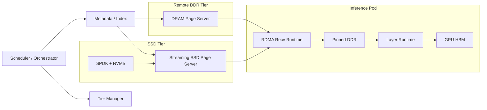

# KVCache 软硬件设计简化版

## 1. 这份简化版看什么

这份文档是完整版 [kvcache-soft-hardware-design-full.md](/Users/miaomili/Documents/AI_coding/docs/kvcache-design/kvcache-soft-hardware-design-full.md) 的压缩版，只保留：

- 推导的核心逻辑
- 最关键的参数假设
- 对硬件和软件架构最有影响的结论
- 一版可落地的参考架构与 IO 流

如果只想快速理解“为什么 KVCache 不能按传统缓存/存储来设计”，看这份就够了。

## 2. 问题定义

KVCache 系统的目标不是单纯提高命中率，而是：

`在算力、内存、SSD、网络和时延约束下，通过分层保留和快速搬运高价值 KV 对象，实现系统推理效率最大化。`

后续所有判断都围绕这 3 个命中率指标：

- `理论可复用率`
- `存储可命中率`
- `有效命中率`

在 agent，尤其是 coding-agent 场景下，真正重要的不是“缓存能不能命中”，而是：

- 命中是否发生在来得及消费的窗口内
- 命中后节省的 prefill 是否大于搬运成本
- 是否把端到端收益真正转化成 TTFT/吞吐改善

## 3. 研究范围与关键假设

### 3.1 业务场景

当前重点只看 `coding-agent`：

- 上下文档位：`25K / 50K / 100K / 150K / 200K`
- 目标有效命中率：`h_eff = 0.90`
- 推荐 TTL：
  - `TTL_hot = 60s`
  - `TTL_cold = 15min`

### 3.2 模型口径

| 模型 | 结构 | FP8 单 token KV |
|---|---|---:|
| Kimi K2.5 | MLA | `39.1 KiB` |
| MiniMax M2.5 | GQA | `124.0 KiB` |

### 3.3 推理节点口径

| 节点 | 规划 prefill 吞吐 |
|---|---:|
| H20 x 8 | `15k tok/s` |
| H200 x 8 | `28k tok/s` |
| GB200 x 8 | `50k tok/s` |

## 4. 推导的核心逻辑

### 4.1 为什么性能越高，带宽和容量都会变大

更快的推理节点意味着：

- 单位时间完成更多 agent step
- 单位时间进入热层/冷层的 session 更多
- 在 TTL 不变时，驻留 session 数上升
- 同时命中的 KV 也要更快地搬回本地

所以：

- `带宽` 主要由 `R_eff` 和 `h_eff` 驱动
- `容量` 同时受 `R_eff`、`TTL`、`L_hot/L_cold` 驱动

### 4.2 最关键的两个公式

读带宽下界：

```text
BW_read_hide = (h_eff / (1 - h_eff)) * R_eff * B_tok
```

性能驱动容量：

```text
M_step = (1 - h_eff) * L_step
lambda_step = R_eff / M_step

Cap_hot  = lambda_step * TTL_hot  * L_hot  * B_tok
Cap_cold = lambda_step * TTL_cold * L_cold * B_tok
```

这 2 个公式说明：

- 更快的推理卡不只提高带宽压力，也会提高容量压力
- 高命中率会显著降低重算，但会明显提高前台读带宽要求

## 5. 硬件结论

### 5.1 推理节点自带 DDR 是热层主体

对 `500 台` 推理节点：

- 每台约 `2TB gross DDR`
- 规划按 `1.2-1.5TB effective`
- 池化后本身就是热层主体

所以专用 DDR 节点不是替代推理节点本地 DDR，而是：

- 补热点溢出
- 吸收不均衡
- 解决 `MiniMax + H200/GB200` 这类重场景

### 5.2 SSD 节点不能乱配

在主流 `2U 2P` 服务器里，SSD 节点不能按“8 张高速 NIC”去设计。  
当前更现实的口径是：

- `4 x 400G NIC`
- `16 x NVMe`
- `512GB-1TB DDR`

推荐两档：

| 配置 | 节点服务能力 | 有效容量 |
|---|---:|---:|
| `SSD-48` | `48 GB/s` 读，`16 GB/s` 写 | `350TB` |
| `SSD-64` | `64 GB/s` 读，`20 GB/s` 写 | `700TB` |

### 5.3 硬件 sizing 必须双约束

不能只按容量设计，必须按：

```text
N_final = max(容量下限, 读带宽下限, 写带宽下限)
```

对 `MiniMax + H200/GB200`，很多场景已经是“容量 + 带宽”双约束，而不是单纯拼大 SSD。

## 6. 软件结论

### 6.1 为什么不能直接拿 Ceph 或 Alluxio 改一改

`Ceph` 的目标是：

- 持久化
- 恢复
- 容灾
- 通用对象/块/文件语义

它更适合作为：

- 超冷层
- 通用存储底座

而不是在线 KVCache 的前台数据面。

`Alluxio` 更像缓存层，但它的重点是：

- 统一命名空间
- 通用 tiered cache
- 上层计算框架加速

它能借鉴分层思路，但也没有把：

- pinned DDR
- HBM 协同
- copy budget
- NUMA 带宽

作为第一约束。

### 6.2 软件的一等指标：不是只有 hit rate

除了命中率，KVCache 还必须盯住：

```text
A_mem = host-side memory traffic / useful payload traffic
```

如果 `A_mem` 太高，即使命中率高，系统也会先被 DDR 带宽打爆。

## 7. RDMA + SPDK 下的核心结论

本设计默认：

- 网络全走 `RDMA`
- SSD 全走 `SPDK`
- 但仍然经过 `host pinned DDR`
- 不假设 `NVMe -> NIC` P2P，也不假设 `NIC -> HBM` 直写

在这个前提下，端到端内存放大下界仍然是：

| 路径 | 端到端 `A_mem` 下界 |
|---|---:|
| `remote DDR hit` | `3x` |
| `SSD hit` | `4x` |

如果接收端或发送端多一次 host copy，很快会变成：

- `remote DDR hit = 5x-7x`
- `SSD hit = 6x-8x`

这说明：

`RDMA + SPDK 只能去掉协议栈额外 copy，不能消灭 DMA 和 host staging 本身。`

## 8. 4 x 400G 为什么会逼出内存通道约束

`4 x 400G` 单方向 payload 约为：

```text
200 GB/s
```

对应的 host memory bandwidth 需求大致是：

| 路径 | `A_mem` | 需要的 host DDR 带宽 |
|---|---:|---:|
| `DRAM-first` 理想发送 | `1x` | `200 GB/s` |
| `SSD-dense` / 推理接收 理想路径 | `2x` | `400 GB/s` |
| 一次额外 host copy | `4x` | `800 GB/s` |
| 两次额外 host copy | `6x` | `1.2 TB/s` |

因此：

- `16 channels total` 的双路平台对 `A_mem=4` 已经很紧
- `24 channels total` 才比较适合 `4 x 400G + A_mem≈4`

## 9. 参考架构与 IO 流

### 9.1 架构图



### 9.2 三条关键 IO 流

`remote DDR hit`

```text
metadata -> select DRAM shard
-> RDMA page read -> local pinned DDR
-> layer runtime -> HBM
-> prefill/decode consume
```

`SSD hit`

```text
metadata -> select SSD shard
-> SPDK read into registered send buffer
-> RDMA send -> local pinned DDR
-> layer runtime -> HBM
-> prefill/decode consume
```

`miss / write-back`

```text
recompute miss suffix
-> local HBM / DDR
-> admission decision
-> keep in DDR / promote / demote
```

## 10. 关键结论

- 推理节点性能越高，前台 page-wise 带宽和驻留容量都会一起上升
- 推理节点本地 DDR 是热层主体，远端 DDR 是主补充，SSD 是冷层和 fallback
- SSD 节点应按 `4 x 400G + 16 x NVMe` 这类现实 `2U 2P` 形态设计
- `Ceph` 适合超冷层，`Alluxio` 适合借鉴思路，但都不是直接可用的 KVCache 前台架构
- 即使 `RDMA + SPDK` 全开，端到端 `A_mem` 下界仍是：
  - `remote DDR hit = 3x`
  - `SSD hit = 4x`
- 软件架构的核心不是“更多特性”，而是：
  - 固定 page 布局
  - 预注册 pinned buffer
  - `page-wise` 与 `layer-wise` 解耦
  - `copy budget` 成为一等指标
