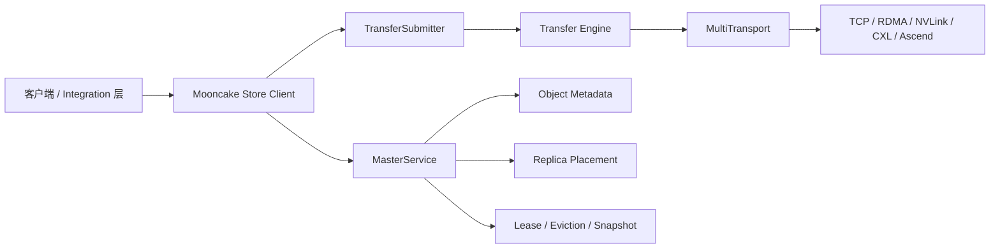
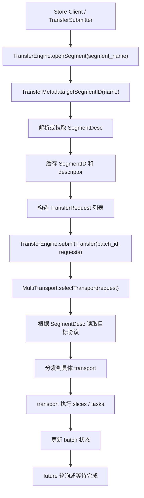
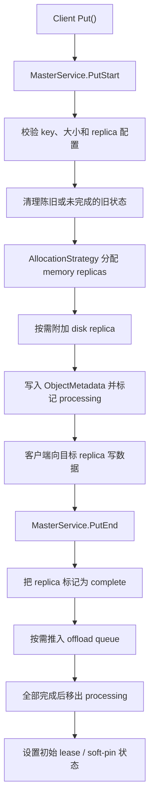

# Mooncake 仓库分析

分析日期：`2026-03-04`

源码来源：

- 仓库地址：`https://github.com/kvcache-ai/Mooncake`
- 本地路径：`/Users/miaomili/Documents/Playground/Mooncake`
- 分支：`main`
- 提交：`a402dc7`

## 范围

这份文档用于持久化前面对 Mooncake 的静态分析，重点放在：

- 仓库整体架构
- `Transfer Engine` 的职责和调用路径
- `MasterService` 的控制面状态流

这份分析基于源码阅读，不包含在当前 macOS 机器上的完整 Linux 构建或运行验证。

## 整体定位

Mooncake 不是单一应用仓库，而是一个围绕解耦式 LLM KVCache Serving 构建的系统仓库。

顶层模块可以先这样理解：

- `mooncake-transfer-engine/`：统一的数据传输抽象，负责跨主机、跨设备、跨内存域搬运数据
- `mooncake-store/`：分布式 KV / object store，负责 metadata、replica 分配、lease、eviction 和 offload
- `mooncake-integration/`：Python bindings 和上层集成入口
- `mooncake-wheel/`：Python 打包和 CLI 封装
- `docs/`、`paper/`、`trace/`、`deploy/`：运维、论文、追踪数据和部署相关材料

几个关键工程特征：

- 代码主体是 C++ 系统代码，Python 主要用于 bindings、打包和编排
- 运行模型明显偏 Linux-first，面向 RDMA / GPU / NPU 生产环境
- store 层和 transport 层边界清楚，控制面负责“放哪里”，数据面负责“怎么搬”

## 构建与运行特征

从仓库结构和构建文件能直接看出：

- 顶层构建入口是 `CMakeLists.txt`
- 默认功能开关集中在 `mooncake-common/common.cmake`
- Python 打包入口在 `mooncake-wheel/pyproject.toml`
- 集成测试编排在 `scripts/run_tests.sh`

实际含义是：

- 最小可行路径更像是 `TCP + HTTP metadata`
- 更高性能的路径再按构建选项打开 RDMA、EFA、NVLink、CXL、Ascend
- 在当前本地 macOS 机器上不适合做完整运行验证

## 架构总览

最核心的分层是：

- `MasterService` 决定对象应该放在哪、什么时候可读、什么时候可被淘汰
- `TransferSubmitter` 和 `Transfer Engine` 决定字节实际如何移动

## 建议先读的源码入口

如果第一次读仓库，建议先看这些文件：

- `mooncake-transfer-engine/include/transfer_engine.h`
- `mooncake-transfer-engine/src/transfer_engine_impl.cpp`
- `mooncake-transfer-engine/src/multi_transport.cpp`
- `mooncake-transfer-engine/include/transfer_metadata.h`
- `mooncake-store/include/master_service.h`
- `mooncake-store/src/master_service.cpp`
- `mooncake-store/src/client_service.cpp`
- `mooncake-store/include/transfer_task.h`
- `mooncake-store/src/transfer_task.cpp`

## `Transfer Engine` 深入分析

### 核心抽象

`TransferEngine` 本身是一个比较薄的 facade，主要状态和行为分散在下面几个对象里：

- `TransferMetadata`：segment 和 endpoint 的 metadata 目录
- `MultiTransport`：按协议路由并批量调度传输请求
- 具体 transport：`tcp`、`rdma`、`nvlink`、`cxl`、`ascend` 等

从职责上看，`TransferEngine` 实际管理的是：

- segment 发现
- 本地内存注册
- batch 化传输提交
- 按目标 segment protocol 选择 transport
- 完成态聚合

### 传输主路径

### 关键判断

1. `openSegment` 在大多数协议下更像 metadata 解析，不是真正建立网络连接。
2. 路由依据是 `SegmentDesc.protocol`，不是调用方主动指定某个 transport。
3. 本地内存注册会广播到所有已安装的 transport，而不是只绑定一个后端。
4. 这套设计以 batch 和 slice 为核心，不是“一次调用搬一段内存”的简单抽象。

### 重要内部角色

`TransferMetadata`

- 负责解析 `segment_name -> SegmentID`
- 负责解析 `SegmentID -> SegmentDesc`
- 负责 cache 填充、metadata 同步和 handshake 交换

`MultiTransport`

- 负责分配 `BatchDesc`
- 负责按 transport 分组请求
- 负责提交 transport-specific task list
- 负责把 slice 级完成态聚合成 batch 状态

### 这层设计的价值

这也是 Mooncake 很适合做 vLLM、SGLang 之类系统底层 transport backend 的原因。上层只描述“我要搬数据”，不需要把 RDMA / TCP / NVLink 的判断逻辑硬编码进去。

## `MasterService` 深入分析

### 核心抽象

`MasterService` 是主要的控制面协调器，负责对象生命周期和集群状态。它覆盖的职责包括：

- segment mount / unmount
- object metadata
- replica 分配与完成态跟踪
- lease / TTL 管理
- eviction 触发与执行
- snapshot / restore
- 过期或异常状态的后台清理

### 写入路径：`PutStart` 与 `PutEnd`

这里最值得记住的几点是：

- `PutStart` 返回的是目标 replica descriptor，不是数据本身
- 分配失败会通过 `need_eviction_` 把压力传给 eviction 线程
- `PutEnd` 才是对象完成可见的关键控制点

### 读路径与 lease

`GetReplicaList()` 会返回已经完成的 replica，并在读路径上授予 lease。

这意味着：

- 对象刚写完时不一定持有一个长期 lease
- 真正发生读取时，lease 才会刷新或授予
- eviction 会尽量避开 lease 尚未过期的对象

### eviction 模型

eviction 在后台线程里执行，常见触发条件是：

- 全局内存使用率过高
- `need_eviction_` 之类的显式压力标志被置位

实际策略可以概括成：

1. 优先淘汰 lease 已过期的 memory replica
2. 要求 `refcnt == 0`
3. 先避开 soft-pinned 对象
4. 只有配置允许时，才会进一步淘汰 soft-pinned 对象

很重要的一点：

- eviction 主要删除的是 memory replica
- 如果对象还有有效 replica，object metadata 本身可以继续保留

这比“直接删除整个对象”更精细。

### snapshot 与 restore

snapshot 的工作方式很像数据库：

- snapshot 线程周期性唤醒
- 通过 `fork()` 拉起子进程
- 子进程序列化并持久化状态
- 父进程继续提供服务并监控子进程

持久化的核心状态包括：

- metadata
- segments
- task manager state
- 指向最新快照的 manifest / marker 文件

restore 的策略比较保守：

- 校验 `latest.txt`
- 校验 manifest 和 serializer version
- 再恢复 metadata、segments 和 task manager state
- 快照异常或版本不兼容时直接安全回退

### 为什么 `MasterService` 是维护难点

`MasterService` 是仓库里状态最密、并发路径最多的部分。后台线程、lease、replication、eviction、snapshot 都交汇在这里，所以大多数正确性风险和可运维性风险都集中在它身上。

## `Store` 与 `Transport` 的关系

最清晰的理解方式是：

- `MasterService` 决定数据应该放在哪，以及当前是否允许读取或淘汰
- `Client` 和 `TransferSubmitter` 把这些决策翻译成具体的数据移动操作
- `Transfer Engine` 再决定最终由哪个 transport backend 执行

这层分界是整个仓库最强的架构优点之一。

## 建议阅读顺序

如果你的目标是尽快建立“能改代码”的理解，建议按这个顺序读：

1. `mooncake-store/src/client_service.cpp`
2. `mooncake-store/src/transfer_task.cpp`
3. `mooncake-transfer-engine/src/transfer_engine_impl.cpp`
4. `mooncake-transfer-engine/src/multi_transport.cpp`
5. `mooncake-store/include/master_service.h`
6. `mooncake-store/src/master_service.cpp`

## 工程判断

优点：

- 控制面和数据面边界清楚
- transport abstraction 复用性强，也便于扩展
- read / write / eviction / snapshot 流程体现了成熟的系统设计思路
- 上层可以统一消费 future，而不用直接处理 transport-specific 细节

复杂热点：

- `MasterService` 的状态和并发责任太重
- 构建行为强依赖 compile-time switch 和运行环境
- `openSegment` 名字容易让人误解，因为它常常只是 metadata 解析
- 基于 `fork()` 的 snapshot 很高效，但调试和排障成本偏高

## 后续分析方向

自然的下一步包括：

1. 把 `Client::Put/Get -> TransferSubmitter -> Transfer Engine` 画成更细的时序图。
2. 拆开 `MasterService` 的内部数据结构，比如 metadata shards、processing keys、task queues、discarded replicas。
3. 单独评估 Mooncake 哪些子集适合本地测试，哪些必须放到 Linux 服务器验证。

## 相关文档

- `docs/mooncake-transfer-paths.md`：更细的 `Client::Put/Get -> TransferSubmitter -> Transfer Engine` 路径分析
- `docs/mooncake-masterservice-structures.md`：`MasterService` 内部状态容器和生命周期分析
- `docs/mooncake-local-build-assessment.md`：基于当前 macOS 机器的本地可编译性评估
