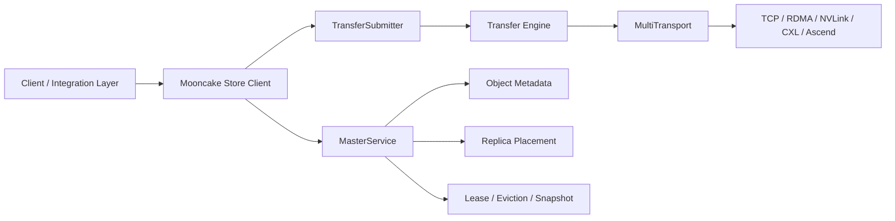
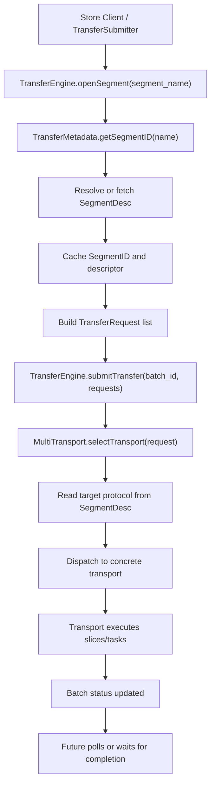
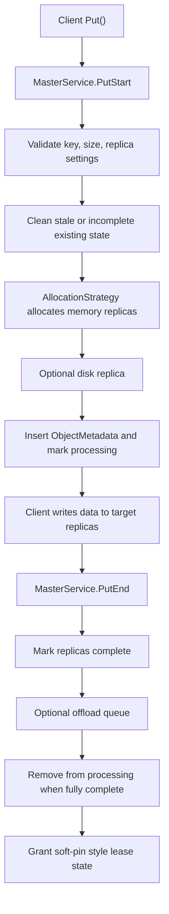

# Mooncake Repository Analysis

Analysis date: 2026-03-04

Source repository:

- URL: `https://github.com/kvcache-ai/Mooncake`
- Local checkout: `/Users/miaomili/Documents/Playground/Mooncake`
- Branch: `main`
- Commit: `a402dc7`

## Scope

This note persists the earlier static analysis of Mooncake, with emphasis on:

- overall repository architecture
- `Transfer Engine` responsibilities and calling path
- `MasterService` control-plane state flow

The analysis is based on source reading only. It does not include a full Linux build or runtime validation on the current macOS machine.

## High-Level View

Mooncake is not a single application. It is a systems repository centered on disaggregated LLM KVCache serving.

The top-level shape is:

- `mooncake-transfer-engine/`: unified transport abstraction for moving data across hosts, devices, and memory domains
- `mooncake-store/`: distributed KV/object store for metadata, replica placement, leases, eviction, and offload
- `mooncake-integration/`: Python bindings and integration surface
- `mooncake-wheel/`: Python packaging and CLI wrapping
- `docs/`, `paper/`, `trace/`, `deploy/`: supporting material for operations, research, and deployment

Key engineering characteristic:

- The codebase is primarily C++ systems code, with Python used for bindings, packaging, and orchestration.
- The runtime model is Linux-first and oriented toward RDMA/GPU/NPU production environments.
- The store and transport layers are clearly separated: control plane decides placement, data plane performs movement.

## Build and Runtime Notes

Observed from the repository structure and build files:

- top-level build starts from `CMakeLists.txt`
- default feature switches are defined in `mooncake-common/common.cmake`
- Python packaging is driven from `mooncake-wheel/pyproject.toml`
- integration tests are orchestrated by `scripts/run_tests.sh`

Practical implication:

- The smallest runnable path appears to be `TCP + HTTP metadata`.
- High-performance paths add RDMA, EFA, NVLink, CXL, or Ascend depending on build flags and environment.
- Full validation is not realistic on the current local macOS host.

## Architecture Summary

Control-plane/data-plane split:

- `MasterService` decides where an object should live and whether it can be read or evicted.
- `TransferSubmitter` and `Transfer Engine` decide how bytes actually move.

## Core Source Map

Repository entry points worth reading first:

- `mooncake-transfer-engine/include/transfer_engine.h`
- `mooncake-transfer-engine/src/transfer_engine_impl.cpp`
- `mooncake-transfer-engine/src/multi_transport.cpp`
- `mooncake-transfer-engine/include/transfer_metadata.h`
- `mooncake-store/include/master_service.h`
- `mooncake-store/src/master_service.cpp`
- `mooncake-store/src/client_service.cpp`
- `mooncake-store/include/transfer_task.h`
- `mooncake-store/src/transfer_task.cpp`

## Transfer Engine Deep Dive

### Main abstraction

`TransferEngine` is a thin facade. Most state and behavior live in the implementation and supporting objects:

- `TransferMetadata`: segment and endpoint metadata directory
- `MultiTransport`: protocol-aware router and batch scheduler
- concrete transports: `tcp`, `rdma`, `nvlink`, `cxl`, `ascend`, and others when enabled

What the engine really manages:

- segment discovery
- local memory registration
- batch-based transfer submission
- transport selection based on target segment protocol
- completion aggregation

### Transfer path

### Key observations

1. `openSegment` is often metadata resolution, not a real network connection.
2. Routing is driven by `SegmentDesc.protocol`, not by the caller's preference.
3. Local memory registration fans out across all installed transports.
4. The engine is designed around batches and slices rather than one-call-per-copy semantics.

### Important internal roles

`TransferMetadata`

- resolves `segment_name -> SegmentID`
- resolves `SegmentID -> SegmentDesc`
- supports cache population, metadata sync, and handshake-based exchange

`MultiTransport`

- allocates `BatchDesc`
- groups requests by transport
- submits transport-specific task lists
- aggregates per-slice completion into batch status

### Why this matters

The design makes Mooncake suitable as a transport backend for systems such as vLLM or SGLang. The upper layer can ask for memory movement without hard-coding RDMA/TCP/NVLink behavior.

## MasterService Deep Dive

### Main abstraction

`MasterService` is the main control-plane coordinator for object lifecycle and cluster state. It is responsible for:

- segment mount and unmount
- object metadata
- replica allocation and completion tracking
- lease and TTL handling
- eviction triggers
- snapshot and restore
- background cleanup for stale or discarded state

### Write path: `PutStart` and `PutEnd`

Observed behavior:

- `PutStart` returns target replica descriptors, not the data transfer itself.
- allocation failure can raise eviction pressure through `need_eviction_`.
- `PutEnd` finalizes replica state and prepares the object for later reads.

### Read path and lease behavior

`GetReplicaList()` returns completed replicas and grants a lease on read.

Important behavior:

- newly written objects do not necessarily hold an active long lease
- reads refresh or assign lease state
- eviction logic avoids objects whose lease has not expired

### Eviction model

Eviction runs in background threads and is triggered by:

- high memory usage
- explicit eviction pressure flags such as `need_eviction_`

The practical policy is:

1. prefer evicting completed memory replicas whose lease has expired
2. require `refcnt == 0`
3. avoid soft-pinned objects first
4. only evict soft-pinned objects when configuration allows it

Important design point:

- eviction primarily removes memory replicas
- object metadata can survive if valid replicas still exist

This is more precise than deleting whole objects aggressively.

### Snapshot and restore

Snapshot behavior follows a database-like pattern:

- periodic snapshot thread wakes up
- `fork()` creates a child process
- the child serializes and persists state
- the parent continues serving and monitors the child

Persisted state includes:

- metadata
- segments
- task manager state
- manifest files used to locate the latest snapshot

Restore behavior is conservative:

- validate `latest.txt`
- validate manifest and serializer version
- load metadata, segments, and task manager state
- fall back safely if the snapshot is invalid or incompatible

### Why this matters

`MasterService` is the densest maintenance surface in the repository. It owns many background threads and intertwined states, so most correctness and operability risk is concentrated here.

## Relationship Between Store and Transport

The cleanest way to think about the system is:

- `MasterService` decides where data should live and whether it is valid to read or evict.
- `Client` and `TransferSubmitter` translate those decisions into concrete movement operations.
- `Transfer Engine` chooses the actual transport implementation.

This layered split is the repository's strongest architectural property.

## Suggested Reading Order

If the goal is to understand the code quickly, read in this order:

1. `mooncake-store/src/client_service.cpp`
2. `mooncake-store/src/transfer_task.cpp`
3. `mooncake-transfer-engine/src/transfer_engine_impl.cpp`
4. `mooncake-transfer-engine/src/multi_transport.cpp`
5. `mooncake-store/include/master_service.h`
6. `mooncake-store/src/master_service.cpp`

## Engineering Judgment

Strengths:

- clear split between control plane and data plane
- transport abstraction is reusable and extensible
- read/write/eviction/snapshot flows show mature systems thinking
- upper layers can consume futures instead of transport-specific code

Complexity hotspots:

- `MasterService` owns too much state and concurrency
- build behavior depends heavily on compile-time switches and environment
- `openSegment` can be misunderstood because it is often metadata work, not socket-style connection setup
- `fork()`-based snapshotting is efficient, but harder to debug than simpler synchronous designs

## Follow-Up Directions

Natural next analysis tasks:

1. Draw a finer-grained sequence diagram for `Client::Put/Get -> TransferSubmitter -> Transfer Engine`.
2. Map `MasterService` internal data structures such as metadata shards, processing keys, task queues, and discarded replicas.
3. Evaluate which subset of Mooncake can be built or tested locally versus requiring a Linux server.
