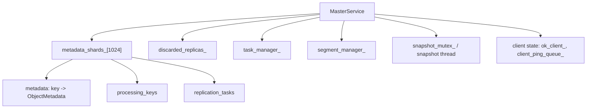
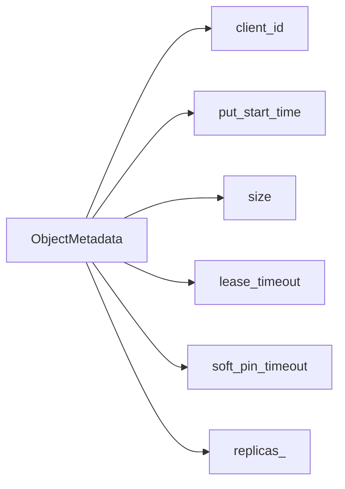
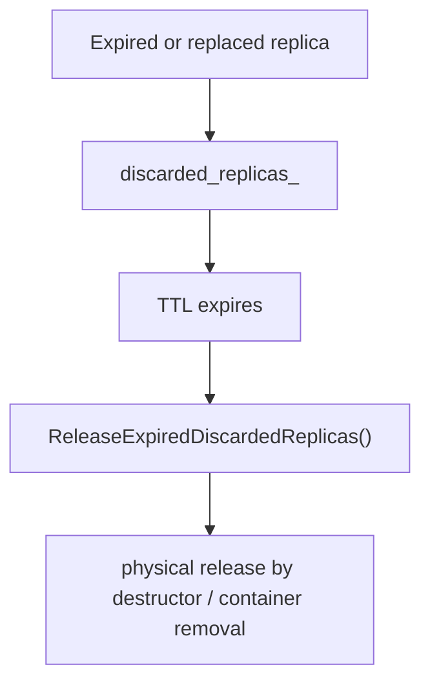
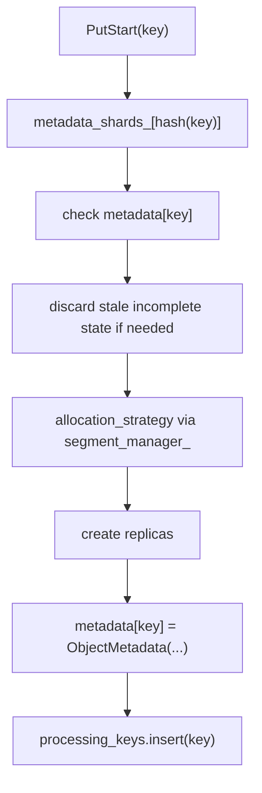
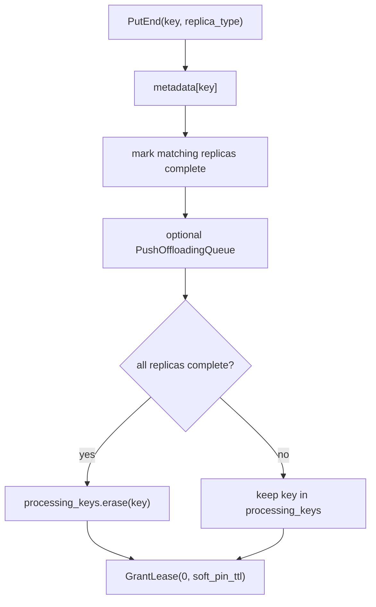
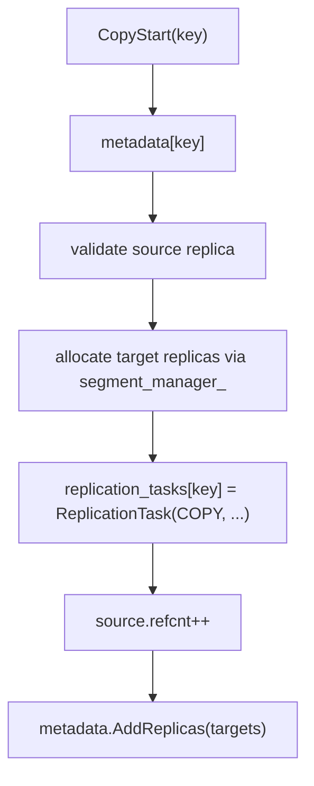
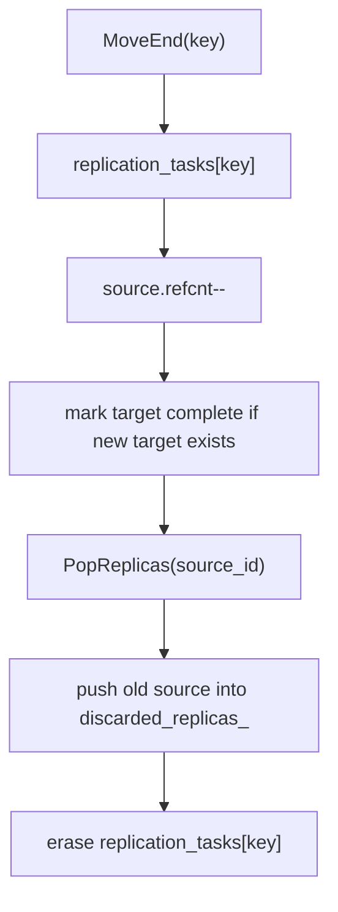

# Mooncake MasterService Data Structures

Analysis date: 2026-03-04

Source repository:

- URL: `https://github.com/kvcache-ai/Mooncake`
- Local checkout: `/Users/miaomili/Documents/Playground/Mooncake`
- Branch: `main`
- Commit: `a402dc7`

## Scope

This note focuses on the internal state containers of `MasterService` and how they interact during:

- `PutStart` / `PutEnd`
- `CopyStart` / `CopyEnd`
- `MoveStart` / `MoveEnd`
- eviction and stale cleanup
- snapshot and restore

It complements `docs/mooncake-analysis.md`.

## Locking Model

The header documents a lock order:

1. `client_mutex_`
2. `metadata_shards_[shard_idx].mutex`
3. `segment_mutex_`

There is also a repository-wide `snapshot_mutex_` that gates snapshot consistency and restore.

Practical implication:

- most object lifecycle logic is shard-local
- snapshot adds a global coordination point around persistence

## Top-Level State Map

The design separates state by purpose:

- object lifecycle state lives in shard-local structures
- delayed free state lives in `discarded_replicas_`
- cross-client background work lives in `task_manager_`
- physical capacity and handles live in `segment_manager_`

## `metadata_shards_`

`MasterService` uses `1024` metadata shards.

Each `MetadataShard` contains:

- `metadata`: `key -> ObjectMetadata`
- `processing_keys`: keys still in incomplete `PutStart` state
- `replication_tasks`: keys with active copy or move work

Why this matters:

- read/write contention is spread across shards by key hash
- the store tracks object existence, incomplete writes, and background replication separately

## `ObjectMetadata`

`ObjectMetadata` is the main per-key state record. Its core fields are:

- `client_id`: owner of the original put
- `put_start_time`: used for stale write cleanup
- `size`: logical value size
- `lease_timeout`: hard lease deadline
- `soft_pin_timeout`: optional soft-retention deadline
- `replicas_`: the actual replica list

`ObjectMetadata` is not just passive storage. It also owns helper logic:

- add or remove replicas
- visit replicas by predicate
- count or find replicas
- grant leases
- check lease expiry
- check soft-pin status
- validate whether the object still has at least one usable replica

That makes it the central lifecycle state machine for each key.

## Replica-Related State

The object does not split memory and disk state into separate top-level maps. Instead, all replica types coexist inside `ObjectMetadata.replicas_`.

Consequences:

- `PutEnd` can mark all memory replicas complete by iterating the same vector
- disk eviction and memory eviction remove subsets of the same vector
- `CopyStart` and `MoveStart` append newly allocated replicas into the same object record

This keeps the key-level state compact, but it also means many operations mutate the same vector under the shard lock.

## `processing_keys`

`processing_keys` is the set of keys whose object creation is still incomplete.

Typical lifecycle:

1. `PutStart` inserts metadata and also inserts the key into `processing_keys`
2. `PutEnd` removes the key when all replicas are complete
3. timeout cleanup scans `processing_keys` and discards stale processing replicas

What it represents:

- an object that exists in metadata but is not yet considered fully stable

This is why `processing_keys` is separate from `metadata`:

- a key can exist, but still require timeout monitoring

## `replication_tasks`

`replication_tasks` stores active copy or move work keyed by object key.

Each `ReplicationTask` contains:

- `client_id`
- `start_time`
- `type`: `COPY` or `MOVE`
- `source_id`
- `replica_ids`: allocated target replicas

This map is the control-plane state for copy and move operations.

Important behavior:

- `CopyStart` or `MoveStart` inserts a task
- source replica `refcnt` is incremented to make eviction unsafe while transfer is running
- `CopyEnd` / `MoveEnd` mark target replicas complete and erase the task
- revoke or timeout drops target replicas and clears the task

## `discarded_replicas_`

`discarded_replicas_` is a delayed-release list protected by its own mutex.

It exists to hold replicas that should no longer be logically visible but should not be released immediately.

Typical producers:

- expired `PutStart` operations
- expired copy or move tasks
- `MoveEnd`, when the old source replica is retired after a successful move

Why it exists:

- it records discard/release metrics
- it decouples logical invalidation from physical memory release
- it gives the system a safe delayed cleanup path

## `task_manager_`

`task_manager_` is distinct from `replication_tasks`.

Difference in role:

- `replication_tasks`: object-local copy/move state stored inside the metadata shard
- `task_manager_`: client task distribution and completion tracking for higher-level scheduled work

This distinction matters because otherwise the names are easy to confuse. One is shard-local object state, the other is a broader work queue and assignment subsystem.

## `segment_manager_`

`segment_manager_` is not object metadata, but it is tightly coupled to lifecycle changes.

It provides:

- allocator access
- segment mount/unmount state
- local disk segment access
- the physical capacity layer used by allocation strategy and offload plumbing

`PutStart`, `CopyStart`, and `MoveStart` all cross into allocator state through `segment_manager_`.

## Accessor Types

The code wraps shard access in helper types:

- `MetadataShardAccessorRW`
- `MetadataShardAccessorRO`
- `MetadataAccessorRW`
- `MetadataAccessorRO`

These helpers matter because they bundle:

- shard lookup by hashed key
- lock acquisition
- lookup of `metadata`
- lookup of `processing_keys`
- lookup of `replication_tasks`
- stale-handle cleanup on mutable access

This is a meaningful design choice: the code tries to make “open a key for mutation” a higher-level operation than raw map access.

## How the Structures Interact

### `PutStart`

State effect:

- create `ObjectMetadata`
- add processing marker
- optionally enqueue stale earlier replicas into `discarded_replicas_`

### `PutEnd`

State effect:

- transition replica status inside `ObjectMetadata`
- possibly remove the processing marker
- initialize lease / soft-pin timing for completed object

### `CopyStart`

State effect:

- object remains the same logical key
- target replicas are appended before transfer completes
- replication task records which new replica IDs belong to the in-flight copy

### `MoveEnd`

State effect:

- the object migrates to a new replica set
- the old source is not immediately freed; it enters delayed discard

## Eviction and Cleanup

Two different cleanup paths operate on different containers.

### Lease-driven eviction

`BatchEvict(...)` focuses on objects that:

- have expired lease
- have memory replicas
- have `refcnt == 0`

This path mainly mutates `ObjectMetadata.replicas_`.

### Timeout cleanup

`DiscardExpiredProcessingReplicas(...)` scans:

- `processing_keys`
- `replication_tasks`

and moves abandoned replicas into `discarded_replicas_`.

This is the path that cleans up unfinished `PutStart`, `CopyStart`, and `MoveStart`.

## Snapshot and Restore Impact

Snapshot serialization persists more than just object metadata.

Persisted logical state includes:

- shard metadata
- discarded replicas
- segments
- task manager state

This is important because restore must reconstruct both:

- what objects and replicas exist
- what deferred cleanup or scheduled work still exists

Practical takeaway:

- `metadata_shards_` alone is not enough to restore the master correctly
- `discarded_replicas_` and `task_manager_` are first-class persisted state

## Design Assessment

The strongest part of the design is that object state is grouped by key and shard, while delayed release and distributed task assignment are pulled into separate containers.

The main complexity comes from the number of partially overlapping lifecycle states:

- object exists in `metadata`
- object is also in `processing_keys`
- object also has `replication_tasks`
- some of its old replicas may already live in `discarded_replicas_`

That overlap is manageable, but it explains why `MasterService` is the hardest part of the repository to modify safely.

## Where to Read Next

If the goal is to change internals safely, the most useful files are:

1. `mooncake-store/include/master_service.h`
2. `mooncake-store/src/master_service.cpp`
3. `mooncake-store/include/replica.h`
4. `mooncake-store/include/task_manager.h`
