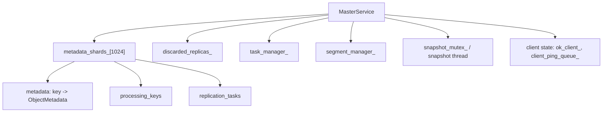
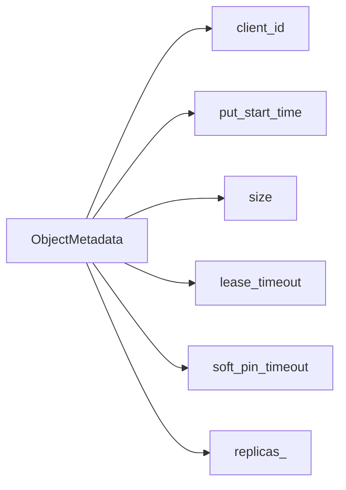
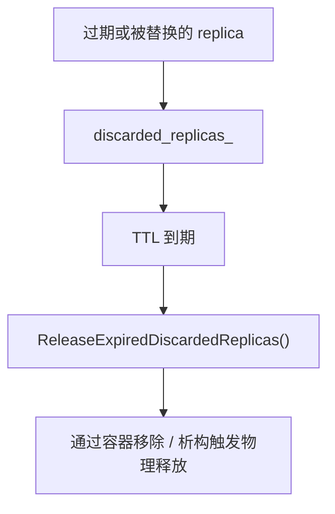
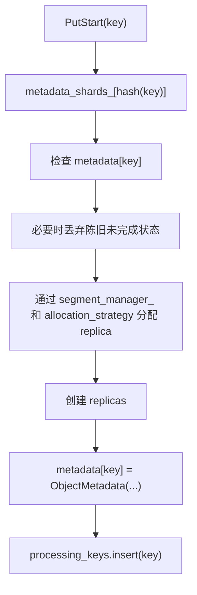
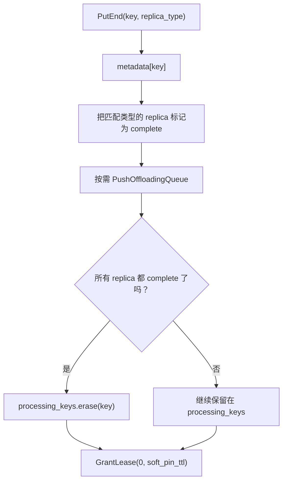
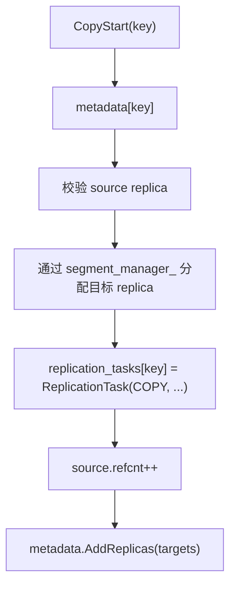
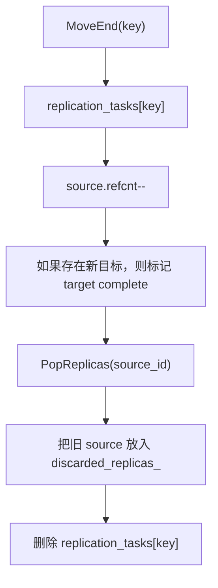

# Mooncake `MasterService` 数据结构分析

分析日期：`2026-03-04`

源码来源：

- 仓库地址：`https://github.com/kvcache-ai/Mooncake`
- 本地路径：`/Users/miaomili/Documents/Playground/Mooncake`
- 分支：`main`
- 提交：`a402dc7`

## 范围

这份文档聚焦 `MasterService` 的内部状态容器，以及这些容器在下面几条路径里的关系：

- `PutStart` / `PutEnd`
- `CopyStart` / `CopyEnd`
- `MoveStart` / `MoveEnd`
- eviction 和 stale cleanup
- snapshot 和 restore

它是 `docs/mooncake-analysis.md` 的补充文档。

## 锁模型

头文件里明确写了锁顺序：

1. `client_mutex_`
2. `metadata_shards_[shard_idx].mutex`
3. `segment_mutex_`

除此之外，还有一个全局的 `snapshot_mutex_`，用于 snapshot 一致性和 restore 协调。

这意味着：

- 大部分对象生命周期逻辑是 shard-local 的
- snapshot 路径会额外引入全局协调点

## 顶层状态图

从职责上可以把它们分成几类：

- shard 内部状态：对象生命周期主状态
- `discarded_replicas_`：延迟释放队列
- `task_manager_`：面向 client 的任务分发和完成跟踪
- `segment_manager_`：物理容量、segment 和 allocator 状态

## `metadata_shards_`

`MasterService` 一共维护 `1024` 个 metadata shard。

每个 `MetadataShard` 里有三块核心状态：

- `metadata`：`key -> ObjectMetadata`
- `processing_keys`：处于未完成 `PutStart` 阶段的 key
- `replication_tasks`：正在执行 copy / move 的 key

这层设计的意义很直接：

- 用 key hash 做分片，降低读写锁竞争
- 把“对象存在”“对象还在写入”“对象有后台复制任务”这三类状态区分开来

## `ObjectMetadata`

`ObjectMetadata` 是单个 key 最核心的状态记录。核心字段包括：

- `client_id`：最初发起 put 的 owner
- `put_start_time`：用于清理过期写入
- `size`：对象逻辑大小
- `lease_timeout`：硬 lease 截止时间
- `soft_pin_timeout`：可选的 soft retention 时间
- `replicas_`：该对象当前持有的 replica 列表

`ObjectMetadata` 不是单纯的数据结构，它还内置了一批操作：

- 增加或删除 replica
- 按 predicate 遍历 replica
- 统计 replica
- 查找特定 replica
- 授予 lease
- 判断 lease 是否过期
- 判断 soft-pin 是否还有效
- 判断对象是否仍然有至少一个有效 replica

所以从设计角度看，它本身就是每个 key 的生命周期状态机。

## replica 相关状态为什么集中在 `ObjectMetadata`

这里没有把 memory replica 和 disk replica 拆到不同的顶层 map，而是统一放在 `ObjectMetadata.replicas_` 里。

直接带来的结果是：

- `PutEnd` 可以直接在同一个 vector 上把 memory replica 标记为 complete
- disk eviction 和 memory eviction 都是在同一个 replica 集合里删子集
- `CopyStart` 和 `MoveStart` 会把新分配的目标 replica 追加到同一个对象记录里

优点是 key 级状态集中。代价是很多操作都要在 shard 锁下改同一个 replica vector。

## `processing_keys`

`processing_keys` 用来表示“对象已经进了 metadata，但创建流程还没完全结束”。

典型生命周期是：

1. `PutStart` 写入 metadata，并把 key 插入 `processing_keys`
2. `PutEnd` 在所有 replica 都 complete 后，把 key 从 `processing_keys` 移除
3. timeout cleanup 会扫描 `processing_keys`，清理长时间未完成的 processing replica

它存在的意义是：

- 一个对象可以“存在”
- 但仍然需要被单独监控，因为它还没完成

这就是为什么 `processing_keys` 不能被简单并入 `metadata`。

## `replication_tasks`

`replication_tasks` 存储 key 级别的 copy / move 进行中状态。

每个 `ReplicationTask` 里包含：

- `client_id`
- `start_time`
- `type`：`COPY` 或 `MOVE`
- `source_id`
- `replica_ids`：这次任务新申请到的目标 replica ID 列表

这张表的角色是“对象级 copy / move 控制面状态”。

它的典型行为是：

- `CopyStart` 或 `MoveStart` 插入任务
- source replica 的 `refcnt` 增加，防止任务进行时被 eviction
- `CopyEnd` / `MoveEnd` 把目标 replica 标成 complete，并删除任务
- revoke 或 timeout 会丢弃目标 replica 并清理任务

## `discarded_replicas_`

`discarded_replicas_` 是一个带独立 mutex 的延迟释放链表。

它承载的是这样一类 replica：

- 从逻辑上已经不应该再对外可见
- 但暂时不立即释放物理资源

常见生产来源：

- 过期的 `PutStart`
- 过期的 copy / move 任务
- `MoveEnd` 成功后被替换掉的旧 source replica

这个结构存在的原因有三点：

- 记录 discard / release 指标
- 把逻辑失效和物理释放解耦
- 提供一个更安全的延迟清理路径

## `task_manager_`

`task_manager_` 和 `replication_tasks` 不是同一层东西。

区别在于：

- `replication_tasks`：存储在 metadata shard 里的对象级 copy / move 状态
- `task_manager_`：更上层的 client task 分发、查询和完成跟踪

这两个名字很容易混，但职责完全不同。前者是对象局部状态，后者更像跨 client 的任务系统。

## `segment_manager_`

`segment_manager_` 虽然不直接存 object metadata，但和生命周期路径高度耦合。

它提供的核心能力包括：

- allocator access
- segment mount / unmount 状态
- local disk segment access
- allocation strategy 和 offload 所需的物理容量信息

`PutStart`、`CopyStart`、`MoveStart` 都会通过 `segment_manager_` 进入 allocator 状态。

## accessor 类型为什么重要

代码里没有直接到处手写“算 shard index + 上锁 + 查 map”，而是封装了几类 accessor：

- `MetadataShardAccessorRW`
- `MetadataShardAccessorRO`
- `MetadataAccessorRW`
- `MetadataAccessorRO`

这些 accessor 统一处理：

- 按 key hash 定位 shard
- 获取锁
- 读取 `metadata`
- 读取 `processing_keys`
- 读取 `replication_tasks`
- 在可写路径上顺带做 stale-handle cleanup

这是个重要的工程设计点：代码在试图把“打开一个 key 进行安全修改”提升成一个高层动作，而不是裸 map 操作。

## 这些结构如何协同

### `PutStart`

这一步带来的状态变化是：

- 创建 `ObjectMetadata`
- 增加 processing 标记
- 如果有陈旧旧状态，可能把旧 replica 放进 `discarded_replicas_`

### `PutEnd`

这一步的状态变化是：

- 更新 `ObjectMetadata` 内部 replica 状态
- 在全完成时移除 processing 标记
- 初始化对象完成后的 lease / soft-pin 时间

### `CopyStart`

这里最关键的状态变化是：

- 对象逻辑上还是同一个 key
- 目标 replica 会先被加进对象状态，再等待数据真正传过去
- `replication_tasks` 记录本次 copy 新增的 replica IDs

### `MoveEnd`

这一步带来的效果是：

- 对象完成迁移到新的 replica 集合
- 旧 source 不会立刻释放，而是进入延迟 discard 阶段

## eviction 与 cleanup 如何作用在这些结构上

这里实际上有两类清理路径，而且它们作用的容器不同。

### lease 驱动的 eviction

`BatchEvict(...)` 主要关注这些对象：

- lease 已过期
- 持有 memory replica
- `refcnt == 0`

这条路径主要修改的是 `ObjectMetadata.replicas_`。

### timeout 驱动的 cleanup

`DiscardExpiredProcessingReplicas(...)` 会扫描：

- `processing_keys`
- `replication_tasks`

然后把被放弃的 replica 移进 `discarded_replicas_`。

这条路径负责清理未完成的 `PutStart`、`CopyStart` 和 `MoveStart`。

## snapshot / restore 对状态结构的要求

snapshot 持久化的内容不只是 object metadata。

核心持久化状态包括：

- shard metadata
- `discarded_replicas_`
- segments
- `task_manager_`

这件事很重要，因为 restore 不只是要恢复“有哪些对象和 replica”，还要恢复：

- 哪些延迟释放状态还在
- 哪些任务系统状态还在

换句话说：

- 只恢复 `metadata_shards_` 并不足以正确恢复 master
- `discarded_replicas_` 和 `task_manager_` 也是一等持久化状态

## 设计判断

这套设计最强的地方在于：

- 对象状态按 key 和 shard 聚合
- 延迟释放和任务系统又被拆到独立容器里

最复杂的地方在于多个生命周期状态会同时叠加：

- 对象存在于 `metadata`
- 同时还在 `processing_keys`
- 还可能在 `replication_tasks` 中有进行中的 copy / move
- 某些旧 replica 又已经进入 `discarded_replicas_`

这种重叠并不是错误，但它解释了为什么 `MasterService` 是全仓库最难安全修改的部分。

## 如果继续深入，建议接着看

1. `mooncake-store/include/master_service.h`
2. `mooncake-store/src/master_service.cpp`
3. `mooncake-store/include/replica.h`
4. `mooncake-store/include/task_manager.h`
