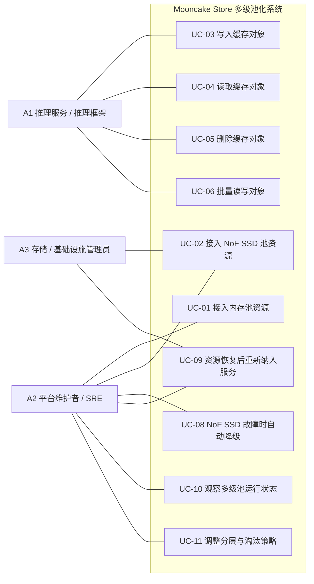

# Mooncake Store 多级池化需求分析（PRD）

## 1. 背景与问题

随着长上下文和高并发推理场景不断增加，KVCache 对容量的需求持续上升。仅依赖内存池的缓存方案成本高、容量扩展受限，容易在内存压力增大时引发缓存抖动、吞吐波动以及更频繁的缓存重建。

Mooncake Store 需要构建一套基于“内存池 + NoF SSD 池”的多级池化方案。该方案的核心目标是在控制成本的前提下扩展有效缓存容量，并在 SSD 层退化或故障时仍然保障推理服务连续运行。

## 2. 目标

- 在相同内存预算下扩大有效 KVCache 工作集。
- 通过引入 NoF SSD 层降低单位有效缓存容量成本。
- 减少因内存压力导致的缓存抖动，提升吞吐稳定性。
- 在 NoF 设备、target 或网络异常时保障推理服务继续可用。
- 提供可观测、可运维、可调优的多级池化能力。

## 3. 非目标

- 不追求数据库级强持久化或强一致性。
- 不要求在 NoF 层故障后完整恢复缓存数据。
- 不覆盖跨地域复制、归档存储或通用块存储能力。
- 不要求推理服务理解或手动控制底层分层策略。

## 4. 外部参与者

- **A1 推理服务 / 推理框架**
  通过统一缓存接口访问系统，关注容量、吞吐和透明分层能力。
- **A2 平台维护者 / SRE**
  负责部署、扩容、监控、调参和故障处理。
- **A3 存储 / 基础设施管理员**
  负责提供并维护 NoF SSD 资源及其接入条件。

## 5. 用例视图

### 5.1 用例图

### 5.2 用例关系

- `UC-03` 依赖 `UC-01`。
- 当 NoF SSD 层可用时，`UC-03` 扩展到 `UC-02`。
- `UC-04` 依赖 `UC-03` 成功完成对象放置。
- `UC-06` 是 `UC-03`、`UC-04` 和 `UC-05` 的批量化形态。
- `UC-08` 依赖 `UC-02` 中的 NoF SSD 资源接入。
- `UC-09` 是 `UC-08` 的恢复闭环。
- `UC-11` 依赖 `UC-10` 提供的可观测性。

### 5.3 详细用例

#### UC-01 接入内存池资源

- **主要参与者**：A2
- **目标**：将新的内存资源加入一级池。
- **触发条件**：新的缓存节点上线或节点重启恢复。
- **前置条件**：
  - 节点已部署完成。
  - 内存资源可被注册。
- **主成功场景**：
  1. 平台维护者启动缓存节点。
  2. 节点向系统注册可用内存资源。
  3. 系统校验资源信息。
  4. 系统将资源加入内存池。
  5. 新对象可被放置到新接入的内存资源上。
- **异常/替代流**：
  - 资源信息非法，接入被拒绝。
  - 重复注册时按幂等处理。
  - 不健康资源不进入可分配集合。
- **后置条件**：
  - 内存资源被接纳或被明确拒绝。
- **质量要求**：
  - 接入过程必须幂等。
  - 接入失败不得影响现有服务。

#### UC-02 接入 NoF SSD 池资源

- **主要参与者**：A2、A3
- **目标**：将新的 NoF SSD 资源加入二级池。
- **触发条件**：新的 NoF SSD target 可用，或既有资源准备重新服务。
- **前置条件**：
  - NoF SSD 资源已准备好。
  - 接入参数和连通性正确。
- **主成功场景**：
  1. 管理员准备 NoF SSD 资源和接入参数。
  2. 维护者向系统提交接入请求。
  3. 系统校验资源可访问性和配置有效性。
  4. 系统将资源纳入 NoF SSD 池。
  5. 该资源开始参与对象放置。
- **异常/替代流**：
  - 参数错误导致接入失败。
  - 资源不可达时记录失败状态。
  - 不稳定资源保持为不可分配状态。
- **后置条件**：
  - 二级池容量增加，或失败原因被记录。
- **质量要求**：
  - 接入过程必须可诊断、可观测。
  - 接入失败不得影响内存层。

#### UC-03 写入缓存对象

- **主要参与者**：A1
- **目标**：写入 KVCache 对象，并由系统自动完成多级放置。
- **触发条件**：推理服务产生新的缓存对象。
- **前置条件**：
  - 存在可写的内存资源。
  - 分层策略已配置。
- **主成功场景**：
  1. 推理服务发起对象写入请求。
  2. 系统评估对象大小、当前容量压力和分层策略。
  3. 系统为对象分配内存层主副本。
  4. 如果 NoF SSD 层可用且策略允许，系统同时分配二级副本。
  5. 推理服务按返回的放置计划完成写入。
  6. 对象进入可读状态。
- **异常/替代流**：
  - 内存资源不足，系统触发淘汰或拒绝写入。
  - NoF SSD 资源不足或不可用，退化为仅内存写入。
  - 二级层写入失败但一级层成功时，整体仍可视为成功。
  - 一级层写入失败时，对象写入失败。
- **后置条件**：
  - 对象至少存在于一级层，或写入失败。
- **质量要求**：
  - 一级层写入成功率优先于二级层完成度。
  - 返回结果必须区分完全成功、部分成功和失败。

#### UC-04 读取缓存对象

- **主要参与者**：A1
- **目标**：通过统一接口读取对象，不向上层暴露分层细节。
- **触发条件**：推理服务请求读取已缓存对象。
- **前置条件**：
  - 对象存在，或系统支持明确的 cache miss 语义。
- **主成功场景**：
  1. 推理服务发起读取请求。
  2. 系统查找对象的可用副本。
  3. 系统优先尝试从内存层读取。
  4. 若内存层可读，则直接返回。
  5. 若内存层不可读而 NoF SSD 层可读，则自动回退到 NoF SSD。
  6. 推理服务获得对象数据。
- **异常/替代流**：
  - 内存层副本存在但不可达，系统回退到 NoF SSD 层。
  - NoF SSD 层也不可用时，系统返回 cache miss。
  - 所有副本都不可用时，推理服务回源重建缓存。
- **后置条件**：
  - 成功返回对象，或明确返回 miss。
- **质量要求**：
  - 层级切换对调用方透明。
  - 读失败必须快速返回，避免长时间阻塞。

#### UC-05 删除缓存对象

- **主要参与者**：A1、A2
- **目标**：删除对象并回收跨层资源。
- **触发条件**：对象过期、业务主动删除或出于容量回收目的。
- **前置条件**：
  - 对象元数据存在，或系统支持幂等删除。
- **主成功场景**：
  1. 外部参与者请求删除对象。
  2. 系统定位对象在各层的副本。
  3. 系统删除元数据并释放资源。
  4. 更新容量与状态指标。
- **异常/替代流**：
  - 对象不存在时按幂等删除处理。
  - 某一层回收失败时，转入后台清理。
- **后置条件**：
  - 对象不再可读，资源最终被回收。
- **质量要求**：
  - 删除必须幂等。
  - 局部清理失败不能导致长期元数据不一致。

#### UC-06 批量读写对象

- **主要参与者**：A1
- **目标**：在批量 KVCache 访问场景中提升吞吐效率。
- **触发条件**：推理服务进行批量对象访问。
- **前置条件**：
  - 调用方能够组织批量请求。
- **主成功场景**：
  1. 推理服务发起批量读写请求。
  2. 系统对整批对象进行放置规划或定位。
  3. 系统执行访问并返回逐对象状态。
  4. 推理服务对失败对象选择重试、忽略或回源。
- **异常/替代流**：
  - 批次中部分对象成功、部分失败。
  - 某一层抖动导致批量结果不完全一致。
- **后置条件**：
  - 批量任务完成，并返回逐对象结果。
- **质量要求**：
  - 批量模式应降低单位对象开销。
  - 部分成功必须是一等语义。

#### UC-08 NoF SSD 故障时自动降级

- **主要参与者**：A2
- **目标**：在 NoF SSD 层故障时维持推理服务可用。
- **触发条件**：NoF SSD 设备、target 或链路持续异常。
- **前置条件**：
  - NoF SSD 层正在被使用。
  - 故障检测机制已启用。
- **主成功场景**：
  1. 系统检测到 NoF SSD 资源持续失败。
  2. 系统将故障资源从新分配路径中隔离。
  3. 系统在读路径中避开故障副本。
  4. 推理服务以退化模式继续运行。
  5. 维护者收到告警。
- **异常/替代流**：
  - 短暂抖动在超过阈值前恢复。
  - 大范围 NoF 故障使系统退化到接近纯内存模式。
- **后置条件**：
  - 故障 NoF 资源不再影响主服务路径。
- **质量要求**：
  - NoF 故障不得升级为推理服务中断。
  - 隔离阈值必须可配置。

#### UC-09 资源恢复后重新纳入服务

- **主要参与者**：A2、A3
- **目标**：让修复后的 NoF SSD 资源重新参与服务。
- **触发条件**：故障资源被修复或链路恢复。
- **前置条件**：
  - 管理员已完成恢复动作。
- **主成功场景**：
  1. 管理员修复故障资源。
  2. 维护者触发重新接入或等待系统重试。
  3. 系统验证资源已经恢复健康。
  4. 系统将资源重新纳入 NoF SSD 池。
  5. 该资源重新可用于后续对象放置。
- **异常/替代流**：
  - 恢复不彻底，资源继续被拒绝。
  - 资源虽健康但性能异常，暂时保持受限状态。
- **后置条件**：
  - 二级池容量恢复。
- **质量要求**：
  - 重新纳管应尽量自动化。
  - 恢复过程不得扰动正在进行的服务。

#### UC-10 观察多级池运行状态

- **主要参与者**：A2
- **目标**：理解系统的健康、容量、压力和退化状态。
- **触发条件**：日常巡检、告警响应、容量规划或性能排障。
- **前置条件**：
  - 监控和指标已启用。
- **主成功场景**：
  1. 维护者查看内存层和 NoF 层容量指标。
  2. 查看使用率、失败、淘汰和退化事件。
  3. 判断瓶颈层或故障域。
  4. 决定扩容、调参或维持现状。
- **异常/替代流**：
  - 指标缺失导致无法定位问题。
  - 告警无法标识层级归属，拖慢排障速度。
- **后置条件**：
  - 维护者形成明确运维决策。
- **质量要求**：
  - 指标必须按层级区分。
  - 必须能区分容量问题、性能问题和故障问题。

#### UC-11 调整分层与淘汰策略

- **主要参与者**：A2
- **目标**：根据 workload 和成本目标调优系统行为。
- **触发条件**：吞吐波动、命中下降、成本压力或硬件变化。
- **前置条件**：
  - 分层和淘汰参数可配置。
- **主成功场景**：
  1. 维护者判断当前策略不够优。
  2. 调整阈值、水位或分层/淘汰策略。
  3. 系统应用新配置。
  4. 维护者观察变更后的行为。
- **异常/替代流**：
  - 新配置导致效果变差，需要回滚。
  - 在线变更引发短暂抖动。
- **后置条件**：
  - 系统体现新的调优结果，或安全回滚。
- **质量要求**：
  - 策略变更必须支持回滚。
  - 关键参数需要安全默认值和运维边界。

## 6. 用例到需求映射

| 用例 | 主要参与者 | 功能需求 | 非功能需求 |
| --- | --- | --- | --- |
| UC-01 接入内存池资源 | A2 | 支持内存资源注册、校验、纳管和幂等管理 | 接入失败不得影响在线服务；结果必须可观测 |
| UC-02 接入 NoF SSD 池资源 | A2、A3 | 支持 NoF SSD 资源注册、校验、接入和状态管理 | 接入过程必须可诊断；失败不得影响内存层 |
| UC-03 写入缓存对象 | A1 | 支持对象写入、内存优先放置、NoF 扩展放置以及部分成功语义 | 一级层成功优先；NoF 失败不得拖垮写路径；写入结果需明确 |
| UC-04 读取缓存对象 | A1 | 支持对象定位、内存优先读取、NoF 回退读取和显式 miss 语义 | 热路径低延迟；失败快速返回；接口对上层统一 |
| UC-05 删除缓存对象 | A1、A2 | 支持对象删除、跨层清理和幂等回收 | 删除必须幂等；局部清理失败必须可恢复 |
| UC-06 批量读写对象 | A1 | 支持批量 put/get/delete 及逐对象结果返回 | 降低单位对象开销；高并发下支持部分成功 |
| UC-08 NoF SSD 故障时自动降级 | A2 | 支持故障检测、资源隔离、停止新放置及读路径避障 | NoF 故障不得中断推理服务；需要自动化和可配置阈值 |
| UC-09 资源恢复后重新纳入服务 | A2、A3 | 支持重探测、重接入和重新启用资源 | 恢复过程不得扰动在线服务；恢复状态必须可见 |
| UC-10 观察多级池运行状态 | A2 | 暴露容量、使用率、命中、失败、淘汰和退化指标 | 指标必须分层且可用于诊断 |
| UC-11 调整分层与淘汰策略 | A2 | 提供可配置的水位、阈值、分层和淘汰策略 | 变更必须可回滚，并有安全边界 |

## 7. 多维需求

### 7.1 功能需求

- 支持内存池和 NoF SSD 池的独立接入与统一管理。
- 支持对象写入时自动进行多级放置。
- 支持内存优先、NoF 回退的统一读取语义。
- 支持批量对象操作。
- 支持删除与跨层回收。
- 支持 NoF 故障隔离与恢复纳管。
- 支持多级池可观测性和策略调优。

### 7.2 性能需求

- 热点对象应驻留内存层，服务主读路径。
- 温数据应由 NoF SSD 层承接，以扩大有效工作集。
- 系统应降低纯内存容量压力导致的吞吐抖动。
- 批量操作应降低控制面开销并提升吞吐效率。
- 分层容量和压力指标应支持持续调优。

### 7.3 可靠性需求

- NoF SSD 故障不得导致推理服务不可用。
- 系统可以退化为更高延迟或更低命中率，但必须保持服务连续性。
- 故障 NoF 资源必须自动隔离。
- 恢复后的 NoF 资源必须能够重新纳管。
- 系统目标是保障推理连续性，而不是强持久化。

### 7.4 易用性与可运维性需求

- 对推理层提供统一缓存接口。
- 对维护者暴露分层指标、告警和状态。
- 支持可配置的阈值、水位和策略控制。
- 让维护者能够基于证据决定扩内存还是扩 NoF SSD。

## 8. 评审版 PRD 页面结构

### 8.1 问题陈述

当前纯内存缓存池无法以可接受成本支撑所需 KVCache 工作集。系统需要多级池化架构，在控制成本的同时扩大容量，并保证服务连续性。

### 8.2 方案概述

在 Mooncake Store 中引入双层池化模型：

- 内存池作为热点主层。
- NoF SSD 池作为容量扩展和温数据层。
- 统一管理对象放置、读路由、降级、恢复、观测和策略调优。

### 8.3 成功标准

- `TBD` 相比纯内存基线的有效缓存容量提升幅度。
- `TBD` 单位有效缓存容量成本下降比例。
- `TBD` 目标 workload 下吞吐稳定性改善幅度。
- `TBD` NoF 层故障时的服务连续性表现。
- `TBD` 维护者识别瓶颈和制定扩容动作的效率提升。

## 9. 分期优先级

| 需求项 | 说明 | 优先级 | 建议版本 |
| --- | --- | --- | --- |
| 内存池资源接入 | 纳管一级层资源 | P0 | MVP |
| NoF SSD 池资源接入 | 纳管二级层资源 | P0 | MVP |
| 多级写入放置 | 内存优先放置并按需扩展到 NoF | P0 | MVP |
| 分层读取 | 内存优先读取、NoF 回退 | P0 | MVP |
| 删除与跨层回收 | 删除对象并释放资源 | P0 | MVP |
| NoF 故障自动隔离 | 让故障 NoF 资源退出服务 | P0 | MVP |
| 退化但不中断的服务 | NoF 故障时保障推理连续性 | P0 | MVP |
| 基础分层观测 | 两层容量、使用率和健康指标 | P0 | MVP |
| 批量对象操作 | 提升批量访问吞吐效率 | P1 | v1 |
| NoF 资源恢复纳管 | 故障恢复后恢复二级层容量 | P1 | v1 |
| 命中/回退/退化指标 | 观察路由和退化行为 | P1 | v1 |
| 可配置分层与淘汰策略 | 水位、阈值、策略控制 | P1 | v1 |
| 策略回滚能力 | 降低调参风险 | P1 | v1 |
| NoF 高水位淘汰 | 控制二级层容量压力 | P1 | v1 |
| 容量规划视图 | 判断应扩内存还是扩 NoF | P1 | v1 |
| 更细粒度性能指标 | 分层延迟和吞吐细化观测 | P2 | v2 |
| 热度感知分层策略 | 基于访问模式自动放置 | P2 | v2 |
| 智能淘汰与预测迁移 | 更高级的分层管理 | P2 | v2 |
| 自动容量建议 | 基于观测推荐扩容动作 | P2 | v2 |

## 10. 风险与开放问题

- 双层活跃池会显著增加状态管理复杂度。
- NoF 性能收益高度依赖设备、拓扑和调优水平。
- 可观测性不足会放大排障难度。
- 需要清晰定义安全默认值和运维边界。
- 仍需补齐 workload 基线和 KPI 目标值。
