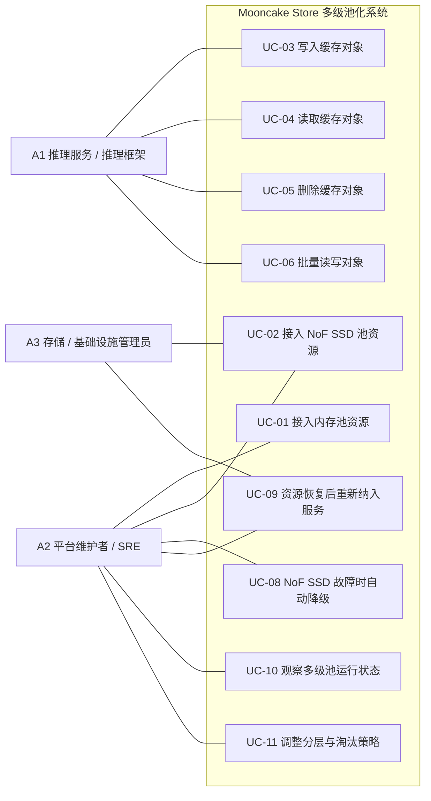

# Mooncake Store 多级池化需求分析（PRD）

## 1. 背景与问题

随着长上下文和高并发推理场景不断增加，KVCache 对容量的需求持续上升。仅依赖内存池的缓存方案成本高、容量扩展受限，容易在内存压力增大时引发缓存抖动、吞吐波动以及更频繁的缓存重建。

Mooncake Store 需要构建一套基于“内存池 + NoF SSD 池”的多级池化方案。该方案的核心目标是在控制成本的前提下扩展有效缓存容量，并在 SSD 层退化或故障时仍然保障推理服务连续运行。

## 2. 目标

- 在相同内存预算下扩大有效 KVCache 工作集。
- 通过引入 NoF SSD 层降低单位有效缓存容量成本。
- 减少因内存压力导致的缓存抖动，提升吞吐稳定性。
- 在 NoF 设备、target 或网络异常时保障推理服务继续可用。
- 提供可观测、可运维、可调优的多级池化能力。

## 3. 非目标

- 不追求数据库级强持久化或强一致性。
- 不要求在 NoF 层故障后完整恢复缓存数据。
- 不覆盖跨地域复制、归档存储或通用块存储能力。
- 不要求推理服务理解或手动控制底层分层策略。

## 4. 外部参与者

- **A1 推理服务 / 推理框架**
  通过统一缓存接口访问系统，关注容量、吞吐和透明分层能力。
- **A2 平台维护者 / SRE**
  负责部署、扩容、监控、调参和故障处理。
- **A3 存储 / 基础设施管理员**
  负责提供并维护 NoF SSD 资源及其接入条件。

## 5. 用例视图

### 5.1 用例图

### 5.2 用例关系

- `UC-03` 依赖 `UC-01`。
- 当 NoF SSD 层可用时，`UC-03` 扩展到 `UC-02`。
- `UC-04` 依赖 `UC-03` 成功完成对象放置。
- `UC-06` 是 `UC-03`、`UC-04` 和 `UC-05` 的批量化形态。
- `UC-08` 依赖 `UC-02` 中的 NoF SSD 资源接入。
- `UC-09` 是 `UC-08` 的恢复闭环。
- `UC-11` 依赖 `UC-10` 提供的可观测性。

### 5.3 详细用例

#### UC-01 接入内存池资源

- **主要参与者**：A2
- **目标**：将新的内存资源加入一级池。
- **触发条件**：新的缓存节点上线或节点重启恢复。
- **前置条件**：
  - 节点已部署完成。
  - 内存资源可被注册。
- **主成功场景**：
  1. 平台维护者启动缓存节点。
  2. 节点向系统注册可用内存资源。
  3. 系统校验资源信息。
  4. 系统将资源加入内存池。
  5. 新对象可被放置到新接入的内存资源上。
- **异常/替代流**：
  - 资源信息非法，接入被拒绝。
  - 重复注册时按幂等处理。
  - 不健康资源不进入可分配集合。
- **后置条件**：
  - 内存资源被接纳或被明确拒绝。
- **质量要求**：
  - 接入过程必须幂等。
  - 接入失败不得影响现有服务。

#### UC-02 接入 NoF SSD 池资源

- **主要参与者**：A2、A3
- **目标**：将新的 NoF SSD 资源加入二级池。
- **触发条件**：新的 NoF SSD target 可用，或既有资源准备重新服务。
- **前置条件**：
  - NoF SSD 资源已准备好。
  - 接入参数和连通性正确。
- **主成功场景**：
  1. 管理员准备 NoF SSD 资源和接入参数。
  2. 维护者向系统提交接入请求。
  3. 系统校验资源可访问性和配置有效性。
  4. 系统将资源纳入 NoF SSD 池。
  5. 该资源开始参与对象放置。
- **异常/替代流**：
  - 参数错误导致接入失败。
  - 资源不可达时记录失败状态。
  - 不稳定资源保持为不可分配状态。
- **后置条件**：
  - 二级池容量增加，或失败原因被记录。
- **质量要求**：
  - 接入过程必须可诊断、可观测。
  - 接入失败不得影响内存层。

#### UC-03 写入缓存对象

- **主要参与者**：A1
- **目标**：写入 KVCache 对象，并由系统自动完成多级放置。
- **触发条件**：推理服务产生新的缓存对象。
- **前置条件**：
  - 存在可写的内存资源。
  - 分层策略已配置。
- **主成功场景**：
  1. 推理服务发起对象写入请求。
  2. 系统评估对象大小、当前容量压力和分层策略。
  3. 系统为对象分配内存层主副本。
  4. 如果 NoF SSD 层可用且策略允许，系统同时分配二级副本。
  5. 推理服务按返回的放置计划完成写入。
  6. 对象进入可读状态。
- **异常/替代流**：
  - 内存资源不足时，系统优先尝试受控淘汰以释放空间；淘汰后仍不足时再拒绝写入或退化处理。
  - NoF SSD 资源不足或不可用，退化为仅内存写入。
  - 二级层写入失败但一级层成功时，整体仍可视为成功。
  - 一级层写入失败时，对象写入失败。
- **后置条件**：
  - 对象至少存在于一级层，或写入失败。
- **质量要求**：
  - 一级层写入成功率优先于二级层完成度。
  - 返回结果必须区分完全成功、部分成功和失败。

#### UC-04 读取缓存对象

- **主要参与者**：A1
- **目标**：通过统一接口读取对象，不向上层暴露分层细节。
- **触发条件**：推理服务请求读取已缓存对象。
- **前置条件**：
  - 对象存在，或系统支持明确的 cache miss 语义。
- **主成功场景**：
  1. 推理服务发起读取请求。
  2. 系统查找对象的可用副本。
  3. 系统优先尝试从内存层读取。
  4. 若内存层可读，则直接返回。
  5. 若内存层不可读而 NoF SSD 层可读，则自动回退到 NoF SSD。
  6. 推理服务获得对象数据。
- **异常/替代流**：
  - 内存层副本存在但不可达，系统回退到 NoF SSD 层。
  - NoF SSD 层也不可用时，系统返回 cache miss。
  - 所有副本都不可用时，推理服务回源重建缓存。
- **后置条件**：
  - 成功返回对象，或明确返回 miss。
- **质量要求**：
  - 层级切换对调用方透明。
  - 读失败必须快速返回，避免长时间阻塞。

#### UC-05 删除缓存对象

- **主要参与者**：A1、A2
- **目标**：删除对象并回收跨层资源。
- **触发条件**：对象过期、业务主动删除或出于容量回收目的。
- **前置条件**：
  - 对象元数据存在，或系统支持幂等删除。
- **主成功场景**：
  1. 外部参与者请求删除对象。
  2. 系统定位对象在各层的副本。
  3. 系统删除元数据并释放资源。
  4. 更新容量与状态指标。
- **异常/替代流**：
  - 对象不存在时按幂等删除处理。
  - 某一层回收失败时，转入后台清理。
- **后置条件**：
  - 对象不再可读，资源最终被回收。
- **质量要求**：
  - 删除必须幂等。
  - 局部清理失败不能导致长期元数据不一致。

#### UC-06 批量读写对象

- **主要参与者**：A1
- **目标**：在批量 KVCache 访问场景中提升吞吐效率。
- **触发条件**：推理服务进行批量对象访问。
- **前置条件**：
  - 调用方能够组织批量请求。
- **主成功场景**：
  1. 推理服务发起批量读写请求。
  2. 系统对整批对象进行放置规划或定位。
  3. 系统执行访问并返回逐对象状态。
  4. 推理服务对失败对象选择重试、忽略或回源。
- **异常/替代流**：
  - 批次中部分对象成功、部分失败。
  - 某一层抖动导致批量结果不完全一致。
- **后置条件**：
  - 批量任务完成，并返回逐对象结果。
- **质量要求**：
  - 批量模式应降低单位对象开销。
  - 部分成功必须是一等语义。

#### UC-08 NoF SSD 故障时自动降级

- **主要参与者**：A2
- **目标**：在 NoF SSD 层故障时维持推理服务可用。
- **触发条件**：NoF SSD 设备、target 或链路持续异常。
- **前置条件**：
  - NoF SSD 层正在被使用。
  - 故障检测机制已启用。
- **主成功场景**：
  1. 系统检测到 NoF SSD 资源持续失败。
  2. 系统将故障资源从新分配路径中隔离。
  3. 系统在读路径中避开故障副本。
  4. 推理服务以退化模式继续运行。
  5. 维护者收到告警。
- **异常/替代流**：
  - 短暂抖动在超过阈值前恢复。
  - 大范围 NoF 故障使系统退化到接近纯内存模式。
- **后置条件**：
  - 故障 NoF 资源不再影响主服务路径。
- **质量要求**：
  - NoF 故障不得升级为推理服务中断。
  - 隔离阈值必须可配置。

#### UC-09 资源恢复后重新纳入服务

- **主要参与者**：A2、A3
- **目标**：让修复后的 NoF SSD 资源重新参与服务。
- **触发条件**：故障资源被修复或链路恢复。
- **前置条件**：
  - 管理员已完成恢复动作。
- **主成功场景**：
  1. 管理员修复故障资源。
  2. 维护者触发重新接入或等待系统重试。
  3. 系统验证资源已经恢复健康。
  4. 系统将资源重新纳入 NoF SSD 池。
  5. 该资源重新可用于后续对象放置。
- **异常/替代流**：
  - 恢复不彻底，资源继续被拒绝。
  - 资源虽健康但性能异常，暂时保持受限状态。
- **后置条件**：
  - 二级池容量恢复。
- **质量要求**：
  - 重新纳管应尽量自动化。
  - 恢复过程不得扰动正在进行的服务。

#### UC-10 观察多级池运行状态

- **主要参与者**：A2
- **目标**：理解系统的健康、容量、压力和退化状态。
- **触发条件**：日常巡检、告警响应、容量规划或性能排障。
- **前置条件**：
  - 监控和指标已启用。
- **主成功场景**：
  1. 维护者查看内存层和 NoF 层容量指标。
  2. 查看使用率、失败、淘汰次数、淘汰对象规模、淘汰收益和退化事件。
  3. 判断瓶颈层或故障域。
  4. 决定扩容、调参或维持现状。
- **异常/替代流**：
  - 指标缺失导致无法定位问题。
  - 告警无法标识层级归属，拖慢排障速度。
- **后置条件**：
  - 维护者形成明确运维决策。
- **质量要求**：
  - 指标必须按层级区分。
  - 必须能区分容量问题、性能问题和故障问题。

#### UC-11 调整分层与淘汰策略

- **主要参与者**：A2
- **目标**：根据 workload 和成本目标调优系统行为。
- **触发条件**：吞吐波动、命中下降、成本压力或硬件变化。
- **前置条件**：
  - 分层和淘汰参数可配置。
- **主成功场景**：
  1. 维护者判断当前策略不够优。
  2. 调整阈值、水位、分层策略、淘汰触发条件、淘汰范围和淘汰优先级。
  3. 系统应用新配置。
  4. 维护者观察变更后的行为。
- **异常/替代流**：
  - 新配置导致效果变差，需要回滚。
  - 在线变更引发短暂抖动。
- **后置条件**：
  - 系统体现新的调优结果，或安全回滚。
- **质量要求**：
  - 策略变更必须支持回滚。
  - 关键参数需要安全默认值和运维边界。

## 6. 从 Use Case 到需求的转换过程

本需求分析采用如下转换链路：

`Use Case -> Capability -> Requirement -> Acceptance`

含义如下：

- **Use Case**：描述系统外部参与者要完成的目标和场景。
- **Capability**：抽象出系统为支撑这些场景必须具备的能力。
- **Requirement**：将系统能力转化为明确的功能需求和非功能需求。
- **Acceptance**：给出需求可验证的验收标准，避免需求停留在口号层。

### 6.1 第一步：从 Use Case 提取系统能力

基于本次 use case 分析，可以抽象出 6 类核心系统能力：

- **C1 资源接入与纳管能力**
  对应 `UC-01`、`UC-02`、`UC-09`
- **C2 多级对象放置与回收能力**
  对应 `UC-03`、`UC-05`
- **C3 分层读取与批量访问能力**
  对应 `UC-04`、`UC-06`
- **C4 故障隔离与退化运行能力**
  对应 `UC-08`
- **C5 可观测与容量运营能力**
  对应 `UC-10`
- **C6 策略配置、容量控制与淘汰能力**
  对应 `UC-11`，并在 `UC-03` 的容量不足场景和 `UC-10` 的观测场景中体现

### 6.2 第二步：从系统能力提炼需求

提炼规则如下：

- 将 use case 主成功场景转化为“系统必须支持……”的功能需求。
- 将异常流转化为“当……失败时系统应……”的退化和异常处理需求。
- 将质量要求转化为性能、可靠性、可运维性等非功能需求。
- 将业务优先级转化为需求边界：
  扩容降本优先，吞吐稳定次之，可靠性以保障推理服务连续性为边界，而不是缓存强恢复。

### 6.3 第三步：形成需求映射与验收闭环

最终每个 use case 都需要落到：

- 对应的系统能力
- 可评审的功能需求
- 可评审的非功能需求
- 可执行的验收方式

这一步的目标是确保：

- 需求不是拍脑袋提出，而是可追溯到 use case
- 需求不是泛泛描述，而是可以落到设计和测试
- 每个关键能力都能被验证

## 7. 用例到能力、需求与验收映射

| 用例 | 对应能力 | 功能需求 | 非功能需求 | 验收方式 |
| --- | --- | --- | --- | --- |
| UC-01 接入内存池资源 | C1 资源接入与纳管能力 | 支持内存资源注册、校验、纳管和幂等管理 | 接入失败不得影响在线服务；结果必须可观测 | 新节点接入后可参与对象分配；重复注册按幂等处理；非法资源被拒绝 |
| UC-02 接入 NoF SSD 池资源 | C1 资源接入与纳管能力 | 支持 NoF SSD 资源注册、校验、接入和状态管理 | 接入过程必须可诊断；失败不得影响内存层 | 合法 NoF 资源接入后可参与对象放置；非法参数接入失败且原因可定位 |
| UC-03 写入缓存对象 | C2 多级对象放置与回收能力 | 支持对象写入、内存优先放置、NoF 扩展放置，以及容量不足时优先触发受控淘汰 | 一级层成功优先；NoF 失败不得拖垮写路径；写入结果需明确 | 写入后至少一级层可读；NoF 不可用时退化为仅内存写入；容量不足时先发生淘汰再决定退化或拒绝 |
| UC-04 读取缓存对象 | C3 分层读取与批量访问能力 | 支持对象定位、内存优先读取、NoF 回退读取和显式 miss 语义 | 热路径低延迟；失败快速返回；接口对上层统一 | 命中内存时直接返回；内存不可用时可回退 NoF；两层都不可用时返回明确 miss |
| UC-05 删除缓存对象 | C2 多级对象放置与回收能力 | 支持对象删除、跨层清理和幂等回收 | 删除必须幂等；局部清理失败必须可恢复 | 删除后对象不可读；重复删除不报错；后台可补偿残留清理 |
| UC-06 批量读写对象 | C3 分层读取与批量访问能力 | 支持批量 put/get/delete 及逐对象结果返回 | 降低单位对象开销；高并发下支持部分成功 | 批量请求可返回成功/失败明细；失败对象可单独重试 |
| UC-08 NoF SSD 故障时自动降级 | C4 故障隔离与退化运行能力 | 支持故障检测、资源隔离、停止新放置及读路径避障 | NoF 故障不得中断推理服务；需要自动化和可配置阈值 | 注入 NoF 故障后，新写入不再使用故障资源；系统以退化模式继续运行 |
| UC-09 资源恢复后重新纳入服务 | C1 资源接入与纳管能力 | 支持重探测、重接入和重新启用资源 | 恢复过程不得扰动在线服务；恢复状态必须可见 | 恢复后资源重新进入可分配集合；后续对象可再次放置到该资源 |
| UC-10 观察多级池运行状态 | C5 可观测与容量运营能力 | 暴露容量、使用率、命中、失败、淘汰次数、淘汰规模、淘汰收益和退化指标 | 指标必须分层且可用于诊断 | 维护者可区分问题位于内存层还是 NoF 层，并能观察淘汰效果 |
| UC-11 调整分层与淘汰策略 | C6 策略配置、容量控制与淘汰能力 | 提供可配置的水位、阈值、分层策略、淘汰触发条件、淘汰范围和淘汰优先级 | 变更必须可回滚，并有安全边界 | 调整策略后系统行为按预期变化；异常配置可快速回滚 |

## 8. 多维需求

### 8.1 详细功能需求

#### FR-1 资源接入与纳管

- 系统必须支持内存池资源的注册、校验、幂等接入和状态管理。
- 系统必须支持 NoF SSD 资源的注册、校验、挂载、纳管和状态管理。
- 系统必须支持对资源状态进行区分，至少包括可用、不可用、隔离和恢复中。
- 系统必须支持恢复后的 NoF 资源重新进入可分配集合。

#### FR-2 多级对象放置

- 系统必须支持对象写入时优先分配内存层副本。
- 系统必须在 NoF SSD 层可用且策略允许时，为对象分配二级副本。
- 系统必须支持容量不足场景下优先执行受控淘汰，再决定退化写入或拒绝写入。
- 系统必须支持对象元数据记录其分层副本状态。

#### FR-3 分层读取与统一访问

- 系统必须对上层暴露统一的对象读取接口。
- 系统必须支持内存优先读取。
- 系统必须在内存层不可用而 NoF 层可用时自动回退到 NoF 层。
- 系统必须在所有副本都不可用时返回明确的 cache miss 或失败语义。

#### FR-4 批量访问能力

- 系统必须支持批量对象写入。
- 系统必须支持批量对象读取。
- 系统必须支持批量对象删除。
- 系统必须返回逐对象结果，而不是只返回整批成功或失败。

#### FR-5 删除与回收能力

- 系统必须支持对象删除和跨层副本回收。
- 系统必须支持幂等删除。
- 系统必须支持局部回收失败时的后台补偿清理。

#### FR-6 故障隔离与恢复

- 系统必须支持持续故障检测。
- 系统必须在 NoF 资源故障达到阈值后，自动停止向该资源分配新对象。
- 系统必须在读路径中避开已隔离的故障副本。
- 系统必须支持故障恢复后的重探测、重接入和重新启用。

#### FR-7 容量控制与淘汰

- 系统必须支持为内存池和 NoF SSD 池分别定义容量水位。
- 系统必须支持按层级触发淘汰。
- 系统必须支持配置淘汰触发条件、淘汰范围和淘汰优先级。
- 系统必须支持在写入受阻时先尝试淘汰，再决定退化或拒绝。
- 系统必须记录淘汰相关事件和结果。

#### FR-8 可观测与运维

- 系统必须提供内存层和 NoF 层的容量、使用率、失败率和健康状态指标。
- 系统必须提供命中、回退、退化和 cache miss 指标。
- 系统必须提供淘汰次数、淘汰对象量、淘汰前后容量变化和淘汰收益指标。
- 系统必须提供配置变更和故障隔离的状态可见性。

#### FR-9 策略配置与调优

- 系统必须支持对分层策略进行参数化配置。
- 系统必须支持对故障隔离阈值进行配置。
- 系统必须支持对淘汰策略进行参数化配置。
- 系统必须支持配置变更后的回滚。

### 8.2 详细非功能需求

#### NFR-1 成本与容量

- 系统设计应以扩容降本为首要目标。
- 在相同内存预算下，系统应扩大可服务 KVCache 工作集。
- NoF SSD 层应承担温数据和扩容层角色，而不是简单的强持久化备份层。

#### NFR-2 性能

- 热点对象应优先驻留并命中内存层。
- 系统应减少内存容量紧张时的缓存抖动和吞吐波动。
- 批量接口应显著降低单位对象的控制面和访问开销。
- 读失败不应长时间阻塞推理请求。

#### NFR-3 可靠性

- NoF SSD 故障不得导致推理服务整体不可用。
- 系统允许在故障场景下退化为更高延迟、更低命中率或更多回源重建。
- 可靠性目标应以推理服务连续性为边界，而不是缓存数据强恢复。
- 故障资源隔离必须自动化，并受阈值控制。

#### NFR-4 易用性

- 对推理服务而言，系统应保持统一接口，不暴露底层分层细节。
- 分层回退、故障隔离和淘汰行为不应要求上层业务手动参与。
- 上层应能明确区分 cache hit、cache miss 和系统失败语义。

#### NFR-5 可观测性与可运维性

- 所有关键指标必须支持按内存层和 NoF 层拆分观察。
- 运维人员必须能够区分容量问题、性能问题、淘汰问题和故障问题。
- 策略调整必须具备安全默认值、变更留痕和回滚能力。
- 维护者必须能够根据观测结果判断应扩内存还是扩 NoF SSD。

#### NFR-6 可测试性

- 需求必须能够被接入测试、读写测试、故障注入测试和淘汰触发测试验证。
- 必须支持验证成功路径、退化路径、恢复路径和容量压力路径。

## 9. 评审版 PRD 页面结构

### 9.1 问题陈述

当前纯内存缓存池无法以可接受成本支撑所需 KVCache 工作集。系统需要多级池化架构，在控制成本的同时扩大容量，并保证服务连续性。

### 9.2 方案概述

在 Mooncake Store 中引入双层池化模型：

- 内存池作为热点主层。
- NoF SSD 池作为容量扩展和温数据层。
- 统一管理对象放置、读路由、降级、恢复、观测和策略调优。

### 9.3 成功标准

- `TBD` 相比纯内存基线的有效缓存容量提升幅度。
- `TBD` 单位有效缓存容量成本下降比例。
- `TBD` 目标 workload 下吞吐稳定性改善幅度。
- `TBD` NoF 层故障时的服务连续性表现。
- `TBD` 维护者识别瓶颈和制定扩容动作的效率提升。

## 10. 分期优先级

| 需求项 | 说明 | 优先级 | 建议版本 |
| --- | --- | --- | --- |
| 内存池资源接入 | 纳管一级层资源 | P0 | MVP |
| NoF SSD 池资源接入 | 纳管二级层资源 | P0 | MVP |
| 多级写入放置 | 内存优先放置并按需扩展到 NoF | P0 | MVP |
| 分层读取 | 内存优先读取、NoF 回退 | P0 | MVP |
| 删除与跨层回收 | 删除对象并释放资源 | P0 | MVP |
| NoF 故障自动隔离 | 让故障 NoF 资源退出服务 | P0 | MVP |
| 退化但不中断的服务 | NoF 故障时保障推理连续性 | P0 | MVP |
| 基础分层观测 | 两层容量、使用率和健康指标 | P0 | MVP |
| 批量对象操作 | 提升批量访问吞吐效率 | P1 | v1 |
| NoF 资源恢复纳管 | 故障恢复后恢复二级层容量 | P1 | v1 |
| 命中/回退/退化指标 | 观察路由和退化行为 | P1 | v1 |
| 可配置分层与淘汰策略 | 水位、阈值、策略控制 | P1 | v1 |
| 策略回滚能力 | 降低调参风险 | P1 | v1 |
| NoF 高水位淘汰 | 控制二级层容量压力 | P1 | v1 |
| 容量规划视图 | 判断应扩内存还是扩 NoF | P1 | v1 |
| 更细粒度性能指标 | 分层延迟和吞吐细化观测 | P2 | v2 |
| 热度感知分层策略 | 基于访问模式自动放置 | P2 | v2 |
| 智能淘汰与预测迁移 | 更高级的分层管理 | P2 | v2 |
| 自动容量建议 | 基于观测推荐扩容动作 | P2 | v2 |

## 11. 风险与开放问题

- 双层活跃池会显著增加状态管理复杂度。
- NoF 性能收益高度依赖设备、拓扑和调优水平。
- 可观测性不足会放大排障难度。
- 需要清晰定义安全默认值和运维边界。
- 仍需补齐 workload 基线和 KPI 目标值。
