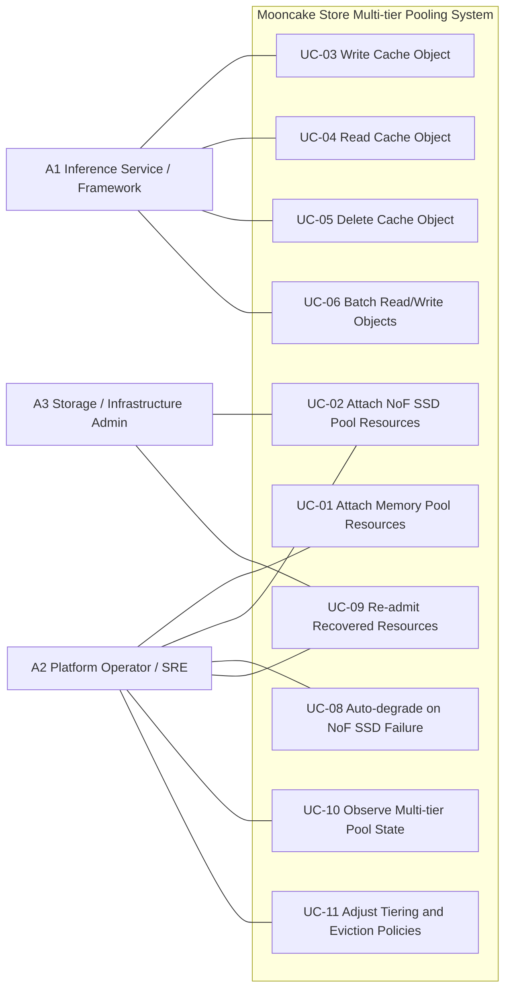

# Mooncake Store Multi-tier Pooling PRD

## 1. Background and Problem

KVCache capacity demand keeps growing with longer contexts and higher
concurrency. A memory-only cache pool is expensive and becomes a hard
capacity bottleneck, which leads to cache churn, throughput instability,
and more frequent cache rebuilds.

Mooncake Store needs a multi-tier pooling design based on a memory pool
and a NoF SSD pool. The primary objective is to expand effective cache
capacity at lower cost, while preserving inference service continuity when
the SSD tier degrades or fails.

## 2. Goals

- Expand effective KVCache working set under the same memory budget.
- Reduce unit cost of effective cache capacity by introducing a NoF SSD
  tier.
- Improve throughput stability by reducing memory-pressure-induced cache
  churn.
- Keep inference service available under NoF device, target, or network
  failures.
- Provide observable, operable, and tunable tiered pooling behavior.

## 3. Non-goals

- Database-grade durability or strong consistency.
- Full cache data recovery after NoF tier failures.
- Cross-region replication, archival storage, or general-purpose block
  storage features.
- Requiring the inference service to understand or manually control tiering.

## 4. External Actors

- **A1 Inference Service / Inference Framework**
  Uses a unified cache interface and expects large capacity, stable
  throughput, and transparent tiering.
- **A2 Platform Operator / SRE**
  Handles deployment, expansion, monitoring, parameter tuning, and
  incident response.
- **A3 Storage / Infrastructure Administrator**
  Provides and maintains NoF SSD resources and their connectivity.

## 5. Use Case View

### 5.1 Use Case Diagram

### 5.2 Use Case Relationships

- `UC-03` depends on `UC-01`.
- `UC-03` can extend to `UC-02` when the NoF SSD tier is available.
- `UC-04` depends on successful object placement from `UC-03`.
- `UC-06` is the batch form of `UC-03`, `UC-04`, and `UC-05`.
- `UC-08` depends on NoF SSD resource attachment in `UC-02`.
- `UC-09` is the recovery loop after `UC-08`.
- `UC-11` depends on observability from `UC-10`.

### 5.3 Detailed Use Cases

#### UC-01 Attach Memory Pool Resources

- **Primary actor**: A2
- **Goal**: Add new memory resources into the primary tier.
- **Trigger**: A cache node is newly deployed or restarted.
- **Preconditions**:
  - The node has been deployed.
  - Memory resources are ready to be registered.
- **Main success scenario**:
  1. The operator starts a cache node.
  2. The node registers available memory resources.
  3. The system validates the resource information.
  4. The system adds the resources into the memory pool.
  5. New objects can be placed on the newly attached memory resources.
- **Alternative / exception flows**:
  - Invalid resource information causes rejection.
  - Duplicate registration is handled idempotently.
  - Unhealthy resources are not admitted into the allocatable pool.
- **Postconditions**:
  - The memory resource is either admitted or explicitly rejected.
- **Quality requirements**:
  - Attachment must be idempotent.
  - Failure must not impact existing service.

#### UC-02 Attach NoF SSD Pool Resources

- **Primary actors**: A2, A3
- **Goal**: Add new NoF SSD resources into the secondary tier.
- **Trigger**: A new NoF SSD target becomes available, or an existing one
  is prepared for service.
- **Preconditions**:
  - NoF SSD resources are provisioned.
  - Connectivity and access parameters are correct.
- **Main success scenario**:
  1. The administrator prepares NoF SSD resources and access information.
  2. The operator submits an attachment request.
  3. The system validates accessibility and configuration.
  4. The system admits the resource into the NoF SSD pool.
  5. The NoF SSD resource becomes eligible for object placement.
- **Alternative / exception flows**:
  - Invalid parameters cause attachment failure.
  - Unreachable resources are recorded as failed.
  - Unstable resources remain non-allocatable until healthy.
- **Postconditions**:
  - Secondary-tier capacity increases, or the failure reason is visible.
- **Quality requirements**:
  - Attachment must be diagnosable and observable.
  - Failure must not impact the memory tier.

#### UC-03 Write Cache Object

- **Primary actor**: A1
- **Goal**: Write a KVCache object and let the system perform automatic
  multi-tier placement.
- **Trigger**: The inference service produces a new cache object.
- **Preconditions**:
  - Writable memory resources exist.
  - Tiering policy has been configured.
- **Main success scenario**:
  1. The inference service sends an object write request.
  2. The system evaluates object size, current pressure, and policy.
  3. The system allocates a primary copy in the memory tier.
  4. If the NoF SSD tier is available and policy allows, the system also
     allocates a secondary-tier copy.
  5. The inference service completes the write according to the returned
     placement plan.
  6. The object becomes readable.
- **Alternative / exception flows**:
  - Memory exhaustion triggers eviction or write rejection.
  - NoF SSD exhaustion or unavailability degrades the write to memory-only.
  - Secondary-tier write failure still allows success if the primary tier
    write succeeds.
  - Primary-tier write failure causes the full write to fail.
- **Postconditions**:
  - The object exists at least in the primary tier, or the write fails.
- **Quality requirements**:
  - Primary-tier write success has higher priority than secondary-tier
    completion.
  - The result must distinguish full success, partial success, and failure.

#### UC-04 Read Cache Object

- **Primary actor**: A1
- **Goal**: Read an object through a unified interface without exposing
  tiering details.
- **Trigger**: The inference service requests a cached object.
- **Preconditions**:
  - The object exists, or the system supports explicit cache miss semantics.
- **Main success scenario**:
  1. The inference service sends a read request.
  2. The system looks up available replicas.
  3. The system first attempts the memory tier.
  4. If the memory-tier replica is readable, the system returns it.
  5. If the memory tier is unavailable but a NoF SSD replica is readable,
     the system falls back to the NoF SSD tier.
  6. The inference service receives the object.
- **Alternative / exception flows**:
  - The memory-tier replica exists but is unreachable, so the system falls
    back to the NoF SSD tier.
  - The NoF SSD tier is also unavailable, so the system returns a cache
    miss.
  - All replicas are unavailable, and the inference service rebuilds the
    cache from upstream.
- **Postconditions**:
  - The object is returned, or a clear miss is returned.
- **Quality requirements**:
  - Tier switching must be transparent to the caller.
  - Read failures must return promptly without long blocking.

#### UC-05 Delete Cache Object

- **Primary actors**: A1, A2
- **Goal**: Remove an object and reclaim resources across tiers.
- **Trigger**: The object expires, is explicitly removed, or must be
  reclaimed for capacity.
- **Preconditions**:
  - Object metadata exists, or the system supports idempotent deletion.
- **Main success scenario**:
  1. An external actor requests object deletion.
  2. The system locates the object's replicas across tiers.
  3. The system removes the metadata and releases resources.
  4. Capacity and state metrics are updated.
- **Alternative / exception flows**:
  - The object does not exist and the system treats the delete as idempotent.
  - Resource cleanup partially fails and is deferred to background cleanup.
- **Postconditions**:
  - The object is no longer readable and resources are reclaimed eventually.
- **Quality requirements**:
  - Delete must be idempotent.
  - Partial cleanup failure must not leave indefinite metadata inconsistency.

#### UC-06 Batch Read/Write Objects

- **Primary actor**: A1
- **Goal**: Improve throughput in bulk KVCache operations.
- **Trigger**: The inference service performs batch object access.
- **Preconditions**:
  - The caller can organize requests in batch form.
- **Main success scenario**:
  1. The inference service sends a batch read/write request.
  2. The system plans placement or lookup for the full batch.
  3. The system executes access and returns per-object status.
  4. The inference service retries, ignores, or rebuilds failed objects.
- **Alternative / exception flows**:
  - A subset of objects succeeds while others fail.
  - Tier instability causes partial completion.
- **Postconditions**:
  - The batch completes with per-object results.
- **Quality requirements**:
  - Batch mode must reduce per-object overhead.
  - Partial success must be a first-class result.

#### UC-08 Auto-degrade on NoF SSD Failure

- **Primary actor**: A2
- **Goal**: Keep inference service available when the NoF SSD tier fails.
- **Trigger**: A NoF SSD device, target, or path becomes persistently
  unhealthy.
- **Preconditions**:
  - The NoF SSD tier is in active use.
  - Failure detection is enabled.
- **Main success scenario**:
  1. The system detects repeated NoF SSD failures.
  2. The system isolates the failed NoF resource from new allocations.
  3. The system avoids failed replicas on the read path.
  4. The inference service continues to run in degraded mode.
  5. The operator receives an alert.
- **Alternative / exception flows**:
  - A transient issue recovers before crossing the failure threshold.
  - Widespread NoF failures degrade the system toward memory-only behavior.
- **Postconditions**:
  - The failed NoF resource no longer impacts the main service path.
- **Quality requirements**:
  - NoF SSD failures must not escalate into inference service interruption.
  - Isolation thresholds must be configurable.

#### UC-09 Re-admit Recovered Resources

- **Primary actors**: A2, A3
- **Goal**: Bring repaired NoF SSD resources back into service.
- **Trigger**: The failed resource is repaired or connectivity is restored.
- **Preconditions**:
  - The administrator has completed recovery actions.
- **Main success scenario**:
  1. The administrator restores the failed resource.
  2. The operator triggers re-attachment or waits for retry.
  3. The system validates that the resource is healthy again.
  4. The system re-admits the resource into the NoF SSD pool.
  5. The resource becomes eligible for future placement.
- **Alternative / exception flows**:
  - Recovery is incomplete and the resource remains rejected.
  - The resource is healthy but underperforming, so it remains throttled or
    unallocated.
- **Postconditions**:
  - Secondary-tier capacity is restored.
- **Quality requirements**:
  - Re-admission should be automated where possible.
  - Recovery must not disrupt ongoing service.

#### UC-10 Observe Multi-tier Pool State

- **Primary actor**: A2
- **Goal**: Understand health, capacity, pressure, and degradation status.
- **Trigger**: Routine operations, alert response, capacity planning, or
  performance debugging.
- **Preconditions**:
  - Monitoring and metrics are enabled.
- **Main success scenario**:
  1. The operator inspects memory-tier and NoF-tier capacity metrics.
  2. The operator checks usage, failures, evictions, and degradation events.
  3. The operator identifies the bottleneck tier or failure domain.
  4. The operator decides whether to expand capacity, tune policies, or
     keep the current setup.
- **Alternative / exception flows**:
  - Metrics are incomplete and the operator cannot localize the issue.
  - Alerts lack tier attribution and slow down diagnosis.
- **Postconditions**:
  - The operator reaches a concrete operational decision.
- **Quality requirements**:
  - Metrics must be tier-specific.
  - Operators must be able to distinguish capacity, performance, and failure
    issues.

#### UC-11 Adjust Tiering and Eviction Policies

- **Primary actor**: A2
- **Goal**: Tune the system against workload and cost objectives.
- **Trigger**: Throughput instability, cache hit degradation, cost pressure,
  or hardware changes.
- **Preconditions**:
  - Tiering and eviction parameters are configurable.
- **Main success scenario**:
  1. The operator determines that the current policy is suboptimal.
  2. The operator updates thresholds, watermarks, or tiering/eviction
     behavior.
  3. The system applies the new configuration.
  4. The operator observes the resulting behavior.
- **Alternative / exception flows**:
  - The new configuration worsens behavior and must be rolled back.
  - Online changes create temporary instability.
- **Postconditions**:
  - The system reflects the desired tuning or is reverted safely.
- **Quality requirements**:
  - Policy changes must support rollback.
  - Key parameters need safe defaults and operational guardrails.

## 6. Use Case to Requirement Mapping

| Use case | Primary actors | Functional requirements | Non-functional requirements |
| --- | --- | --- | --- |
| UC-01 Attach Memory Pool Resources | A2 | Register, validate, admit, and idempotently manage memory resources | Attachment failure must not impact online service; attachment result must be observable |
| UC-02 Attach NoF SSD Pool Resources | A2, A3 | Register, validate, attach, and manage NoF SSD resource state | Attachment must be diagnosable; NoF attachment failure must not affect the memory tier |
| UC-03 Write Cache Object | A1 | Support object writes, memory-first placement, NoF extension placement, and partial success semantics | Primary-tier success has priority; NoF failure must not collapse the write path; write outcomes must be explicit |
| UC-04 Read Cache Object | A1 | Support object lookup, memory-first reads, NoF fallback, and explicit miss semantics | Low latency for the hot path; prompt failure return; unified caller interface |
| UC-05 Delete Cache Object | A1, A2 | Support object deletion, cross-tier cleanup, and idempotent reclaim | Delete must be idempotent; partial cleanup failures must be recoverable |
| UC-06 Batch Read/Write Objects | A1 | Support batch put/get/delete with per-object result reporting | Reduce per-object overhead; support partial success under high concurrency |
| UC-08 Auto-degrade on NoF SSD Failure | A2 | Detect NoF failures, isolate failed resources, stop new placement, and avoid failed replicas on reads | NoF failures must not interrupt inference service; automation and configurable thresholds are required |
| UC-09 Re-admit Recovered Resources | A2, A3 | Re-probe, re-attach, and re-enable recovered resources | Re-admission must not disrupt ongoing service; recovery state must be observable |
| UC-10 Observe Multi-tier Pool State | A2 | Expose capacity, usage, hit, failure, eviction, and degradation metrics | Metrics must be tier-specific and actionable for diagnosis |
| UC-11 Adjust Tiering and Eviction Policies | A2 | Expose configurable watermarks, thresholds, tiering, and eviction policies | Changes must be rollback-safe and bounded by operational guardrails |

## 7. Requirements by Dimension

### 7.1 Functional Requirements

- Support independent attachment and unified management of a memory pool and
  a NoF SSD pool.
- Support automatic multi-tier placement during object writes.
- Support unified reads with memory-first and NoF fallback behavior.
- Support batch object operations.
- Support deletion and cross-tier reclamation.
- Support NoF failure isolation and resource re-admission.
- Support multi-tier observability and policy adjustment.

### 7.2 Performance Requirements

- Hot objects should stay in memory for the primary read path.
- Warm objects should be served by the NoF SSD tier to expand the effective
  working set.
- The system should reduce throughput instability caused by memory-only
  capacity pressure.
- Batch operations should reduce control-plane overhead and improve
  throughput efficiency.
- Tier-specific capacity and pressure visibility should support tuning.

### 7.3 Reliability Requirements

- NoF SSD failures must not make the inference service unavailable.
- The system may degrade in latency or cache hit ratio, but should preserve
  service continuity.
- Failed NoF resources must be isolated automatically.
- Recovered NoF resources must be eligible for re-admission.
- The system targets inference continuity rather than strong durability.

### 7.4 Usability and Operability Requirements

- Present a unified cache interface to the inference layer.
- Provide tier-specific metrics, alerts, and state visibility to operators.
- Support configurable thresholds, watermarks, and policy controls.
- Allow operators to decide whether to expand memory or NoF SSD based on
  system evidence.

## 8. PRD Page Structure for Review

### 8.1 Problem Statement

The current memory-only cache pool cannot support the required KVCache
working set economically. A multi-tier pooling architecture is needed to
expand capacity at lower cost while preserving service continuity.

### 8.2 Proposed Solution

Introduce a two-tier pooling model in Mooncake Store:

- Memory pool as the primary hot-data tier.
- NoF SSD pool as the capacity expansion and warm-data tier.
- Unified control over placement, read routing, degradation, recovery,
  observability, and policy tuning.

### 8.3 Success Criteria

- `TBD` effective cache capacity increase over the memory-only baseline.
- `TBD` unit cost reduction of effective cache capacity.
- `TBD` throughput stability improvement under target workloads.
- `TBD` service continuity under NoF-tier failures.
- `TBD` operator efficiency in identifying bottlenecks and capacity actions.

## 9. Prioritization by Release

| Requirement item | Description | Priority | Recommended release |
| --- | --- | --- | --- |
| Memory pool attachment | Admit primary-tier resources | P0 | MVP |
| NoF SSD pool attachment | Admit secondary-tier resources | P0 | MVP |
| Multi-tier object write placement | Memory-first placement with NoF extension | P0 | MVP |
| Tiered object reads | Memory-first reads with NoF fallback | P0 | MVP |
| Object deletion and cross-tier reclaim | Remove objects and reclaim resources | P0 | MVP |
| Auto-isolation on NoF failure | Keep failed NoF resources out of service | P0 | MVP |
| Degraded but continuous service | Preserve inference continuity during NoF failures | P0 | MVP |
| Basic tiered observability | Capacity, usage, and health metrics for both tiers | P0 | MVP |
| Batch object operations | Improve throughput efficiency in batch access | P1 | v1 |
| Re-admission of recovered NoF resources | Restore NoF capacity after recovery | P1 | v1 |
| Hit, fallback, and degradation metrics | Observe routing and service degradation | P1 | v1 |
| Configurable tiering and eviction policies | Watermarks, thresholds, policy controls | P1 | v1 |
| Safe rollback of policy changes | Reduce tuning risk | P1 | v1 |
| NoF high-watermark eviction | Control secondary-tier pressure | P1 | v1 |
| Capacity planning view | Decide whether to scale memory or NoF SSD | P1 | v1 |
| Fine-grained performance metrics | Tier-specific latency and throughput detail | P2 | v2 |
| Heat-aware tiering policies | Automatic placement based on access patterns | P2 | v2 |
| Smart eviction and predictive migration | Advanced tier management | P2 | v2 |
| Automatic capacity suggestions | Recommend scaling actions based on telemetry | P2 | v2 |

## 10. Risks and Open Questions

- State management becomes more complex with two active tiers.
- NoF performance benefits depend heavily on devices, topology, and tuning.
- Insufficient observability will make issues hard to diagnose.
- Safe defaults and operator guardrails must be defined clearly.
- Workload baselines and target KPIs still need to be formalized.
