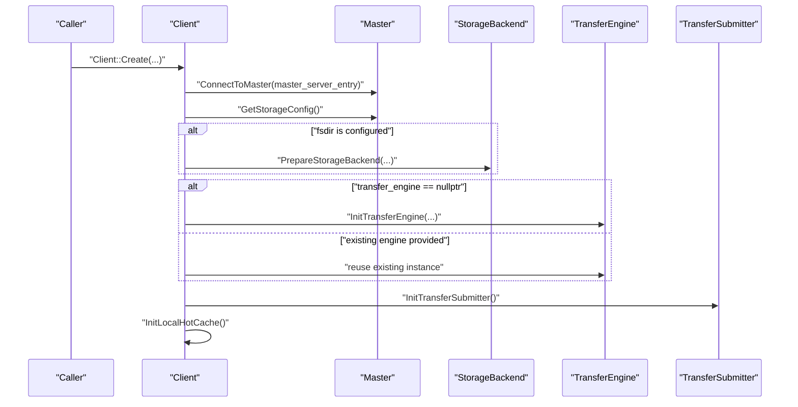
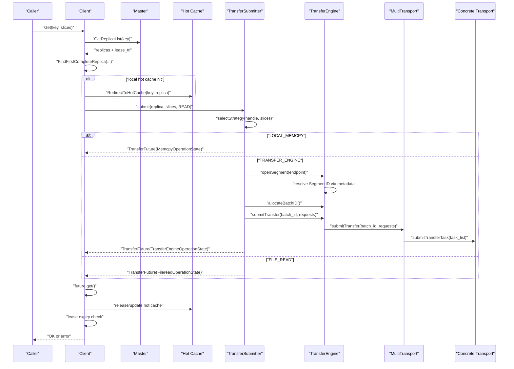
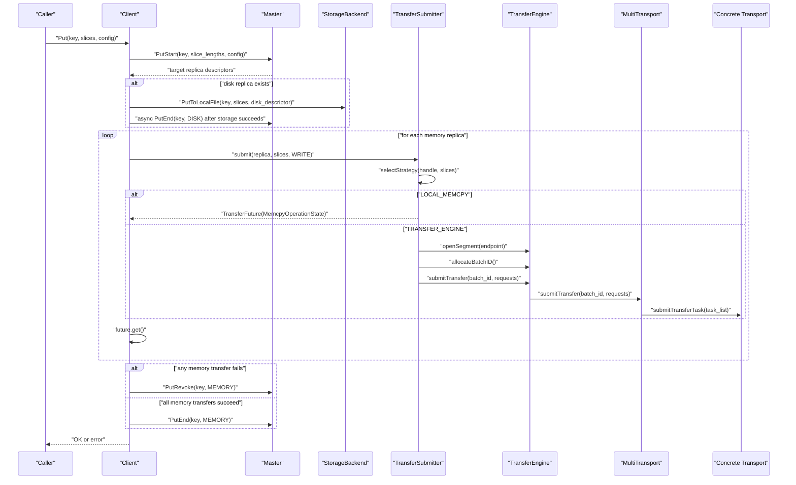
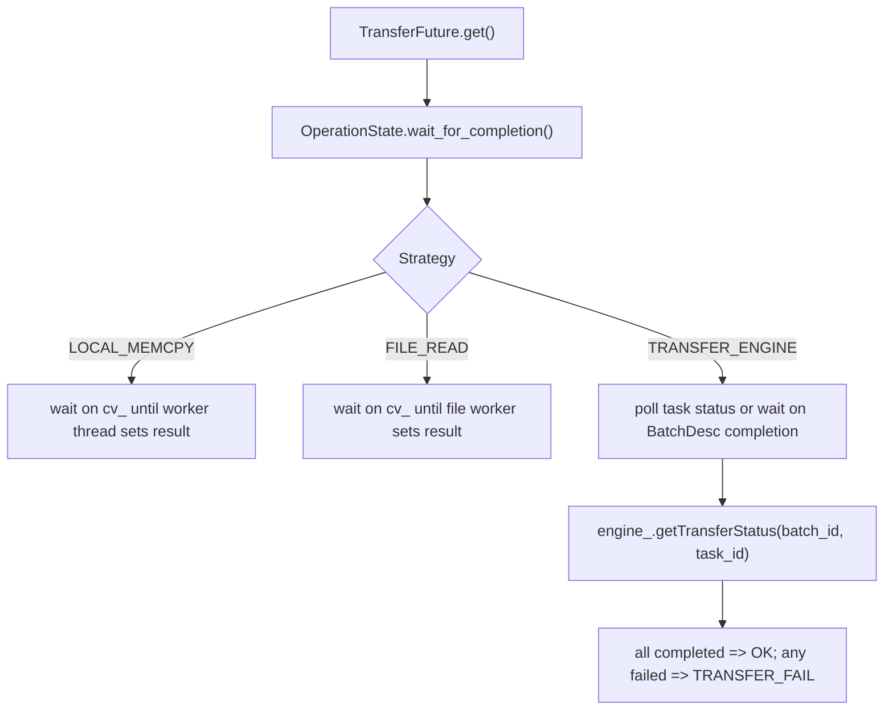

# Mooncake Transfer Paths

Analysis date: 2026-03-04

Source repository:

- URL: `https://github.com/kvcache-ai/Mooncake`
- Local checkout: `/Users/miaomili/Documents/Playground/Mooncake`
- Branch: `main`
- Commit: `a402dc7`

## Scope

This note focuses on the client-side data path:

- `Client::Create`
- `Client::Get`
- `Client::Put`
- `TransferSubmitter`
- `TransferFuture` and `OperationState`
- `Transfer Engine` and `MultiTransport`

It is a finer-grained companion to `docs/mooncake-analysis.md`.

## Main Actors

- `Client`: orchestrates RPC with master and drives local reads and writes
- `MasterClient`: returns replica descriptors and finalizes object lifecycle
- `TransferSubmitter`: chooses between memcpy, transfer engine, or file read
- `TransferFuture`: async completion wrapper
- `TransferEngine`: facade around segment resolution, batching, and transport submission
- `MultiTransport`: groups requests by transport and dispatches them to concrete backends

## Startup Path

`Client::Create` is the setup sequence that makes later transfer calls possible.

Observed flow:

1. connect to master
2. fetch storage config and optionally initialize `StorageBackend`
3. initialize or reuse `TransferEngine`
4. initialize `TransferSubmitter`
5. initialize local hot cache

Practical implication:

- storage is optional
- transport is optional only in `rpc_only` mode
- `TransferSubmitter` is the last component that turns replica descriptors into movement operations

## Read Path: `Client::Get`

### High-level sequence

### Step-by-step behavior

1. `Client::Get(key, slices)` first calls `Query(key)`.
2. `Query(key)` asks the master for completed replicas and a lease TTL.
3. `Client::Get(key, query_result, slices)` picks the first complete replica.
4. If the replica is in memory, the client may redirect to local hot cache.
5. `TransferRead()` forwards to `TransferData(..., READ)`.
6. `TransferData()` calls `transfer_submitter_->submit(...)`.
7. The future is waited synchronously through `future->get()`.
8. After data transfer completes, hot cache bookkeeping runs.
9. The client checks whether the read finished after the lease expired.

### Important behavior

- lease is granted by the master at query time, not after the bytes move
- the client checks lease expiry after the transfer finishes
- hot cache is treated as an optimization layer that rewrites the replica descriptor to a local address

## Write Path: `Client::Put`

### High-level sequence

### Step-by-step behavior

1. `Put()` computes slice lengths and may force a preferred segment under `cxl`.
2. `PutStart()` asks the master to allocate target replicas.
3. If a disk replica is present and `StorageBackend` exists, the client persists that copy first.
4. Disk completion is finalized asynchronously by the client-side write thread after the backend store succeeds.
5. Each memory replica is written through `TransferWrite()`.
6. `TransferWrite()` is just `TransferData(..., WRITE)`.
7. Transfer failures trigger `PutRevoke(key, MEMORY)`.
8. Successful completion triggers `PutEnd(key, MEMORY)`.

### Important behavior

- the client writes disk replicas before memory finalization so disk-side revoke/end remains well-defined
- memory replicas are transferred one replica at a time in `Put()`
- master-side object visibility is finalized by `PutEnd`, not by the transfer itself

## `TransferSubmitter` Strategy Selection

The strategy split is explicit:

- `LOCAL_MEMCPY`
- `TRANSFER_ENGINE`
- `FILE_READ`

Selection rules:

1. disk replica always goes to `FILE_READ` for read path
2. if `MC_STORE_MEMCPY` is disabled, memory replicas always use `TRANSFER_ENGINE`
3. if `MC_STORE_MEMCPY` is enabled and source/target resolve to the same local IP, the path becomes `LOCAL_MEMCPY`
4. otherwise use `TRANSFER_ENGINE`

This means the caller does not choose the transfer backend directly. The backend is derived from replica type, endpoint locality, and environment configuration.

## `TransferSubmitter` Internals

### `submit(...)`

`submit(...)` is the main branch point:

- validate transfer size against handle size
- inspect replica type
- choose strategy
- create a `TransferFuture`
- update transfer metrics if submission succeeds

### `submitMemcpyOperation(...)`

This path:

- builds a vector of memcpy operations
- maps READ and WRITE into different source/destination orientation
- pushes the work into `MemcpyWorkerPool`
- returns `TransferFuture(MemcpyOperationState)`

### `submitTransferEngineOperation(...)`

This path:

1. checks the remote transport endpoint
2. resolves `SegmentHandle` via `engine_.openSegment(...)`
3. builds one `TransferRequest` per slice
4. calls `submitTransfer(requests)`

### `submitTransfer(requests)`

This is the narrow handoff into `Transfer Engine`:

1. allocate batch ID
2. call `engine_.submitTransfer(batch_id, requests)`
3. wrap the batch in `TransferEngineOperationState`
4. return `TransferFuture`

## `TransferFuture` and Completion Model

`TransferFuture` is a uniform wrapper over three different completion modes:

- `MemcpyOperationState`
- `FilereadOperationState`
- `TransferEngineOperationState`

Important behavior:

- `TransferEngineOperationState` owns the batch ID lifetime and frees it in the destructor
- event-driven completion is supported when compiled that way; otherwise the state polls transfer status
- the client-facing API stays synchronous because `future.get()` is called inside `TransferData()`

## Transfer Engine Handoff

The Transfer Engine part of the path is narrower than it first appears.

### `openSegment(...)`

For most protocols:

- normalize segment name
- look up `SegmentID` via transfer metadata
- return that ID

This is usually metadata resolution, not a socket-style connection.

### `MultiTransport::submitTransfer(...)`

Once `engine_.submitTransfer(...)` reaches `MultiTransport`:

1. each request is assigned a `TransferTask`
2. each request is routed to a concrete transport by `selectTransport(...)`
3. tasks are grouped by transport instance
4. grouped task lists are submitted to each transport backend

### Status propagation

`MultiTransport` aggregates per-task slice completion into:

- task-level status
- batch-level status

That aggregated state is what `TransferEngineOperationState` observes when it waits.

## End-to-End Mental Model

The simplest way to reason about the path is:

- the master chooses *where* an object replica lives
- the client chooses *when* to read or write it
- `TransferSubmitter` chooses *how* to move the bytes
- `Transfer Engine` chooses *which transport implementation* executes the move

## Hotspots for Modification

If the goal is to change behavior, the best entry points are:

1. `Client::Get` and `Client::Put` for user-visible semantics
2. `TransferSubmitter::selectStrategy` for locality policy
3. `TransferSubmitter::submitTransferEngineOperation` for request shaping
4. `TransferEngineImpl::openSegment` for segment resolution behavior
5. `MultiTransport::submitTransfer` for batching and dispatch policy
