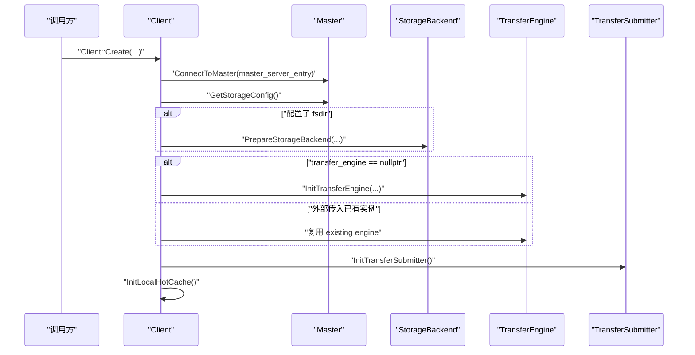
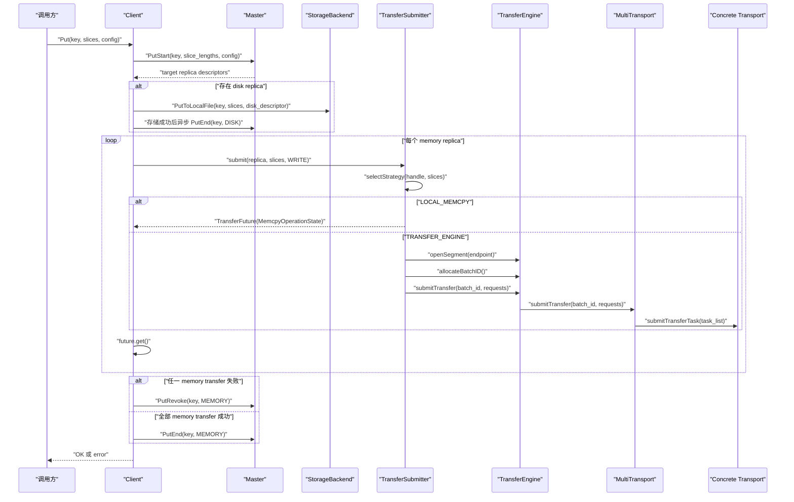

# Mooncake 传输路径分析

分析日期：`2026-03-04`

源码来源：

- 仓库地址：`https://github.com/kvcache-ai/Mooncake`
- 本地路径：`/Users/miaomili/Documents/Playground/Mooncake`
- 分支：`main`
- 提交：`a402dc7`

## 范围

这份文档只关注客户端侧的数据路径，主要包括：

- `Client::Create`
- `Client::Get`
- `Client::Put`
- `TransferSubmitter`
- `TransferFuture` 与 `OperationState`
- `Transfer Engine` 与 `MultiTransport`

它是 `docs/mooncake-analysis.md` 的细化版。

## 主要参与者

- `Client`：负责和 master 的 RPC 交互，并驱动本地读写流程
- `MasterClient`：负责返回 replica descriptor，并完成对象生命周期上的确认操作
- `TransferSubmitter`：在 memcpy、`Transfer Engine` 和 file read 三种路径之间做选择
- `TransferFuture`：统一的异步完成态包装
- `TransferEngine`：负责 segment 解析、batch 提交和 transport 层入口
- `MultiTransport`：按 transport 对请求分组并分发到具体后端

## 初始化路径

`Client::Create` 是后续所有传输路径的准备阶段。

可以把流程理解成：

1. 连接 master
2. 拉取 storage config，必要时初始化 `StorageBackend`
3. 初始化或复用 `TransferEngine`
4. 初始化 `TransferSubmitter`
5. 初始化 local hot cache

这里最重要的结论是：

- storage backend 是可选的
- 只有 `rpc_only` 模式才会跳过 transport 初始化
- 真正把 replica descriptor 转成“数据搬运动作”的对象是 `TransferSubmitter`

## 读路径：`Client::Get`

### 高层时序

### 逐步展开

1. `Client::Get(key, slices)` 先调用 `Query(key)`。
2. `Query(key)` 向 master 获取已完成的 replica 列表和 lease TTL。
3. `Client::Get(key, query_result, slices)` 再挑选第一个 complete replica。
4. 如果 replica 在内存中，客户端可能先尝试重定向到 local hot cache。
5. `TransferRead()` 会转到 `TransferData(..., READ)`。
6. `TransferData()` 再调用 `transfer_submitter_->submit(...)`。
7. 客户端通过 `future->get()` 同步等待结果。
8. 传输完成后再做 hot cache 的释放和异步回填。
9. 最后检查 lease 是否在数据搬运完成前已经过期。

### 这条路径里最容易忽略的点

- lease 是在 query 阶段由 master 授予的，不是在字节传输完成后授予
- 客户端是在传输结束后才检查 lease 是否过期
- hot cache 的本质是把 replica descriptor 重写成本地地址，从而把远程读路径短路成本地访问

## 写路径：`Client::Put`

### 高层时序

### 逐步展开

1. `Put()` 会先整理 slice 长度，必要时在 `cxl` 模式下设置 preferred segment。
2. `PutStart()` 向 master 申请目标 replica。
3. 如果返回结果里包含 disk replica 且本地有 `StorageBackend`，客户端会先把磁盘副本写下去。
4. disk replica 的完成确认是客户端写线程在 backend store 成功后异步通知 master 的。
5. 每个 memory replica 再通过 `TransferWrite()` 写入。
6. `TransferWrite()` 本质上就是 `TransferData(..., WRITE)`。
7. 如果任何一次 memory transfer 失败，客户端会调用 `PutRevoke(key, MEMORY)`。
8. 所有 memory transfer 都成功后，客户端再调用 `PutEnd(key, MEMORY)`。

### 这条路径的几个关键点

- 客户端会先处理 disk replica，再完成 memory 路径的最终确认，这样 disk 相关的 revoke / end 语义更稳定
- 在当前 `Put()` 实现里，memory replicas 是逐个写的，不是统一 batch 推送
- 对象是否真正“完成可见”，是由 `PutEnd` 决定的，而不是由单次数据传输决定

## `TransferSubmitter` 的策略选择

这里的策略分支非常清楚：

- `LOCAL_MEMCPY`
- `TRANSFER_ENGINE`
- `FILE_READ`

基本规则可以概括成：

1. 如果目标是 disk replica，读路径会走 `FILE_READ`
2. 如果 `MC_STORE_MEMCPY` 被关闭，memory replica 会统一走 `TRANSFER_ENGINE`
3. 如果 `MC_STORE_MEMCPY` 开启，并且源 / 目标被判断为同一台本地机器，则会走 `LOCAL_MEMCPY`
4. 其他情况走 `TRANSFER_ENGINE`

也就是说，调用方并不直接选择 transport backend。backend 是由 replica 类型、endpoint locality 和环境配置共同决定的。

## `TransferSubmitter` 内部结构

### `submit(...)`

`submit(...)` 是主要分支点，负责：

- 校验 handle size 和 slices 总长度是否一致
- 判断 replica 类型
- 选择策略
- 创建 `TransferFuture`
- 在提交成功时更新传输指标

### `submitMemcpyOperation(...)`

这条路径会：

- 构造 memcpy operation 列表
- 根据 READ / WRITE 决定 source 和 destination 的方向
- 把任务提交给 `MemcpyWorkerPool`
- 返回 `TransferFuture(MemcpyOperationState)`

### `submitTransferEngineOperation(...)`

这条路径会：

1. 校验 transport endpoint
2. 通过 `engine_.openSegment(...)` 解析 `SegmentHandle`
3. 为每个 slice 构造 `TransferRequest`
4. 调用 `submitTransfer(requests)`

### `submitTransfer(requests)`

这是进入 `Transfer Engine` 的最窄入口：

1. 分配 batch ID
2. 调用 `engine_.submitTransfer(batch_id, requests)`
3. 用这个 batch 构造 `TransferEngineOperationState`
4. 返回 `TransferFuture`

## `TransferFuture` 与完成态模型

`TransferFuture` 统一封装了三种不同的完成态：

- `MemcpyOperationState`
- `FilereadOperationState`
- `TransferEngineOperationState`

这里的几个关键事实：

- `TransferEngineOperationState` 持有 batch ID 的生命周期，并在析构时释放
- 如果编译启用了 event-driven completion，它会直接等 `BatchDesc`；否则就轮询 transfer status
- 虽然中间对象是 future 语义，但客户端对外仍然表现为同步接口，因为 `TransferData()` 内部直接 `future.get()`

## `Transfer Engine` 交接点

真正进入 `Transfer Engine` 后，路径比名字看起来更窄。

### `openSegment(...)`

对大多数协议来说，它做的主要是：

- 规范化 segment name
- 通过 transfer metadata 查 `SegmentID`
- 返回这个 `SegmentID`

也就是说，这通常不是 socket 风格的“建立连接”，而是 metadata 解析。

### `MultiTransport::submitTransfer(...)`

当 `engine_.submitTransfer(...)` 进入 `MultiTransport` 后，内部流程是：

1. 给每个 request 绑定一个 `TransferTask`
2. 用 `selectTransport(...)` 给 request 选择具体 transport
3. 按 transport 对 task 分组
4. 把分组后的 task list 提交到各自的 transport backend

### 状态如何向上回传

`MultiTransport` 会把 slice 级完成态聚合成：

- task 级状态
- batch 级状态

`TransferEngineOperationState` 等待的就是这个聚合结果。

## 一句话理解整条路径

最简单的心智模型是：

- master 负责决定 object replica 放在哪
- client 负责决定什么时候读、什么时候写
- `TransferSubmitter` 负责决定字节怎么搬
- `Transfer Engine` 负责决定最终用哪个 transport implementation 执行

## 如果要继续改代码，优先看这些入口

1. `Client::Get` 和 `Client::Put`：改用户可见语义最直接
2. `TransferSubmitter::selectStrategy`：改 locality policy 最直接
3. `TransferSubmitter::submitTransferEngineOperation`：改 request 组织方式最直接
4. `TransferEngineImpl::openSegment`：改 segment 解析语义最直接
5. `MultiTransport::submitTransfer`：改 batching 和 dispatch policy 最直接
