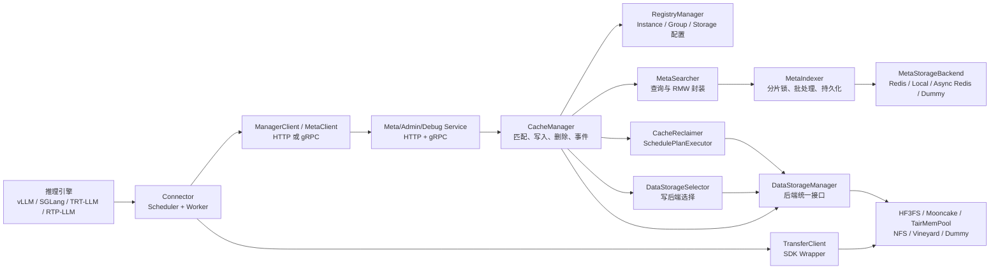
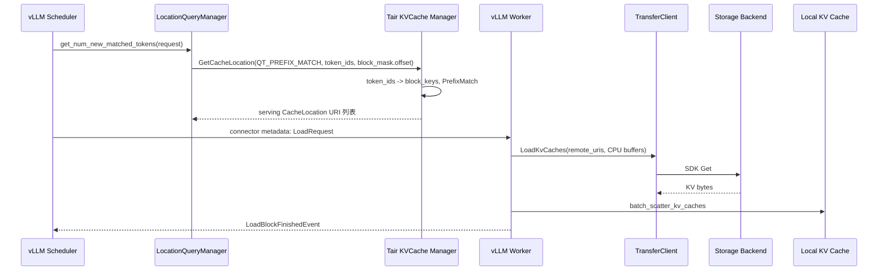
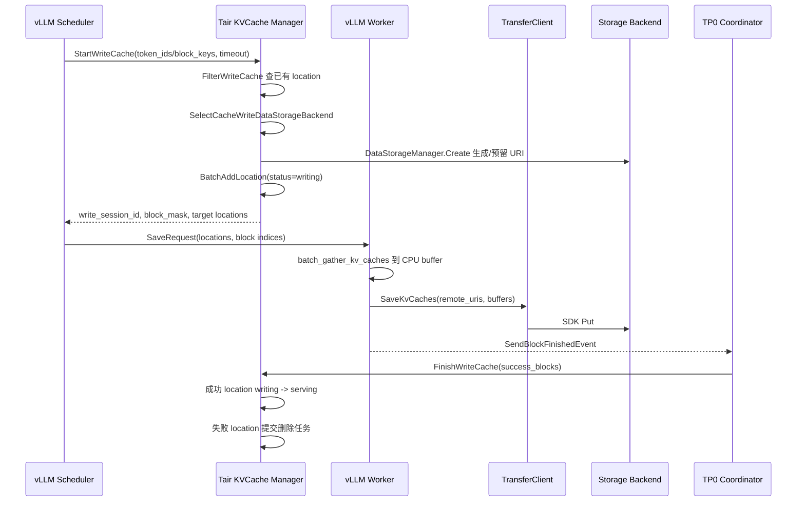

# Tair KVCache 架构与 IO 流分析

分析对象：`/Users/mlx/Documents/cli-code/MoonCake/tair-kvcache`  
代码版本：`b6bc64b3f8da894296c93457b688853363364725`，浅克隆自 `alibaba/tair-kvcache`。  
结论先行：当前开源仓库的核心是 Tair KVCache Manager 和推理引擎 Connector。Manager 是全局元数据控制面，不直接搬运 KV tensor；真实数据 IO 由客户端 TransferClient 和后端 SDK 按 Manager 返回的 URI 执行。

## 1. 系统定位

Tair KVCache 将 LLM 推理中的 KVCache 拆成两类职责：

- 控制面：Manager 维护 Instance、Block、CacheLocation、LocationSpec、配额、水位、回收状态。
- 数据面：推理引擎 Connector/TransferClient 根据控制面返回的 URI，把 GPU KV tensor gather 到传输缓冲区，写入远端后端；读取时反向拉取并 scatter 回本地 KV cache。

因此它更像“KVCache 元数据编排器 + 多后端数据搬运客户端”，而不是单体缓存服务。Manager 返回的是数据位置和状态，不返回 KV tensor 本身。

## 2. 核心概念

代码和文档里的核心抽象如下：

- `Storage`：一套后端存储系统，支持 HF3FS/VCNS 3FS、Mooncake、TairMemPool、NFS、Vineyard、Dummy 等。
- `Instance Group`：共享配额和后端候选列表的资源组。多个 Instance 可以共享同一个 Group 的容量。
- `Instance`：一个可复用 KVCache 的边界。跨 Instance 不复用 KVCache，这是仓库 `AGENTS.md` 和 `docs/design/basic_concepts.md` 共同强调的系统约束。
- `Block`：定长 token 序列的 hash 结果。代码用连续 block hash 保留前缀关系，首创 block 时还会记录 `_prev_key_` 属性。
- `CacheLocation`：某个 block 的一个存储位置。状态流转为 `writing -> serving -> deleting`。
- `LocationSpec`：一个 CacheLocation 内的分片位置，例如 `tp0`、`tp1`。URI 里携带后端、host/storage name、路径或 key、size、blkid 等信息。

一个 block 可以有多个 location，一个 location 可以有多个 spec。查询命中时，Manager 会选择 serving 且后端数据仍存在的 location；如果同一后端上多个 location 的 spec 互补，还会合并成一个返回视图。

## 3. 组件架构

### Manager 服务层

`MetaService` 暴露 `RegisterInstance`、`GetCacheLocation`、`StartWriteCache`、`FinishWriteCache`、`RemoveCache`、`TrimCache`、`ReportEvent` 等接口。HTTP 与 gRPC 都转发到 `MetaServiceImpl`，再进入 `CacheManager`。

`MetaServiceImpl` 做参数校验、leader 保护、故障注入、指标和访问日志，然后调用 Manager 层。多数元数据写接口是 leader-only；`GetClusterInfo` 用于 leader 发现。

### CacheManager

CacheManager 是业务中枢：

- 注册 Instance，校验同名 instance 的 block size、模型部署、spec 配置是否一致。
- 将 token_ids 按 block_size hash 成 block key。
- 根据 query_type 执行 batch get、prefix match、reverse rolling sliding window match。
- 写入前过滤已有 location，分配新 URI，并插入 `writing` 元数据。
- 写入完成后把成功 location 改成 `serving`，失败 location 交给后台删除。
- 处理 Vineyard 事件上报、节点下线清理。
- 组织回收器、计划执行器、事件发布器和指标采集。

### MetaSearcher 与 MetaIndexer

MetaSearcher 是对 MetaIndexer 的查询和 RMW 包装：

- `BatchGetBestLocation`：逐 block 返回最佳 location。
- `PrefixMatch`：只返回连续前缀命中。
- `ReverseRollSlideWindowMatch`：从后向前找一段完整滑动窗口命中。
- `BatchAddLocation`：为每个 block 生成 location_id，插入 `writing` 状态。
- `BatchUpdateLocationStatus`、`BatchCASLocationStatus`、`BatchCADLocationStatus`：用状态更新、CAS、条件删除支撑完成写入和回收。

MetaIndexer 负责批量分组、分片锁、元数据后端读写、内存 usage 统计和持久化。后端可以是 Redis、本地、异步 Redis 或 Dummy。

### DataStorageManager 与后端

DataStorageManager 给 Manager 提供统一接口：`Create`、`Delete`、`Exist/MightExist`、`Lock/Unlock`。这里的 `Create` 通常只是生成或预留 URI，并不等于写入 KV tensor。

不同后端语义有差异：

- NFS：生成 `nfs://...`/文件路径类 URI，Delete/Exist 当前是占位实现，基本返回 OK/true。
- Mooncake：生成 `mooncake://.../?key=...&size=...` 类 URI，Delete/Exist 会调用 Mooncake client；Create 本身只构造 key URI。
- HF3FS/VCNS 3FS/TairMemPool：通过 open_source/stub_source 后端接入，Manager 返回统一 URI，客户端 SDK 负责实际 IO。
- Vineyard：通过 `ReportEvent` 由节点上报 block add/delete/heartbeat/down，Manager 把本地节点持有的 block 作为 serving location 写入元数据。

## 4. 读路径 IO 流

以 vLLM Connector 为例：

读路径要点：

1. Scheduler 已经本地算过的 token 通过 `block_mask.offset` 跳过，Manager 只查还可能远端命中的后续 block。
2. `QT_PREFIX_MATCH` 只返回连续前缀命中。一旦某个 block 没有 serving location，后续 block 即使存在也不会作为前缀命中返回。
3. 查询时只选择 `CLS_SERVING` 的 location；`writing` 和 `deleting` 都不会被返回。
4. `GetCheckLocDataExistFunc` 会对 serving location 做 `MightExist` 快速校验。若后端数据不存在，则提交删除请求剪枝元数据。
5. Worker 只取本 TP rank 对应的 `LocationSpec.name`，例如 `tp0` 或 `tp1`，再由 TransferClient 读取并 scatter 到本地 KV cache。

这条路径的控制面开销是 Manager 查询，数据面开销是后端读取 + CPU/GPU gather/scatter。当前 vLLM Connector 还支持异步查询，本地 query cache TTL 约 1 秒，用于避免调度循环重复阻塞。

## 5. 写路径 IO 流

写路径是两阶段提交语义，但不是完整分布式事务：

1. `StartWriteCache` 先过滤已有缓存。
   - 如果已存在 serving/writing location，返回的 `block_mask` 会标记这部分不需要写。
   - 若已有 serving location 的后端数据快速校验失败，会提交元数据剪枝删除。
2. Manager 选择可用存储后端。
   - 先取 Instance Group 的候选 Storage。
   - 再检查后端 available 状态、Group 总容量、按存储类型的 quota。
   - 最后按 cache preference 选择，例如 always/prefer 3FS、Mooncake、TairMemPool。
3. Manager 调用 DataStorageManager.Create 得到 URI，再把每个新 location 写成 `CLS_WRITING`。
4. WriteLocationManager 保存 `write_session_id -> keys/location_ids`，超时上限被限制到 1800 秒。
5. Worker 做真实写入。vLLM 当前先从 GPU KV cache gather 到 CPU buffer，再 `SaveKvCaches` 走 SDK Put。
6. TP0 汇总所有 TP rank 的写入结果。只有所有 rank 对同一个 block 都成功，该 block 才在 `FinishWriteCache` 里置为成功。
7. `FinishWriteCache` 把成功 location 改为 `CLS_SERVING`；失败 block 的 location 进入后台删除。

写路径的关键可靠性点是：在真实数据写完之前，Manager 中的 location 处于 `writing`，不会被读命中；如果客户端不调用 Finish，超时回调会以全失败路径清理这些 location。

## 6. 删除与回收 IO 流

删除分两类：

- 主动删除：`RemoveCache`、`TrimCache`、写失败清理、后端数据校验失败剪枝。
- 周期回收：CacheReclaimer 根据 Instance Group quota、存储类型 quota、后端水位和采样策略提交删除。

SchedulePlanExecutor 使用两阶段删除：

1. 先同步把目标 location CAS 到 `CLS_DELETING`，并调用 `MetaIndexer.Sync` 确保状态持久化。
2. 延迟任务执行时再按 storage unique name 聚合 URI，调用 DataStorageManager.Delete 删除底层对象。
3. 最后用条件删除从元数据中移除仍处于 `CLS_DELETING` 的 location，并扣减 usage。

这种顺序保证删除中的 location 不会被读命中，同时避免还没持久化 deleting 状态就开始删底层对象。

## 7. 多后端与 URI 语义

Manager 通过 URI 把异构后端抽象成同一种返回格式：

- `type` 描述存储类型。
- `location_specs[].name` 对应 TP/PP/混合注意力分片。
- `location_specs[].uri` 描述具体后端位置。
- `size` 参数用于 Manager 统计容量。
- `blkid` 支持多个 block/spec 合并到同一个文件或对象里的场景。

需要注意的是，Manager 的后端 Create 有些只生成位置，有些会连接后端查询状态；真正的数据一致性主要由 `writing/serving/deleting` 状态机、Finish 回告、后端 Exist/MightExist、回收流程共同维护。

## 8. 与 vLLM Connector 的配合

vLLM Connector 分 Scheduler 和 Worker 两个角色：

- Scheduler 初始化时注册 Instance，提交 `GetCacheLocation` 和 `StartWriteCache`。
- Worker 初始化 TransferClient，根据 Manager 返回的 storage_configs 初始化 SDK。
- Worker 注册本地 KV cache tensor 指针，计算每个 manager block 对应的本地 token/block index。
- Load 时，Worker 用 `LoadKvCaches` 拉取远端 URI 到 CPU buffer，再 scatter 回 GPU KV cache。
- Save 时，Worker 等当前 compute stream 事件，gather GPU KV cache 到 CPU buffer，再 `SaveKvCaches` 写远端 URI。
- TP0 Coordinator 汇总各 TP rank 的 Save/Load 事件，并统一调用 `FinishWriteCache` 或向 Scheduler 上报加载失败 block。

这里有两个粒度转换：

- token_ids 按 Manager block_size 形成 manager block。
- manager block 再映射到 vLLM 本地 block_id + token offset。若两者 block_size 不同，Connector 会逐 token 计算映射。

## 9. 架构优点

- 控制面和数据面分离，Manager 不接触大体量 KV tensor，服务压力主要是元数据和调度。
- Instance/Group/Storage 解耦，便于按模型、团队、业务组做容量隔离。
- `LocationSpec` 能自然表达 TP、PP、MLA、混合注意力等分片。
- 查询只返回 serving location，并带后端存在性剪枝，降低读到坏数据的概率。
- 两阶段写入避免未完成数据被命中。
- 两阶段删除避免删除中数据继续被读，并把慢速删除移到后台执行。
- 后端选择同时考虑可用性、quota、偏好策略，可用于多级缓存或多存储池。

## 10. 风险与观察点

- 部分后端接口仍是占位或弱校验。例如 NFS 的 Delete/Exist 当前基本返回成功/存在，实际一致性依赖客户端和外部存储。
- 写路径不是端到端事务。Manager 先写 `writing` 元数据，客户端再写数据，最后 Finish；中间失败依赖超时和回收补偿。
- `StartWriteCache` 里注释提到，如果 BatchAddLocation 部分成功后返回，可能导致 storage leak。虽然代码期望批量整体 OK，但这里仍是风险点。
- `MightExist` 是低延迟快速校验，允许假阳性。它能降低误删风险，但不能保证每次查询都发现底层对象丢失。
- vLLM Connector 当前通过 CPU buffer 做 gather/scatter 与传输，GPU 到后端的零拷贝/直连程度取决于后端 SDK 和配置。
- 异步查询本地 cache TTL 很短，适合调度循环去重，但不是长期缓存。
- 多实例之间强隔离，跨 Instance 的相同 prefix 不会复用；业务侧必须保证可复用部署使用同一个 instance_id。
- HA 场景依赖 leader-only 保护和 Registry/MetaIndexer recover，切主期间写 session 会按清理逻辑处理，仍需要关注恢复窗口内的可用性。

## 11. 对 MoonCake 方向的启发

如果把它和 Mooncake KVCache/多级存储池化方向对齐，可以抽取几个设计点：

- Manager 不搬数据，只管理 location 和状态，是降低控制面热路径开销的关键。
- `writing -> serving -> deleting` 这类简单状态机足够表达大多数 KVCache IO 生命周期。
- `LocationSpec` 比单一 URI 更适合表达 TP/PP/MLA/混合注意力。
- 写入前的 prefix/批量去重可以减少重复保存，尤其是长上下文和相似 prompt 场景。
- 后端 URI 应保留 `size`、`blkid`、host/storage name，方便容量统计、批量删除和多后端选择。
- 如果 Mooncake 后端要作为主力数据面，Manager 侧最好强化 Create/Exist/Delete 的真实语义，并减少占位式返回。

## 12. 代码索引

- 概念文档：`docs/design/basic_concepts.md`
- API 定义：`kv_cache_manager/protocol/protobuf/meta_service.proto`
- 服务入口：`kv_cache_manager/service/meta_service_impl.cc`
- Manager 主逻辑：`kv_cache_manager/manager/cache_manager.cc`
- 元数据查询/RMW：`kv_cache_manager/manager/meta_searcher.cc`
- 元数据索引：`kv_cache_manager/meta/meta_indexer.h`
- 存储后端管理：`kv_cache_manager/data_storage/data_storage_manager.cc`
- 后端选择：`kv_cache_manager/manager/data_storage_selector.cc`
- location 选择策略：`kv_cache_manager/manager/select_location_policy.cc`
- 后台删除执行：`kv_cache_manager/manager/schedule_plan_executor.cc`
- vLLM Connector：`kv_cache_manager/py_connector/vllm/v1_connector.py`
- vLLM 数据搬运：`kv_cache_manager/py_connector/vllm/data_transfer.py`
- TransferClient：`kv_cache_manager/client/src/transfer_client_impl.cc`
